# 基础信息

|      |      |
|------|------|
| 名称 | TaskStatusApi |
| 编码语言 | .java |
| 代码路径 | WeFe/board/board-service/src/main/java/com/welab/wefe/board/service/api/project/fusion/task/TaskStatusApi.java |
| 包名 | com.welab.wefe.board.service.api.project.fusion.task |
| 依赖项 | ['com.welab.wefe.common.exception.StatusCodeWithException', 'com.welab.wefe.common.web.api.base.AbstractApi', 'com.welab.wefe.common.web.api.base.Api', 'com.welab.wefe.common.web.dto.AbstractApiInput', 'com.welab.wefe.common.web.dto.ApiResult', 'com.welab.wefe.fusion.core.enums.FusionTaskStatus', 'java.util.EnumSet'] |
| 概述说明 | 这是一个任务状态API类，继承自AbstractApi，处理输入并返回所有FusionTaskStatus枚举值。输入类为空。 |

# 说明

该代码定义了一个名为TaskStatusApi的API类，继承自AbstractApi，用于处理任务状态相关请求。API路径为fusion/task/status，名称为任务状态，描述为任务状态。输入参数为Input类，继承自AbstractApiInput，无额外字段。处理逻辑返回包含所有FusionTaskStatus枚举值的EnumSet集合，并通过success方法包装为ApiResult返回。整个API的功能是获取所有可能的任务状态枚举值。

# 类列表 Class Summary

| 名称   | 类型  | 说明 |
|-------|------|-------------|
| TaskStatusApi | class | 这是一个任务状态API类，继承自AbstractApi，处理输入并返回所有FusionTaskStatus枚举值。输入类为空。 |


## 类 TaskStatusApi

|      |      |
|------|------|
| 访问范围 | @Api(path = "fusion/task/status", name = "任务状态", desc = "任务状态");public |
| 类型 | class |
| 名称 | TaskStatusApi |
| 说明 | 这是一个任务状态API类，继承自AbstractApi，处理输入并返回所有FusionTaskStatus枚举值。输入类为空。 |


### UML类图

```mermaid
classDiagram
    class AbstractApi~T, R~ {
        <<Abstract>>
        +ApiResult~R~ handle(T input) throws StatusCodeWithException
        +ApiResult~R~ success(R result)
    }

    class TaskStatusApi {
        +TaskStatusApi()
        +ApiResult~EnumSet~FusionTaskStatus~~ handle(Input input) throws StatusCodeWithException
    }

    class AbstractApiInput {
        <<Abstract>>
    }

    class Input {
    }

    class ApiResult~T~ {
    }

    class EnumSet~E~ {
    }

    class FusionTaskStatus {
    }

    TaskStatusApi --|> AbstractApi~Input, EnumSet~FusionTaskStatus~~ : 继承
    Input --|> AbstractApiInput : 继承
    TaskStatusApi --> Input : 使用
    TaskStatusApi --> EnumSet~FusionTaskStatus~ : 返回
    TaskStatusApi --> ApiResult~EnumSet~FusionTaskStatus~~ : 返回
    EnumSet~FusionTaskStatus~ --> FusionTaskStatus : 包含
```

该代码定义了一个任务状态API类`TaskStatusApi`，继承自泛型抽象类`AbstractApi`，处理输入类型为`Input`，返回类型为`EnumSet<FusionTaskStatus>`。主要功能是获取所有`FusionTaskStatus`枚举值并通过`ApiResult`包装返回。类图中展示了继承关系、泛型参数传递以及类之间的依赖关系，体现了API处理请求并返回枚举状态集合的设计模式。


### 内部方法调用关系图

```mermaid
graph TD
    A["类TaskStatusApi"]
    B["父类: AbstractApi<Input, EnumSet<FusionTaskStatus>>"]
    C["注解: @Api(path='fusion/task/status', name='任务状态', desc='任务状态')"]
    D["方法: handle(Input input)"]
    E["内部类: Input"]
    F["父类: AbstractApiInput"]
    G["操作: EnumSet.allOf(FusionTaskStatus.class)"]
    H["返回: success(statuses)"]

    A --> B
    A --> C
    A --> D
    A --> E
    E --> F
    D --> G
    G --> H
```



这段代码展示了一个任务状态API的实现，继承自抽象API类并处理特定输入。流程图清晰地呈现了类继承结构、注解配置和核心方法逻辑。TaskStatusApi通过handle方法获取所有枚举状态并返回成功结果，内部类Input作为参数类型继承自抽象输入类。整个结构体现了标准的API实现模式，包含注解配置、输入输出类型定义和业务逻辑处理三个核心部分。

### 字段列表 Field List

| 名称  | 类型  | 说明 |
|-------|-------|------|

### 方法列表

| 名称  | 类型  | 说明 |
|-------|-------|------|
| handle | ApiResult<EnumSet<FusionTaskStatus>> | 重写方法处理输入，返回包含所有FusionTaskStatus枚举值的成功结果。 |


