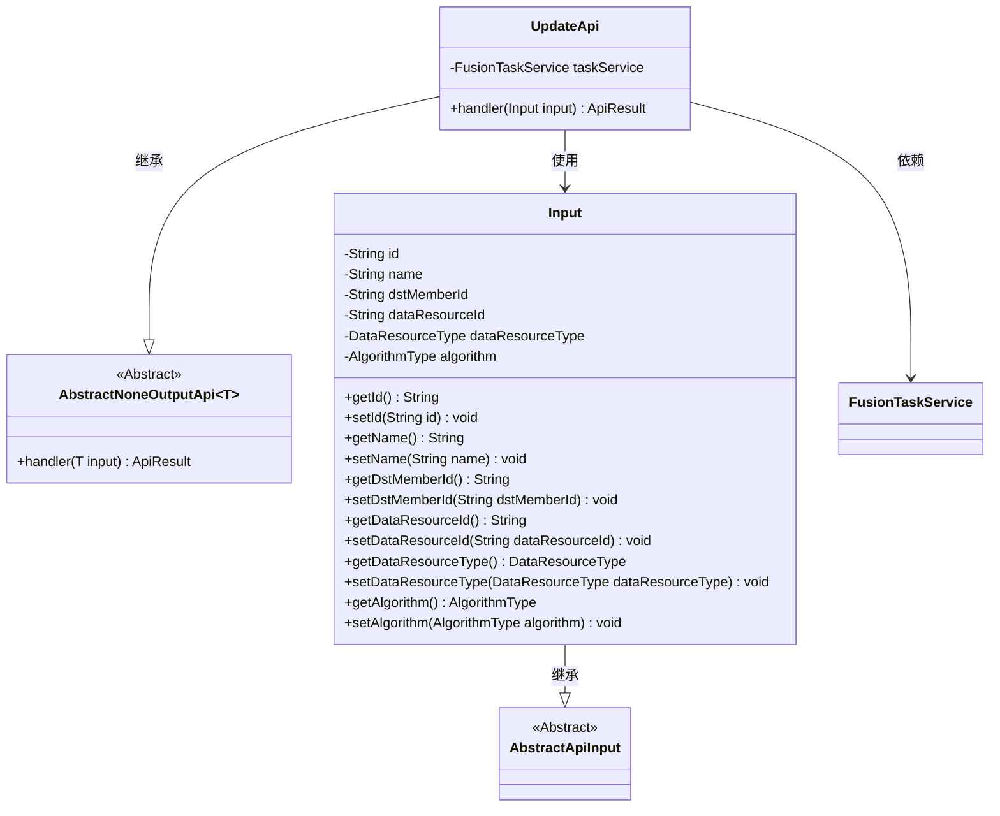

# 基础信息

|      |      |
|------|------|
| 名称 | UpdateApi |
| 编码语言 | .java |
| 代码路径 | WeFe/board/board-service/src/main/java/com/welab/wefe/board/service/api/project/fusion/task/UpdateApi.java |
| 包名 | com.welab.wefe.board.service.api.project.fusion.task |
| 依赖项 | ['com.welab.wefe.board.service.service.fusion.FusionTaskService', 'com.welab.wefe.common.exception.StatusCodeWithException', 'com.welab.wefe.common.fieldvalidate.annotation.Check', 'com.welab.wefe.common.web.api.base.AbstractNoneOutputApi', 'com.welab.wefe.common.web.api.base.Api', 'com.welab.wefe.common.web.dto.AbstractApiInput', 'com.welab.wefe.common.web.dto.ApiResult', 'com.welab.wefe.common.wefe.enums.DataResourceType', 'com.welab.wefe.fusion.core.enums.AlgorithmType', 'org.springframework.beans.factory.annotation.Autowired'] |
| 概述说明 | 修改对齐任务的API，包含任务ID、名称、合作方ID、数据资源ID和类型等必填字段，默认算法为RSA_PSI。 |

# 说明

该代码定义了一个名为UpdateApi的类，用于修改对齐任务。类继承自AbstractNoneOutputApi，输入参数为内部类Input。Input包含任务Id、名称、合作方id、数据资源id、数据资源类型和算法类型等必填字段，其中算法类型默认为RSA_PSI。通过调用taskService的update方法处理输入参数，并返回成功结果。

# 类列表 Class Summary

| 名称   | 类型  | 说明 |
|-------|------|-------------|
| UpdateApi | class | 修改对齐任务的API，包含任务ID、名称、合作方ID、数据资源ID和类型等必填字段，默认使用RSA_PSI算法。 |

## 类 UpdateApi

|      |      |
|------|------|
| 访问范围 | @Api(path = "task/update", name = "修改对齐任务", desc = "修改对齐任务");public |
| 类型 | class |
| 名称 | UpdateApi |
| 说明 | 修改对齐任务的API，包含任务ID、名称、合作方ID、数据资源ID和类型等必填字段，默认使用RSA_PSI算法。 |

### UML类图

该类图展示了UpdateApi及其相关类的结构。UpdateApi继承自泛型类AbstractNoneOutputApi<Input>，包含对FusionTaskService的依赖和输入参数处理逻辑。Input类继承自AbstractApiInput，封装了任务更新所需的多个字段及其getter/setter方法。整体设计体现了API层对业务服务的封装和参数校验能力。

### 内部方法调用关系图

```mermaid
graph TD
    A["类UpdateApi"]
    B["注解: @Api"]
    C["继承: AbstractNoneOutputApi<Input>"]
    D["依赖注入: @Autowired FusionTaskService"]
    E["重写方法: handler(Input input)"]
    F["内部类: Input"]
    G["属性: String id"]
    H["属性: String name"]
    I["属性: String dstMemberId"]
    J["属性: String dataResourceId"]
    K["属性: DataResourceType dataResourceType"]
    L["属性: AlgorithmType algorithm"]
    M["校验注解: @Check"]
    N["Getter/Setter方法"]

    A --> B
    A --> C
    A --> D
    A --> E
    A --> F
    F --> G
    F --> H
    F --> I
    F --> J
    F --> K
    F --> L
    G --> M
    H --> M
    I --> M
    J --> M
    K --> M
    L --> M
    F --> N
```

流程图描述了UpdateApi类的结构，这是一个用于修改对齐任务的API类。它继承自AbstractNoneOutputApi，通过@Autowired注入FusionTaskService服务，并重写handler方法处理输入参数。内部类Input包含多个带@Check校验注解的属性和对应的Getter/Setter方法，用于接收和验证任务更新请求的参数。整个流程展示了从API入口到参数校验的完整类结构关系。

### 字段列表 Field List

| 名称  | 类型  | 说明 |
|-------|-------|------|
| taskService | FusionTaskService | 自动注入FusionTaskService实例taskService。 |

### 方法列表

| 名称  | 类型  | 说明 |
|-------|-------|------|
| handler | ApiResult | Java方法重写，调用taskService更新输入数据，成功后返回ApiResult。异常时抛出StatusCodeWithException。 |

