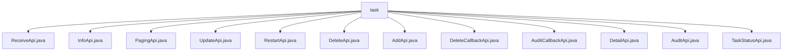

# 基础信息

|      |      |
|------|------|
| 名称 | task |
| 编码语言 | .java |
| 代码路径 | WeFe/board/board-service/src/main/java/com/welab/wefe/board/service/api/project/fusion/task |
| 包名 | docs.board.board-service.src.main.java.com.welab.wefe.board.service.api.project.fusion.task |
| 概述说明 | ReceiveApi处理对齐请求，InfoApi查询任务进度，PagingApi分页查询任务，UpdateApi修改任务，RestartApi重跑任务，DeleteApi删除任务，AddApi添加任务，DeleteCallbackApi处理删除回调，AuditCallbackApi处理审核回调，DetailApi查询任务详情，AuditApi处理任务审核，TaskStatusApi获取任务状态枚举。 |

# 说明

## 概述  
该模块核心职责是提供联邦学习中对齐任务的完整生命周期管理，包括任务创建、查询、修改、审核及状态跟踪等功能。接口规范遵循RESTful风格，统一继承AbstractApi基类，路径前缀为"fusion/task/"，支持签名访问和参数校验。  

关键数据结构包括Input类（含projectId/businessId等标识字段）、FusionTaskOutput（分页/详情输出）和EnumSet<FusionTaskStatus>（状态枚举）。外部依赖主要为FusionTaskService（核心业务逻辑）和ActuatorManager（执行器管理）。例如ReceiveApi通过alignByPartner处理对齐请求，DetailApi返回任务详情及密码学性能数据。  

## 主要业务场景  
模块支持典型联邦学习对齐任务流程：通过AddApi创建任务（例如指定RSA_PSI算法），由AuditApi审核后，ReceiveApi触发多方数据对齐，InfoApi/PagingApi监控进度，最终可通过DeleteApi清理任务。交互模式类似工作流引擎，各API通过businessId串联流程。  

功能完整性体现在全链路覆盖：包含状态查询（TaskStatusApi）、回调处理（AuditCallbackApi）、重试机制（RestartApi）等。集成案例包括带签名的审核回调（例如auditStatus变更）和分页查询（组合projectId/status条件）。所有API均通过Service层统一执行业务逻辑，确保处理一致性。

### 包内部结构视图

该流程图展示了项目融合任务模块下的API文件结构，包含12个具体的API实现类，如接收、信息查询、分页、更新、重启等操作接口。所有API文件均位于同一级目录下，没有更深层次的嵌套关系，形成扁平化的结构布局。

# 文件列表

| 名称   | 类型  | 说明 |
|-------|------|-------------|
| [ReceiveApi.java](ReceiveApi.md) | file | 接收对齐请求API，需提供项目ID、业务ID、任务名称、合作方ID、数据资源信息、算法类型等必填参数，调用FusionTaskService进行对齐处理。 |
| [InfoApi.java](InfoApi.md) | file | InfoApi类用于查询任务进度，接收businessId参数并返回任务信息。继承AbstractApi，输入为Input类，输出为JObject。 |
| [PagingApi.java](PagingApi.md) | file | 分页查询任务列表的API，输入包含项目ID、业务ID和任务状态，调用FusionTaskService分页查询并返回结果。 |
| [UpdateApi.java](UpdateApi.md) | file | 修改对齐任务的API，包含任务ID、名称、合作方ID、数据资源ID和类型等必填字段，默认算法为RSA_PSI。 |
| [RestartApi.java](RestartApi.md) | file | 这是一个名为"任务重跑对齐任务"的API类，路径为"fusion/task/restart"，继承自AbstractNoneOutputApi，使用FusionTaskService处理输入并返回成功结果。 |
| [DeleteApi.java](DeleteApi.md) | file | 删除任务API，接收任务ID参数，调用FusionTaskService执行删除操作，返回成功结果。 |
| [AddApi.java](AddApi.md) | file | 添加对齐任务的API接口，包含项目ID、任务名称、合作方ID、数据资源信息、算法类型等必填字段，支持主键处理和追溯功能，并进行输入参数校验。 |
| [DeleteCallbackApi.java](DeleteCallbackApi.md) | file | 这是一个用于接收删除请求的API类，路径为"task/delete_callback"，需传入必填参数businessId，调用fusionTaskService处理删除回调，返回成功结果。 |
| [AuditCallbackApi.java](AuditCallbackApi.md) | file | 审计回调接口，接收包含业务ID、审核状态、评论和哈希函数的输入，调用服务处理后返回成功结果。 |
| [DetailApi.java](DetailApi.md) | file | DetailApi类处理任务详情查询，调用FusionTaskService获取数据。main方法生成RSA密钥对并测试两种模幂运算性能。输入类Input包含必填taskId字段。 |
| [AuditApi.java](AuditApi.md) | file | AuditApi类处理任务审核，包含必填businessId、审核状态auditStatus等字段，可选追溯字段traceColumn和审核评论auditComment。输入参数校验逻辑确保必填项非空。 |
| [TaskStatusApi.java](TaskStatusApi.md) | file | 这是一个任务状态API类，继承自AbstractApi，处理输入并返回所有FusionTaskStatus枚举值。输入类为空。 |

