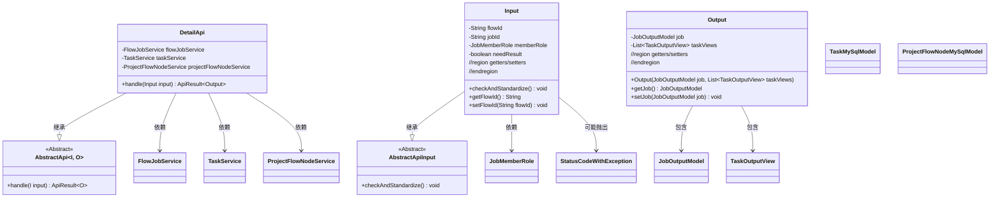
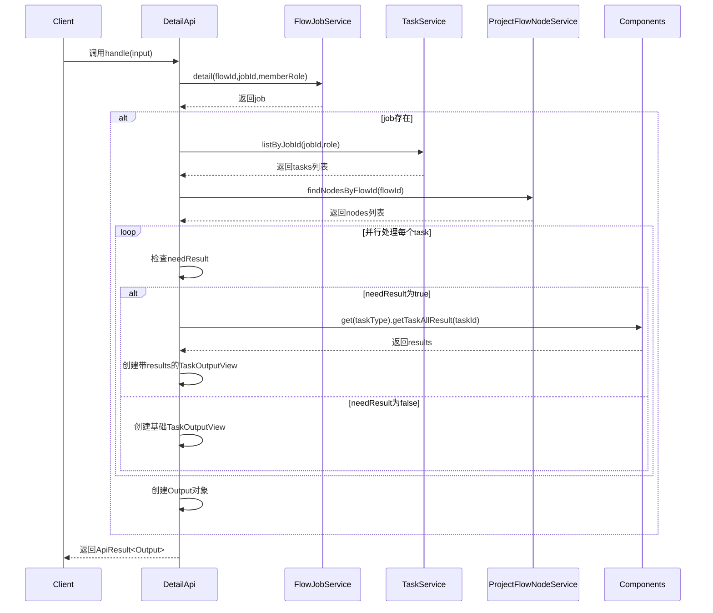

# 基础信息

|      |      |
|------|------|
| 名称 | DetailApi |
| 编码语言 | .java |
| 代码路径 | WeFe/board/board-service/src/main/java/com/welab/wefe/board/service/api/project/job/DetailApi.java |
| 包名 | com.welab.wefe.board.service.api.project.job |
| 依赖项 | ['com.welab.wefe.board.service.component.Components', 'com.welab.wefe.board.service.database.entity.job.ProjectFlowNodeMySqlModel', 'com.welab.wefe.board.service.database.entity.job.TaskMySqlModel', 'com.welab.wefe.board.service.dto.entity.job.JobOutputModel', 'com.welab.wefe.board.service.dto.entity.job.TaskOutputView', 'com.welab.wefe.board.service.dto.entity.job.TaskResultOutputModel', 'com.welab.wefe.board.service.service.FlowJobService', 'com.welab.wefe.board.service.service.ProjectFlowNodeService', 'com.welab.wefe.board.service.service.TaskService', 'com.welab.wefe.common.StatusCode', 'com.welab.wefe.common.exception.StatusCodeWithException', 'com.welab.wefe.common.fieldvalidate.annotation.Check', 'com.welab.wefe.common.util.StringUtil', 'com.welab.wefe.common.web.api.base.AbstractApi', 'com.welab.wefe.common.web.api.base.Api', 'com.welab.wefe.common.web.dto.AbstractApiInput', 'com.welab.wefe.common.web.dto.ApiResult', 'com.welab.wefe.common.wefe.enums.JobMemberRole', 'org.springframework.beans.factory.annotation.Autowired', 'java.util.List', 'java.util.stream.Collectors'] |
| 概述说明 | 获取任务详情的API，通过flowId和jobId查询任务信息，包括任务列表和节点信息，支持按需返回任务执行结果。输入参数需校验flowId和jobId不能同时为空。 |

# 说明

该代码定义了一个名为DetailApi的API类，用于获取作业详情。API路径为flow/job/detail，接受Input参数包括流程ID、任务ID、角色和是否需要返回任务执行结果。处理逻辑中通过flowJobService获取作业详情，使用taskService和projectFlowNodeService分别获取相关任务和流程节点信息。根据needResult参数决定是否包含任务执行结果，最终返回包含作业详情和任务视图列表的Output对象。输入参数会进行校验，确保flowId和jobId不同时为空，且指定jobId时必须指定memberRole。

# 类列表 Class Summary

| 名称   | 类型  | 说明 |
|-------|------|-------------|
| DetailApi | class | DetailApi类用于获取任务详情，输入参数包括流程ID、任务ID、角色和是否需要结果，输出包含任务详情和任务视图列表。 |

## 类 DetailApi

|      |      |
|------|------|
| 访问范围 | @Api(path = "flow/job/detail", name = "get job detail");public |
| 类型 | class |
| 名称 | DetailApi |
| 说明 | DetailApi类用于获取任务详情，输入参数包括流程ID、任务ID、角色和是否需要结果，输出包含任务详情和任务视图列表。 |

### UML类图

该代码实现了一个获取任务详情的API接口，主要包含输入参数校验、任务详情查询、关联任务和节点数据获取等功能。类图展示了DetailApi继承自泛型抽象类AbstractApi，包含三个服务依赖和嵌套的Input/Output类。Input类负责参数校验，Output类封装返回数据，整体设计符合分层架构思想，通过依赖注入和服务调用实现业务逻辑。

### 内部方法调用关系图

```mermaid
graph TD
    A["DetailApi类"]
    B["继承: AbstractApi<Input, Output>"]
    C["依赖注入: FlowJobService"]
    D["依赖注入: TaskService"]
    E["依赖注入: ProjectFlowNodeService"]
    F["主方法: handle(Input input)"]
    G["获取job详情: flowJobService.detail()"]
    H["检查job是否存在"]
    I["获取tasks: taskService.listByJobId()"]
    J["获取nodes: projectFlowNodeService.findNodesByFlowId()"]
    K["并行处理tasks"]
    L["检查input.needResult"]
    M["获取task结果: Components.get().getTaskAllResult()"]
    N["构造TaskOutputView"]
    O["返回成功结果: success(new Output())"]
    P["内部类Output"]
    Q["内部类Input"]

    A --> B
    A --> C
    A --> D
    A --> E
    A --> F
    F --> G
    G --> H
    H -->|job存在| I
    H -->|job不存在| O
    I --> K
    K --> L
    L -->|true| M
    M --> N
    L -->|false| N
    N --> O
    A --> P
    A --> Q
```

这段代码实现了一个获取任务详情的API，主要流程包括：通过flowJobService获取任务基本信息，通过taskService获取相关任务列表，通过projectFlowNodeService获取流程节点信息。当需要任务结果时，会通过Components获取具体任务类型的执行结果。整个过程考虑了参数校验、空值处理、并行处理等场景，最终将数据封装成Output对象返回。内部类Input负责参数校验，Output负责结果封装，体现了良好的职责分离。

### 字段列表 Field List

| 名称  | 类型  | 说明 |
|-------|-------|------|
| taskService | TaskService | 自动注入TaskService实例。 |
| flowJobService | FlowJobService | 使用@Autowired自动注入FlowJobService实例。 |
| projectFlowNodeService | ProjectFlowNodeService | 自动注入项目流程节点服务实例。 |

### 方法列表

| 名称  | 类型  | 说明 |
|-------|-------|------|
| handle | ApiResult<Output> | 处理输入并返回任务输出结果：检查任务详情，若无则返回成功；否则获取任务列表和流程节点，并行处理任务并收集结果，最终返回任务输出视图。 |

