# 基础信息

|      |      |
|------|------|
| 名称 | DownloadLogApi |
| 编码语言 | .java |
| 代码路径 | WeFe/board/board-service/src/main/java/com/welab/wefe/board/service/api/project/job/DownloadLogApi.java |
| 包名 | com.welab.wefe.board.service.api.project.job |
| 依赖项 | ['com.welab.wefe.board.service.service.globalconfig.GlobalConfigService', 'com.welab.wefe.common.exception.StatusCodeWithException', 'com.welab.wefe.common.fieldvalidate.annotation.Check', 'com.welab.wefe.common.util.UrlUtil', 'com.welab.wefe.common.web.api.base.AbstractApi', 'com.welab.wefe.common.web.api.base.Api', 'com.welab.wefe.common.web.dto.AbstractApiInput', 'com.welab.wefe.common.web.dto.ApiResult', 'com.welab.wefe.common.wefe.dto.global_config.FlowConfigModel', 'org.springframework.beans.factory.annotation.Autowired', 'org.springframework.http.HttpMethod', 'org.springframework.http.RequestEntity', 'org.springframework.http.ResponseEntity', 'org.springframework.web.client.RestTemplate'] |
| 概述说明 | DownloadLogApi类通过GET请求下载任务日志，需提供jobId参数，调用内部接口获取日志数据并返回字节数组响应。 |

# 说明

这是一个名为DownloadLogApi的Java类，用于处理下载任务日志的API请求。它继承自AbstractApi，接受DownloadLogApi.Input作为输入参数，返回ResponseEntity。类中注入了GlobalConfigService用于获取配置信息。handle方法通过构造URL并使用RestTemplate发起GET请求，获取指定jobId对应的日志数据。Input内部类定义了必需的jobId字段及其getter/setter方法，并包含参数校验注解。整个API路径为job/log/download，名称为download job log。

# 类列表 Class Summary

| 名称   | 类型  | 说明 |
|-------|------|-------------|
| DownloadLogApi | class | DownloadLogApi类用于下载任务日志，通过jobId获取内网URL并返回字节流响应。输入参数为必填的jobId。 |


## 类 DownloadLogApi

|      |      |
|------|------|
| 访问范围 | @Api(path = "job/log/download", name = "download job log");public |
| 类型 | class |
| 名称 | DownloadLogApi |
| 说明 | DownloadLogApi类用于下载任务日志，通过jobId获取内网URL并返回字节流响应。输入参数为必填的jobId。 |


### UML类图

```mermaid
classDiagram
    class DownloadLogApi {
        -GlobalConfigService globalConfigService
        +handle(DownloadLogApi~Input~ input) ApiResult~ResponseEntity~
    }
    DownloadLogApi --> GlobalConfigService : 依赖
    DownloadLogApi --> AbstractApi~DownloadLogApi~Input~, ResponseEntity~ : 继承

    class AbstractApi~T, R~ {
        <<Abstract>>
        #handle(T input) ApiResult~R~
    }

    class GlobalConfigService {
        +getModel(Class~T~ clazz) T
    }

    class DownloadLogApi~Input~ {
        -String jobId
        +String getJobId()
        +void setJobId(String jobId)
    }
    DownloadLogApi~Input~ --> AbstractApiInput : 继承

    class AbstractApiInput {
        <<Abstract>>
    }

    class ResponseEntity~T~ {
    }

    class ApiResult~T~ {
    }
```

这段代码展示了一个下载日志的API实现类DownloadLogApi，它继承自泛型抽象类AbstractApi，处理输入参数Input并返回ResponseEntity。Input类继承自AbstractApiInput，包含jobId属性和对应的getter/setter方法。DownloadLogApi通过GlobalConfigService获取配置信息，使用RestTemplate发起HTTP请求获取日志数据。类图清晰地展示了继承关系和依赖关系，包括泛型类的使用和接口实现。


### 内部方法调用关系图

```mermaid
graph TD
    A["类DownloadLogApi"]
    B["继承: AbstractApi<Input, ResponseEntity>"]
    C["依赖注入: GlobalConfigService globalConfigService"]
    D["重写方法: handle(Input input)"]
    E["调用: globalConfigService.getModel(FlowConfigModel.class)"]
    F["拼接URL: intranetBaseUri + '/job/download_logs?job_id=' + input.jobId"]
    G["创建: RequestEntity"]
    H["实例化: RestTemplate"]
    I["调用: restTemplate.exchange"]
    J["返回: success(response)"]
    K["静态内部类Input"]
    L["属性: String jobId"]
    M["校验注解: @Check"]
    N["getter/setter方法"]

    A --> B
    A --> C
    A --> D
    D --> E
    E --> F
    F --> G
    G --> H
    H --> I
    I --> J
    A -.-> K
    K --> L
    L --> M
    K --> N
```



该流程图展示了DownloadLogApi类的完整处理流程。从继承关系开始，通过依赖注入获取配置服务，处理输入参数时拼接下载URL，使用RestTemplate发起HTTP请求，最终返回响应结果。静态内部类Input包含任务ID属性和校验逻辑，通过getter/setter方法提供访问接口。整个过程体现了从参数验证到远程调用的完整链路。

### 字段列表 Field List

| 名称  | 类型  | 说明 |
|-------|-------|------|
| globalConfigService | GlobalConfigService | 使用@Autowired自动注入GlobalConfigService实例。 |

### 方法列表

| 名称  | 类型  | 说明 |
|-------|-------|------|
| handle | ApiResult<ResponseEntity> | 处理下载日志请求，构建内网URL并发起GET请求，返回字节数组响应。 |


