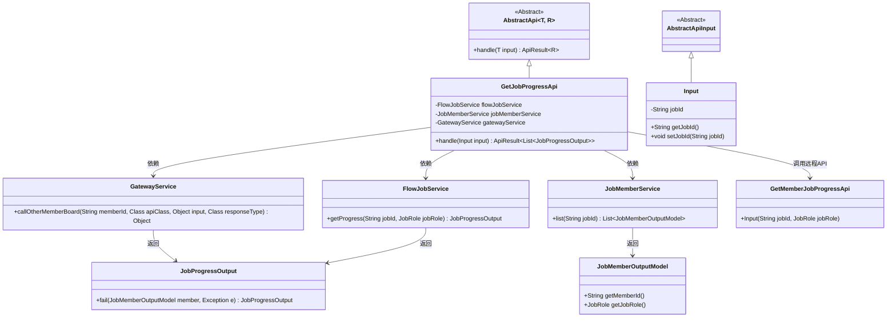
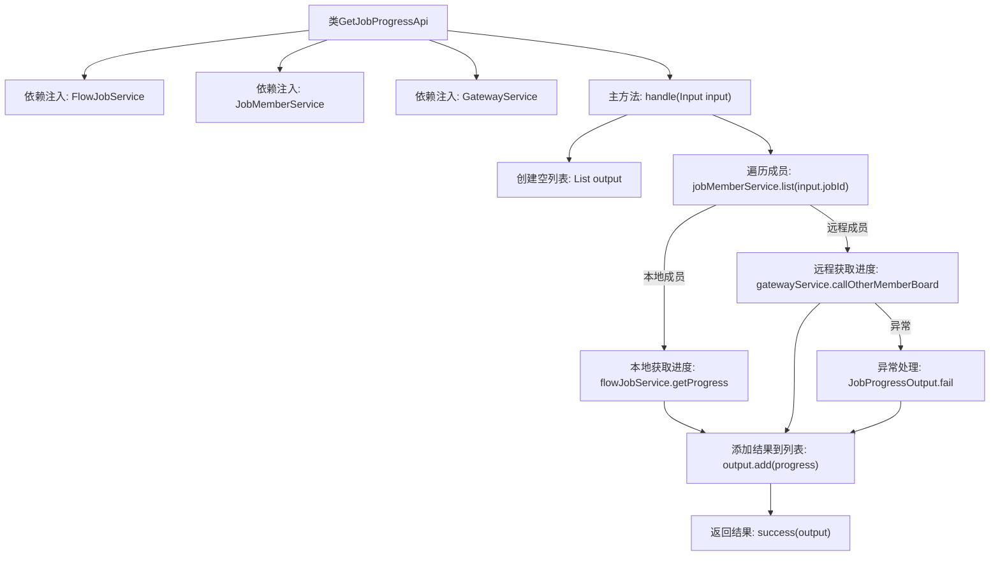
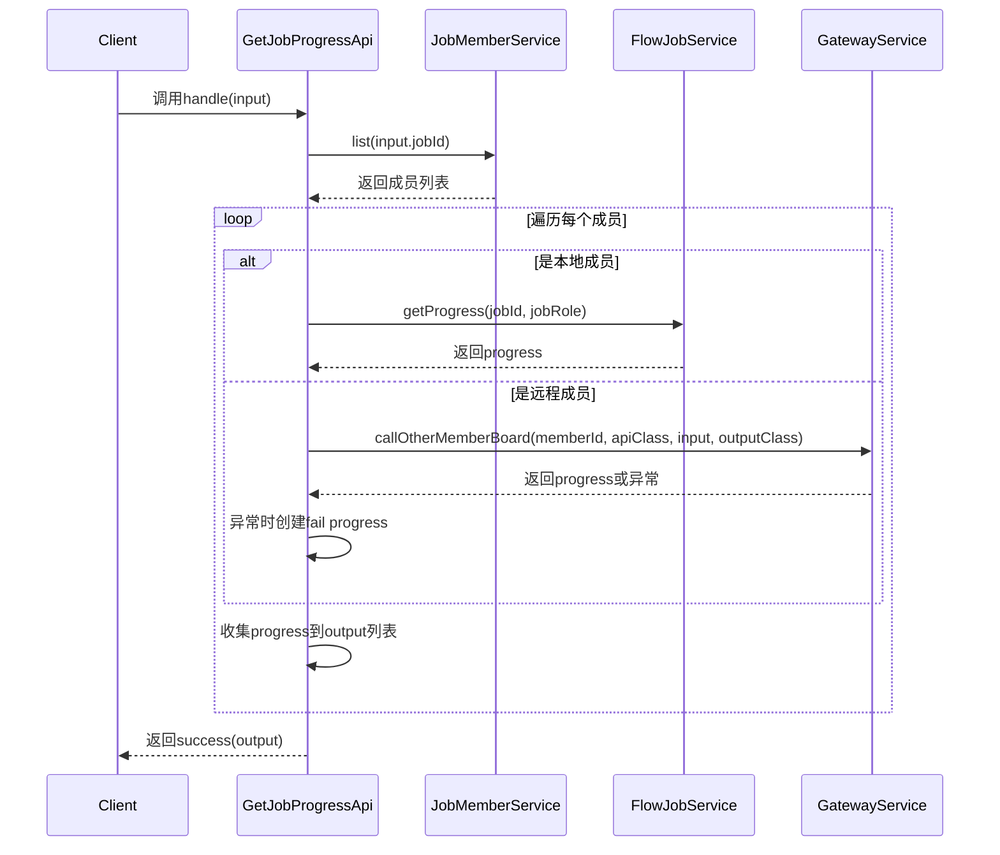

# 基础信息

|      |      |
|------|------|
| 名称 | GetJobProgressApi |
| 编码语言 | .java |
| 代码路径 | WeFe/board/board-service/src/main/java/com/welab/wefe/board/service/api/project/job/GetJobProgressApi.java |
| 包名 | com.welab.wefe.board.service.api.project.job |
| 依赖项 | ['com.welab.wefe.board.service.api.gateway.GetMemberJobProgressApi', 'com.welab.wefe.board.service.dto.entity.job.JobMemberOutputModel', 'com.welab.wefe.board.service.dto.vo.JobProgressOutput', 'com.welab.wefe.board.service.service.CacheObjects', 'com.welab.wefe.board.service.service.FlowJobService', 'com.welab.wefe.board.service.service.GatewayService', 'com.welab.wefe.board.service.service.JobMemberService', 'com.welab.wefe.common.exception.StatusCodeWithException', 'com.welab.wefe.common.fieldvalidate.annotation.Check', 'com.welab.wefe.common.web.api.base.AbstractApi', 'com.welab.wefe.common.web.api.base.Api', 'com.welab.wefe.common.web.dto.AbstractApiInput', 'com.welab.wefe.common.web.dto.ApiResult', 'org.springframework.beans.factory.annotation.Autowired', 'java.util.ArrayList', 'java.util.List'] |
| 概述说明 | 获取任务执行进度API，支持本地和远程查询成员进度，返回任务ID对应的所有成员进度列表。 |

# 说明

该API类用于获取所有成员的任务执行进度，路径为"flow/job/get_progress"，允许签名访问。它继承自抽象API类，输入为包含任务ID的Input类，输出为任务进度列表。处理逻辑包括：通过注入的服务类获取本地成员进度或通过网关服务调用远程成员接口获取进度，异常时返回失败信息。输入类包含必填的任务ID字段及对应的getter/setter方法。

# 类列表 Class Summary

| 名称   | 类型  | 说明 |
|-------|------|-------------|
| GetJobProgressApi | class | 获取任务执行进度API，支持本地和远程查询成员进度，返回任务ID对应的所有成员进度列表。 |

## 类 GetJobProgressApi

|      |      |
|------|------|
| 访问范围 | @Api(path = "flow/job/get_progress", name = "Get job execution progress of all members", allowAccessWithSign = true);public |
| 类型 | class |
| 名称 | GetJobProgressApi |
| 说明 | 获取任务执行进度API，支持本地和远程查询成员进度，返回任务ID对应的所有成员进度列表。 |

### UML类图

类图描述：
该图展示了GetJobProgressApi类及其相关依赖关系，它是一个继承自AbstractApi的API实现类，用于获取任务执行进度。主要包含三个服务依赖：FlowJobService（本地进度查询）、JobMemberService（成员列表获取）和GatewayService（远程成员进度查询）。Input类继承自AbstractApiInput，包含任务ID字段。JobProgressOutput是返回结果类型，JobMemberOutputModel表示成员信息。通过本地/远程两种方式获取进度，最终汇总返回进度列表。

### 内部方法调用关系图

该流程图展示了GetJobProgressApi类的核心处理逻辑，主要分为本地和远程两种方式获取任务进度。时序图则详细描述了从客户端请求到最终返回结果的完整调用链，包括成员列表获取、进度查询（区分本地/远程）、异常处理和结果聚合等关键步骤。整个过程实现了分布式环境下任务进度的统一收集功能。

### 字段列表 Field List

| 名称  | 类型  | 说明 |
|-------|-------|------|
| jobMemberService | JobMemberService | 使用@Autowired自动注入JobMemberService实例。 |
| flowJobService | FlowJobService | 使用@Autowired自动注入FlowJobService实例。 |
| gatewayService | GatewayService | 使用@Autowired自动注入GatewayService实例。 |

### 方法列表

| 名称  | 类型  | 说明 |
|-------|-------|------|
| handle | ApiResult<List<JobProgressOutput>> | 处理任务进度查询，本地成员直接获取进度，远程成员通过网关调用其他成员接口获取进度，异常时返回失败信息，最终汇总返回结果。 |

