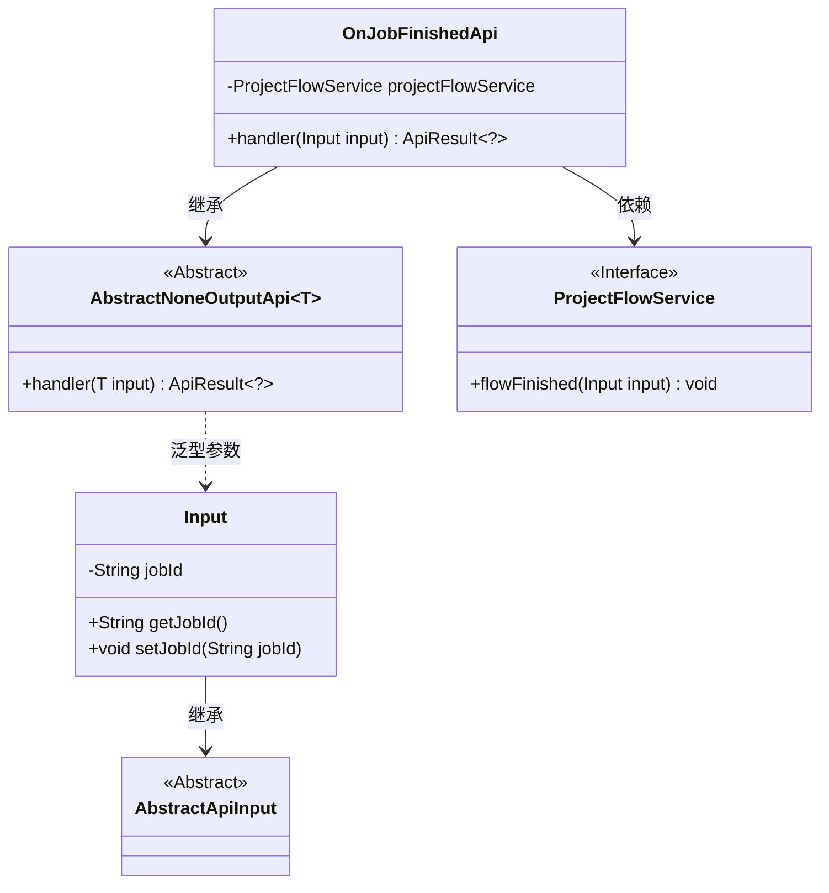
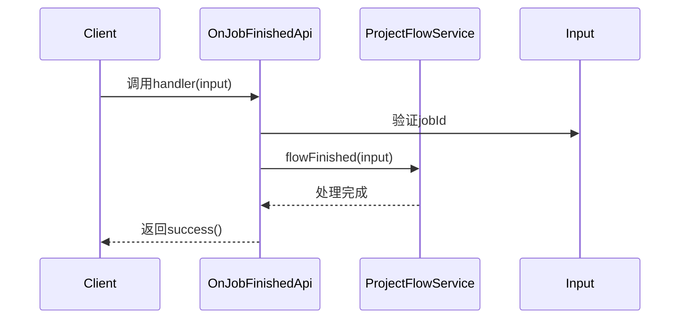

# 基础信息

|      |      |
|------|------|
| 名称 | OnJobFinishedApi |
| 编码语言 | .java |
| 代码路径 | WeFe/board/board-service/src/main/java/com/welab/wefe/board/service/api/project/job/OnJobFinishedApi.java |
| 包名 | com.welab.wefe.board.service.api.project.job |
| 依赖项 | ['com.welab.wefe.board.service.service.ProjectFlowService', 'com.welab.wefe.common.exception.StatusCodeWithException', 'com.welab.wefe.common.fieldvalidate.annotation.Check', 'com.welab.wefe.common.web.api.base.AbstractNoneOutputApi', 'com.welab.wefe.common.web.api.base.Api', 'com.welab.wefe.common.web.dto.AbstractApiInput', 'com.welab.wefe.common.web.dto.ApiResult', 'org.springframework.beans.factory.annotation.Autowired'] |
| 概述说明 | 定义了一个名为OnJobFinishedApi的API类，路径为project/job/finished，用于任务完成回调。需签名访问，接收jobId参数，调用ProjectFlowService处理任务完成逻辑。 |

# 说明

该代码定义了一个名为OnJobFinishedApi的API类，用于处理任务完成后的回调请求。API路径为"project/job/finished"，允许签名访问。类继承自AbstractNoneOutputApi，输入参数为内部类Input，包含必填字段jobId。主要逻辑是通过注入的ProjectFlowService执行flowFinished方法处理输入参数，成功后返回空结果。整个API实现了任务完成后的回调处理功能。

# 类列表 Class Summary

| 名称   | 类型  | 说明 |
|-------|------|-------------|
| OnJobFinishedApi | class | 定义了一个处理任务完成回调的API接口，路径为project/job/finished，需传入jobId参数，调用ProjectFlowService处理流程完成逻辑。 |

## 类 OnJobFinishedApi

|      |      |
|------|------|
| 访问范围 | @Api(path = "project/job/finished", name = "callback on job finished", allowAccessWithSign = true);public |
| 类型 | class |
| 名称 | OnJobFinishedApi |
| 说明 | 定义了一个处理任务完成回调的API接口，路径为project/job/finished，需传入jobId参数，调用ProjectFlowService处理流程完成逻辑。 |

### UML类图

该图展示了作业完成回调API的类结构关系。OnJobFinishedApi继承自泛型类AbstractNoneOutputApi，并依赖ProjectFlowService接口处理业务逻辑。Input类作为输入参数继承自AbstractApiInput，包含作业ID属性和访问方法。整体结构体现了Spring风格的依赖注入和分层设计，通过抽象基类规范了API处理流程。

### 内部方法调用关系图

```mermaid
graph TD
    A["类OnJobFinishedApi"]
    B["注解: @Api"]
    C["依赖注入: ProjectFlowService projectFlowService"]
    D["方法: handler(Input input)"]
    E["调用: projectFlowService.flowFinished(input)"]
    F["返回: success()"]
    G["嵌套类Input"]
    H["属性: String jobId"]
    I["方法: getJobId()"]
    J["方法: setJobId(String jobId)"]
    K["父类: AbstractNoneOutputApi<Input>"]
    L["父类: AbstractApiInput"]

    A --> B
    A --> K
    A --> C
    A --> D
    D --> E
    D --> F
    A --> G
    G --> L
    G --> H
    G --> I
    G --> J
```

这段代码定义了一个处理项目任务完成回调的API类OnJobFinishedApi，继承自AbstractNoneOutputApi基类。主要功能是通过ProjectFlowService处理任务完成事件，包含输入参数校验逻辑。流程图展示了类结构关系，时序图描述了API调用的完整流程，包括参数验证、服务调用和响应返回。嵌套类Input用于封装必需的jobId参数，并通过注解进行校验。

### 字段列表 Field List

| 名称  | 类型  | 说明 |
|-------|-------|------|
| projectFlowService | ProjectFlowService | 自动注入ProjectFlowService服务实例。 |

### 方法列表

| 名称  | 类型  | 说明 |
|-------|-------|------|
| handler | ApiResult<?> | 方法重写，调用projectFlowService完成流程，返回成功结果。 |

