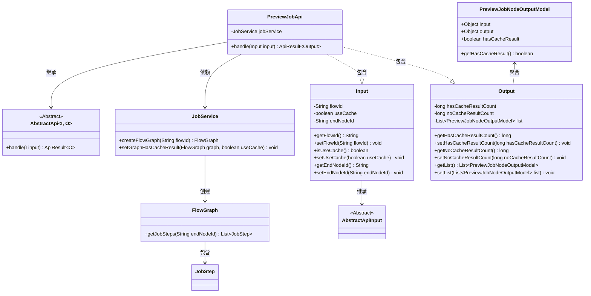
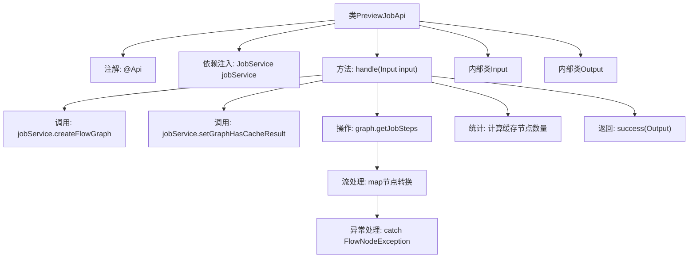
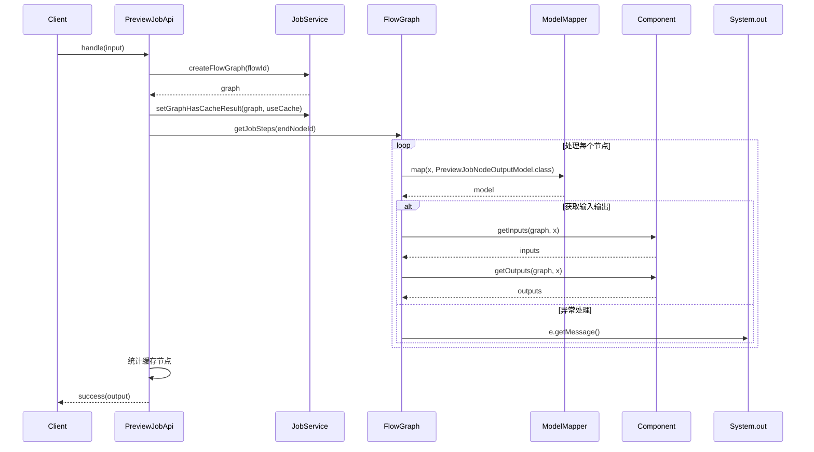

# 基础信息

|      |      |
|------|------|
| 名称 | PreviewJobApi |
| 编码语言 | .java |
| 代码路径 | WeFe/board/board-service/src/main/java/com/welab/wefe/board/service/api/project/job/PreviewJobApi.java |
| 包名 | com.welab.wefe.board.service.api.project.job |
| 依赖项 | ['com.welab.wefe.board.service.dto.entity.job.PreviewJobNodeOutputModel', 'com.welab.wefe.board.service.exception.FlowNodeException', 'com.welab.wefe.board.service.model.FlowGraph', 'com.welab.wefe.board.service.service.JobService', 'com.welab.wefe.common.exception.StatusCodeWithException', 'com.welab.wefe.common.fieldvalidate.annotation.Check', 'com.welab.wefe.common.web.api.base.AbstractApi', 'com.welab.wefe.common.web.api.base.Api', 'com.welab.wefe.common.web.dto.AbstractApiInput', 'com.welab.wefe.common.web.dto.ApiResult', 'com.welab.wefe.common.web.util.ModelMapper', 'org.springframework.beans.factory.annotation.Autowired', 'java.util.List', 'java.util.stream.Collectors'] |
| 概述说明 | 预览流程执行过程的API，输入包含流程ID、是否使用缓存和终止节点，输出包含缓存结果统计和节点详情列表。 |

# 说明

PreviewJobApi是一个用于预览流程执行过程的API类，继承自AbstractApi。它接收包含流程ID、是否使用缓存和终止节点ID的输入参数，通过JobService创建流程图并设置缓存结果。处理过程中，将流程节点映射为输出模型，统计有缓存和无缓存的节点数量，最终返回包含统计结果和节点列表的输出对象。输入类Input包含流程ID、是否使用缓存和终止节点ID的校验和访问方法。输出类Output包含缓存统计数据和节点列表的访问方法。

# 类列表 Class Summary

| 名称   | 类型  | 说明 |
|-------|------|-------------|
| PreviewJobApi | class | PreviewJobApi用于预览流程执行过程，输入包括流程ID、是否使用缓存和终止节点，输出包含缓存结果统计和节点详情列表。 |

## 类 PreviewJobApi

|      |      |
|------|------|
| 访问范围 | @Api(path = "project/flow/job/preview", name = "Preview flow execution process");public |
| 类型 | class |
| 名称 | PreviewJobApi |
| 说明 | PreviewJobApi用于预览流程执行过程，输入包括流程ID、是否使用缓存和终止节点，输出包含缓存结果统计和节点详情列表。 |

### UML类图

类图描述：该图展示了PreviewJobApi及其关联类的结构。PreviewJobApi继承自泛型类AbstractApi，依赖JobService来创建和处理流程图。包含嵌套类Input和Output，其中Input继承自AbstractApiInput，Output聚合了PreviewJobNodeOutputModel列表。JobService与FlowGraph交互，后者包含JobStep信息。整体实现了流程执行预览功能，包含缓存处理和数据统计能力。

### 内部方法调用关系图

这段代码实现了一个流程作业预览API，主要功能是通过flowId获取流程图，处理节点数据并统计缓存命中情况。流程图展示了类结构和主要方法调用关系，时序图详细描述了从客户端请求到返回结果的完整处理过程，包括流程图创建、节点转换、输入输出获取以及异常处理等关键步骤。内部类Input用于封装请求参数，Output用于包装响应数据，整个设计体现了清晰的职责划分和分层处理思想。

### 字段列表 Field List

| 名称  | 类型  | 说明 |
|-------|-------|------|
| jobService | JobService | 自动注入JobService实例。 |

### 方法列表

| 名称  | 类型  | 说明 |
|-------|-------|------|
| handle | ApiResult<Output> | 处理输入生成流程图节点输出，统计缓存与非缓存结果数量并返回。 |

