# 基础信息

|      |      |
|------|------|
| 名称 | QueryApi |
| 编码语言 | .java |
| 代码路径 | WeFe/board/board-service/src/main/java/com/welab/wefe/board/service/api/project/job/QueryApi.java |
| 包名 | com.welab.wefe.board.service.api.project.job |
| 依赖项 | ['com.welab.wefe.board.service.dto.base.PagingInput', 'com.welab.wefe.board.service.dto.base.PagingOutput', 'com.welab.wefe.board.service.dto.entity.job.JobListOutputModel', 'com.welab.wefe.board.service.service.FlowJobService', 'com.welab.wefe.common.exception.StatusCodeWithException', 'com.welab.wefe.common.fieldvalidate.annotation.Check', 'com.welab.wefe.common.web.api.base.AbstractApi', 'com.welab.wefe.common.web.api.base.Api', 'com.welab.wefe.common.web.dto.ApiResult', 'com.welab.wefe.common.wefe.enums.JobStatus', 'org.springframework.beans.factory.annotation.Autowired'] |
| 概述说明 | QueryApi类用于查询流程执行记录，继承AbstractApi，输入包含流程ID、任务ID、名称和状态，输出分页结果。调用flowJobService.query处理请求。 |

# 说明

这是一个名为QueryApi的Java类，用于查询流程执行记录。它继承自AbstractApi，接受Input类作为输入，返回分页的JobListOutputModel结果。Input类包含流程ID、任务ID、任务名称和任务状态等查询参数，其中流程ID为必填项。类中注入了FlowJobService来处理查询逻辑，并通过handle方法调用该服务返回结果。所有输入参数都有对应的getter和setter方法。

# 类列表 Class Summary

| 名称   | 类型  | 说明 |
|-------|------|-------------|
| QueryApi | class | 查询流程执行记录的API类，包含分页输入参数flowId、jobId、name和status，调用FlowJobService处理查询请求并返回分页结果。 |


## 类 QueryApi

|      |      |
|------|------|
| 访问范围 | @Api(path = "flow/job/query", name = "Query flow execution record");public |
| 类型 | class |
| 名称 | QueryApi |
| 说明 | 查询流程执行记录的API类，包含分页输入参数flowId、jobId、name和status，调用FlowJobService处理查询请求并返回分页结果。 |


### UML类图

```mermaid
classDiagram
    class QueryApi {
        -FlowJobService flowJobService
        +handle(Input input) ApiResult~PagingOutput~JobListOutputModel~~
    }
    
    class PagingInput {
        <<Abstract>>
    }
    
    class Input {
        -String flowId
        -String jobId
        -String name
        -JobStatus status
        +getFlowId() String
        +setFlowId(String flowId)
        +getJobId() String
        +setJobId(String jobId)
        +getName() String
        +setName(String name)
        +getStatus() JobStatus
        +setStatus(JobStatus status)
    }
    
    class PagingOutput~T~ {
        <<Generic>>
    }
    
    class JobListOutputModel {
    }
    
    class FlowJobService {
        +query(Input input) PagingOutput~JobListOutputModel~
    }
    
    class ApiResult~T~ {
        <<Generic>>
    }
    
    QueryApi --> FlowJobService : 依赖
    QueryApi --> Input : 使用
    Input --|> PagingInput : 继承
    QueryApi ..> ApiResult~PagingOutput~JobListOutputModel~~ : 返回
    QueryApi ..> PagingOutput~JobListOutputModel~ : 返回嵌套
    FlowJobService ..> PagingOutput~JobListOutputModel~ : 返回
```

这段代码展示了一个查询API的实现结构。QueryApi继承自AbstractApi，处理分页查询请求，依赖FlowJobService执行实际查询操作。Input类继承PagingInput，包含流程ID、任务ID等查询参数，使用泛型PagingOutput包装返回结果。整体设计体现了分层架构，通过泛型实现了类型安全的返回结果处理。


### 内部方法调用关系图

```mermaid
graph TD
    A["类QueryApi"]
    B["注解: @Api(path='flow/job/query', name='Query flow execution record')"]
    C["继承: AbstractApi<Input, PagingOutput<JobListOutputModel>>"]
    D["依赖注入: @Autowired FlowJobService flowJobService"]
    E["重写方法: handle(Input input)"]
    F["内部类: Input"]
    G["父类: PagingInput"]
    H["属性: String flowId @Check(name='流程ID', require=true)"]
    I["属性: String jobId @Check(name='任务ID')"]
    J["属性: String name @Check(name='任务名称')"]
    K["属性: JobStatus status @Check(name='任务状态')"]
    L["getter/setter方法组"]

    A --> B
    A --> C
    A --> D
    A --> E
    A --> F
    F --> G
    F --> H
    F --> I
    F --> J
    F --> K
    F --> L
    E -->|调用| D
    E -->|返回| C
```



该流程图展示了QueryApi类的完整结构，包含类注解、继承关系、依赖注入服务和内部类Input的组成。内部类Input继承PagingInput并包含四个带校验注解的属性和对应的getter/setter方法。主类重写了handle方法，该方法会调用注入的flowJobService.query()并返回封装后的分页结果。整个设计实现了查询流程执行记录的功能，通过注解配置API元数据，通过继承实现类型安全，通过依赖注入解耦服务调用。

### 字段列表 Field List

| 名称  | 类型  | 说明 |
|-------|-------|------|
| flowJobService | FlowJobService | 使用@Autowired自动注入FlowJobService实例。 |

### 方法列表

| 名称  | 类型  | 说明 |
|-------|-------|------|
| handle | ApiResult<PagingOutput<JobListOutputModel>> | Java方法重写，调用flowJobService.query处理输入并返回分页结果。 |


