# 基础信息

|      |      |
|------|------|
| 名称 | ResumeJobApi |
| 编码语言 | .java |
| 代码路径 | WeFe/board/board-service/src/main/java/com/welab/wefe/board/service/api/project/job/ResumeJobApi.java |
| 包名 | com.welab.wefe.board.service.api.project.job |
| 依赖项 | ['com.welab.wefe.board.service.service.ProjectFlowJobService', 'com.welab.wefe.common.exception.StatusCodeWithException', 'com.welab.wefe.common.fieldvalidate.annotation.Check', 'com.welab.wefe.common.util.JObject', 'com.welab.wefe.common.web.api.base.AbstractApi', 'com.welab.wefe.common.web.api.base.Api', 'com.welab.wefe.common.web.dto.AbstractApiInput', 'com.welab.wefe.common.web.dto.ApiResult', 'org.springframework.beans.factory.annotation.Autowired'] |
| 概述说明 | 这是一个用于恢复任务的API类，路径为"flow/job/resume"，通过ProjectFlowJobService服务处理输入参数jobId来恢复指定任务，成功后返回空结果。 |

# 说明

这是一个名为ResumeJobApi的API类，用于恢复任务。它继承自AbstractApi，处理输入类型为ResumeJobApi.Input，输出类型为JObject。API路径为flow/job/resume，名称为resume job。类中注入了ProjectFlowJobService服务，通过resumeJob方法处理输入参数。输入类Input继承自AbstractApiInput，包含一个必填字段jobId（任务Id），并提供了getter和setter方法。处理成功后返回空结果。

# 类列表 Class Summary

| 名称   | 类型  | 说明 |
|-------|------|-------------|
| ResumeJobApi | class | 这是一个用于恢复任务的API类，路径为"flow/job/resume"，通过任务ID调用projectFlowJobService恢复指定任务。 |


## 类 ResumeJobApi

|      |      |
|------|------|
| 访问范围 | @Api(path = "flow/job/resume", name = "resume job");public |
| 类型 | class |
| 名称 | ResumeJobApi |
| 说明 | 这是一个用于恢复任务的API类，路径为"flow/job/resume"，通过任务ID调用projectFlowJobService恢复指定任务。 |


### UML类图

```mermaid
classDiagram
    class ResumeJobApi {
        -ProjectFlowJobService projectFlowJobService
        +handle(Input input) ApiResult~JObject~
    }
    
    class AbstractApi~T, R~ {
        <<Abstract>>
        +handle(T input) ApiResult~R~
    }
    
    class ProjectFlowJobService {
        +resumeJob(ResumeJobApi$Input input)
    }
    
    class JObject {
    }
    
    class ResumeJobApi$Input {
        -String jobId
        +String getJobId()
        +void setJobId(String jobId)
    }
    
    class AbstractApiInput {
        <<Abstract>>
    }
    
    ResumeJobApi --> AbstractApi~Input, JObject~ : 继承
    ResumeJobApi --> ProjectFlowJobService : 依赖
    ResumeJobApi$Input --> AbstractApiInput : 继承
    ResumeJobApi ..> ResumeJobApi$Input : 嵌套
    AbstractApi~T, R~ ..> ApiResult~R~ : 使用
    ProjectFlowJobService ..> ResumeJobApi$Input : 参数依赖
```

这段代码展示了一个基于抽象API框架的作业恢复API实现。ResumeJobApi继承自泛型抽象类AbstractApi，处理Input输入类型并返回JObject结果。代码结构包含嵌套的Input类继承AbstractApiInput，通过ProjectFlowJobService执行实际业务逻辑。类图清晰地展示了继承关系、依赖关系和嵌套类结构，体现了Spring框架中典型的API层实现模式，包含依赖注入、参数校验和异常处理机制。


### 内部方法调用关系图

```mermaid
graph TD
    A["类ResumeJobApi"]
    B["注解: @Api(path='flow/job/resume', name='resume job')"]
    C["继承: AbstractApi<Input, JObject>"]
    D["依赖注入: @Autowired ProjectFlowJobService"]
    E["重写方法: handle(Input input)"]
    F["调用: projectFlowJobService.resumeJob(input)"]
    G["返回: success()"]
    H["嵌套类Input"]
    I["注解: @Check(name='任务Id，主键', require=true)"]
    J["属性: String jobId"]
    K["方法: getJobId()/setJobId()"]

    A --> B
    A --> C
    A --> D
    A --> E
    E --> F
    E --> G
    A --> H
    H --> I
    H --> J
    H --> K
```



流程图描述了ResumeJobApi类的结构和执行流程。该类是一个带有API注解的控制器，继承自AbstractApi模板类，通过Autowired注入ProjectFlowJobService服务。核心处理逻辑在handle方法中，调用resumeJob服务并返回成功结果。包含一个嵌套的Input类，用于参数校验和传输，具有jobId属性和对应的getter/setter方法。整体展现了从API接收到服务调用的完整链路。

### 字段列表 Field List

| 名称  | 类型  | 说明 |
|-------|-------|------|
| projectFlowJobService | ProjectFlowJobService | 使用@Autowired自动注入ProjectFlowJobService实例。 |

### 方法列表

| 名称  | 类型  | 说明 |
|-------|-------|------|
| handle | ApiResult<JObject> | 方法重写，处理输入并恢复项目流作业，成功返回结果。 |


