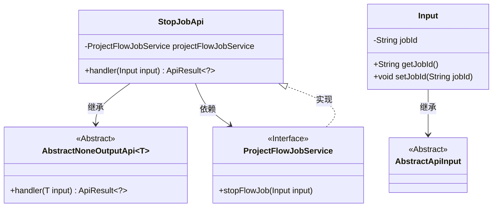
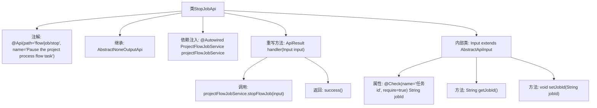

# 基础信息

|      |      |
|------|------|
| 名称 | StopJobApi |
| 编码语言 | .java |
| 代码路径 | WeFe/board/board-service/src/main/java/com/welab/wefe/board/service/api/project/job/StopJobApi.java |
| 包名 | com.welab.wefe.board.service.api.project.job |
| 依赖项 | ['com.welab.wefe.board.service.service.ProjectFlowJobService', 'com.welab.wefe.common.exception.StatusCodeWithException', 'com.welab.wefe.common.fieldvalidate.annotation.Check', 'com.welab.wefe.common.web.api.base.AbstractNoneOutputApi', 'com.welab.wefe.common.web.api.base.Api', 'com.welab.wefe.common.web.dto.AbstractApiInput', 'com.welab.wefe.common.web.dto.ApiResult', 'org.springframework.beans.factory.annotation.Autowired'] |
| 概述说明 | 停止项目流程任务的API，接收任务ID作为必填参数，调用ProjectFlowJobService处理停止操作。 |

# 说明

该代码定义了一个名为StopJobApi的API类，用于暂停项目流程任务。API路径为flow/job/stop，通过ProjectFlowJobService服务处理停止任务请求。输入参数Input包含一个必填字段jobId（任务ID），并通过校验确保其非空。处理逻辑调用stopFlowJob方法并返回成功结果。整个类继承自AbstractNoneOutputApi，不返回具体输出数据。

# 类列表 Class Summary

| 名称   | 类型  | 说明 |
|-------|------|-------------|
| StopJobApi | class | 停止项目流程任务的API，接收任务ID作为必填参数，调用服务层停止指定任务并返回成功结果。 |

## 类 StopJobApi

|      |      |
|------|------|
| 访问范围 | @Api(path = "flow/job/stop", name = "Pause the project process flow task");public |
| 类型 | class |
| 名称 | StopJobApi |
| 说明 | 停止项目流程任务的API，接收任务ID作为必填参数，调用服务层停止指定任务并返回成功结果。 |

### UML类图

这段代码展示了一个停止项目流程任务的API实现。StopJobApi继承自泛型抽象类AbstractNoneOutputApi，处理包含任务ID的输入参数，并通过ProjectFlowJobService接口实现具体业务逻辑。输入类Input继承自AbstractApiInput，包含必要的任务ID字段及校验注解。整体结构体现了清晰的层次关系和依赖注入的使用。

### 内部方法调用关系图

这段代码定义了一个名为StopJobApi的API类，用于暂停项目流程任务。该类继承自AbstractNoneOutputApi，并通过@Autowired注入ProjectFlowJobService服务。主要逻辑在handler方法中实现，调用projectFlowJobService.stopFlowJob(input)来停止任务，然后返回成功结果。Input内部类包含一个必填的任务ID字段jobId及其getter/setter方法。整个流程清晰展示了从API入口到服务调用的完整处理链。

### 字段列表 Field List

| 名称  | 类型  | 说明 |
|-------|-------|------|
| projectFlowJobService | ProjectFlowJobService | 使用@Autowired自动注入ProjectFlowJobService服务实例。 |

### 方法列表

| 名称  | 类型  | 说明 |
|-------|-------|------|
| handler | ApiResult<?> | 代码重写handler方法，调用projectFlowJobService停止流程任务，成功返回结果。 |

