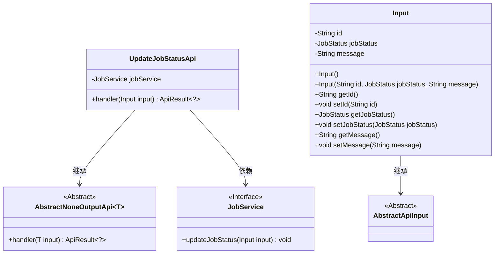

# 基础信息

|      |      |
|------|------|
| 名称 | UpdateJobStatusApi |
| 编码语言 | .java |
| 代码路径 | WeFe/board/board-service/src/main/java/com/welab/wefe/board/service/api/project/job/UpdateJobStatusApi.java |
| 包名 | com.welab.wefe.board.service.api.project.job |
| 依赖项 | ['com.welab.wefe.board.service.service.JobService', 'com.welab.wefe.common.exception.StatusCodeWithException', 'com.welab.wefe.common.fieldvalidate.annotation.Check', 'com.welab.wefe.common.web.api.base.AbstractNoneOutputApi', 'com.welab.wefe.common.web.api.base.Api', 'com.welab.wefe.common.web.dto.AbstractApiInput', 'com.welab.wefe.common.web.dto.ApiResult', 'com.welab.wefe.common.wefe.enums.JobStatus', 'org.springframework.beans.factory.annotation.Autowired'] |
| 概述说明 | 更新任务状态的API接口，接收任务ID、状态和备注信息，调用JobService更新状态并返回成功结果。 |

# 说明

该代码定义了一个名为UpdateJobStatusApi的API类，用于更新任务状态。API路径为project/job/update/status，继承自AbstractNoneOutputApi，输入类型为内部类Input。Input类包含三个字段：必填的id和jobStatus，以及可选的message。API通过注入的JobService调用updateJobStatus方法处理输入，成功后返回空结果。所有输入字段均通过注解进行校验。

# 类列表 Class Summary

| 名称   | 类型  | 说明 |
|-------|------|-------------|
| UpdateJobStatusApi | class | 更新任务状态的API，接收任务ID、状态和备注信息，调用JobService更新状态并返回成功结果。 |

## 类 UpdateJobStatusApi

|      |      |
|------|------|
| 访问范围 | @Api(path = "project/job/update/status", name = "Update the status of the job");public |
| 类型 | class |
| 名称 | UpdateJobStatusApi |
| 说明 | 更新任务状态的API，接收任务ID、状态和备注信息，调用JobService更新状态并返回成功结果。 |

### UML类图

类图描述：
该图展示了UpdateJobStatusApi及其相关类的结构。UpdateJobStatusApi继承自泛型类AbstractNoneOutputApi<Input>，并依赖JobService接口。Input作为内部类继承自AbstractApiInput，包含id、jobStatus和message三个私有字段及对应的getter/setter方法。JobService作为接口提供updateJobStatus方法。整个结构体现了通过API更新任务状态时各组件间的层级和调用关系。

### 内部方法调用关系图

```mermaid
graph TD
    A["类UpdateJobStatusApi"]
    B["注解: @Api"]
    C["继承: AbstractNoneOutputApi<Input>"]
    D["依赖注入: @Autowired JobService"]
    E["重写方法: handler(Input input)"]
    F["内部类: Input"]
    G["构造方法: Input()"]
    H["构造方法: Input(String id, JobStatus jobStatus, String message)"]
    I["校验注解: @Check id"]
    J["校验注解: @Check jobStatus"]
    K["校验注解: @Check message"]
    L["方法: getId/setId"]
    M["方法: getJobStatus/setJobStatus"]
    N["方法: getMessage/setMessage"]
    O["调用: jobService.updateJobStatus(input)"]
    P["返回: success()"]

    A --> B
    A --> C
    A --> D
    A --> E
    A --> F
    F --> G
    F --> H
    F --> I
    F --> J
    F --> K
    F --> L
    F --> M
    F --> N
    E --> O
    E --> P
```

这段代码定义了一个用于更新任务状态的API类UpdateJobStatusApi，它继承自抽象基类并实现了带输入参数的请求处理。核心流程是通过JobService更新任务状态，内部类Input封装了任务ID、状态和备注信息，并使用@Check注解进行参数校验。流程图展示了类结构、依赖关系和方法调用链，重点呈现了输入参数的构造与校验过程，以及实际业务逻辑的处理路径。

### 字段列表 Field List

| 名称  | 类型  | 说明 |
|-------|-------|------|
| jobService | JobService | 使用@Autowired自动注入JobService实例。 |

### 方法列表

| 名称  | 类型  | 说明 |
|-------|-------|------|
| handler | ApiResult<?> | Java方法重写，调用jobService更新任务状态，成功返回ApiResult。 |

