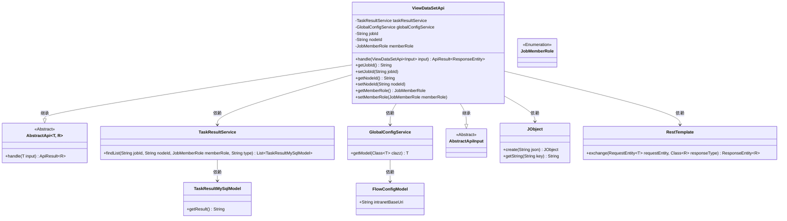
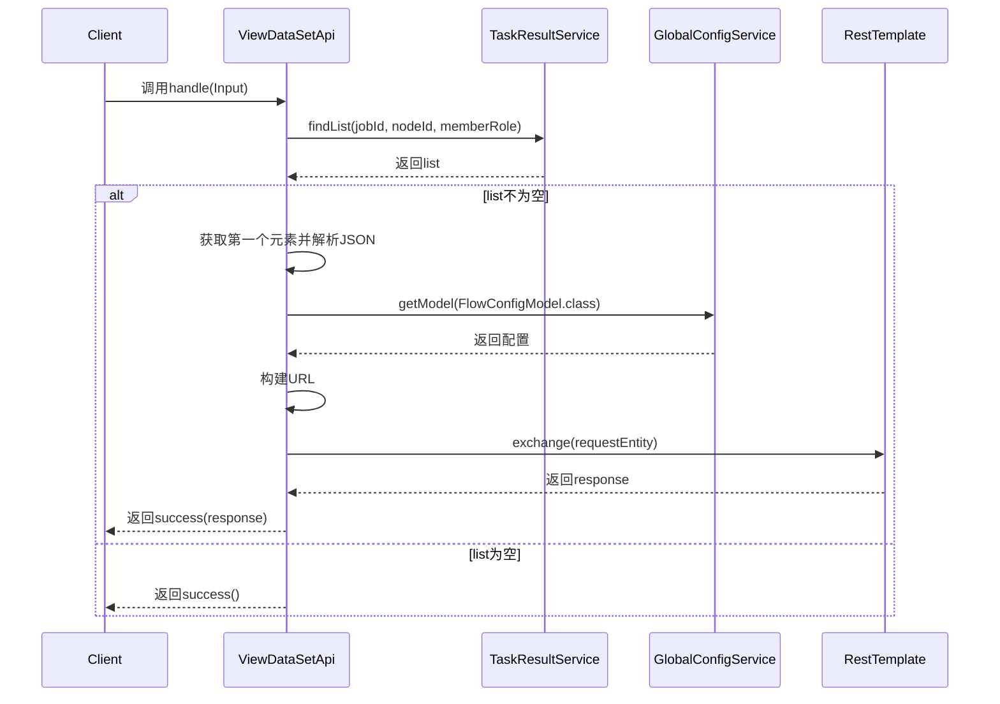

# 基础信息

|      |      |
|------|------|
| 名称 | ViewDataSetApi |
| 编码语言 | .java |
| 代码路径 | WeFe/board/board-service/src/main/java/com/welab/wefe/board/service/api/project/job/ViewDataSetApi.java |
| 包名 | com.welab.wefe.board.service.api.project.job |
| 依赖项 | ['com.welab.wefe.board.service.database.entity.job.TaskResultMySqlModel', 'com.welab.wefe.board.service.service.TaskResultService', 'com.welab.wefe.board.service.service.globalconfig.GlobalConfigService', 'com.welab.wefe.common.exception.StatusCodeWithException', 'com.welab.wefe.common.fieldvalidate.annotation.Check', 'com.welab.wefe.common.util.JObject', 'com.welab.wefe.common.util.UrlUtil', 'com.welab.wefe.common.web.api.base.AbstractApi', 'com.welab.wefe.common.web.api.base.Api', 'com.welab.wefe.common.web.dto.AbstractApiInput', 'com.welab.wefe.common.web.dto.ApiResult', 'com.welab.wefe.common.wefe.dto.global_config.FlowConfigModel', 'com.welab.wefe.common.wefe.enums.JobMemberRole', 'org.springframework.beans.factory.annotation.Autowired', 'org.springframework.http.HttpMethod', 'org.springframework.http.RequestEntity', 'org.springframework.http.ResponseEntity', 'org.springframework.web.client.RestTemplate', 'java.util.List'] |
| 概述说明 | ViewDataSetApi类处理数据集查看请求，通过任务ID、节点ID和角色获取数据，生成URL并调用内部服务返回结果。 |

# 说明

ViewDataSetApi类是一个处理数据集视图请求的API，继承自AbstractApi。它通过taskResultService和globalConfigService获取任务结果和全局配置。主要功能是根据输入的jobId、nodeId和memberRole查询数据，构建URL并发送GET请求获取数据集视图。输入参数包括必填的jobId、nodeId和memberRole，通过getter/setter方法访问。成功时返回响应实体，否则返回空成功结果。

# 类列表 Class Summary

| 名称   | 类型  | 说明 |
|-------|------|-------------|
| ViewDataSetApi | class | ViewDataSetApi类处理数据集查看请求，通过任务ID、节点ID和角色获取数据，生成URL并调用RestTemplate返回结果。输入参数包括jobId、nodeId和memberRole。 |

## 类 ViewDataSetApi

|      |      |
|------|------|
| 访问范围 | @Api(path = "job/data_set/view", name = "view data set data rows");public |
| 类型 | class |
| 名称 | ViewDataSetApi |
| 说明 | ViewDataSetApi类处理数据集查看请求，通过任务ID、节点ID和角色获取数据，生成URL并调用RestTemplate返回结果。输入参数包括jobId、nodeId和memberRole。 |

### UML类图

这段代码展示了一个名为`ViewDataSetApi`的API类，继承自`AbstractApi`，用于处理数据集查看请求。它依赖`TaskResultService`和`GlobalConfigService`来获取任务结果和全局配置信息，并通过`RestTemplate`发起HTTP请求。输入参数封装在嵌套类`Input`中，继承自`AbstractApiInput`。代码涉及多个服务交互和数据处理，包括JSON解析和HTTP通信，整体设计符合分层架构原则。

### 内部方法调用关系图

```mermaid
graph TD
    A["类ViewDataSetApi"]
    B["继承: AbstractApi<Input, ResponseEntity>"]
    C["依赖: TaskResultService taskResultService"]
    D["依赖: GlobalConfigService globalConfigService"]
    E["重写方法: handle(Input input)"]
    F["静态内部类: Input"]
    G["属性: String jobId"]
    H["属性: String nodeId"]
    I["属性: JobMemberRole memberRole"]
    J["方法: getter/setter"]

    A --> B
    A --> C
    A --> D
    A --> E
    A --> F
    F --> G
    F --> H
    F --> I
    F --> J

    subgraph handle流程
        E1["调用taskResultService.findList"]
        E2["检查list是否为空"]
        E3["获取第一个TaskResultMySqlModel"]
        E4["解析JSON结果"]
        E5["获取table_name和table_namespace"]
        E6["构建URL"]
        E7["创建RequestEntity"]
        E8["调用RestTemplate.exchange"]
        E9["返回success(response)"]
        E10["返回success()"]

        E --> E1
        E1 --> E2
        E2 --"是"--> E3
        E3 --> E4
        E4 --> E5
        E5 --> E6
        E6 --> E7
        E7 --> E8
        E8 --> E9
        E2 --"否"--> E10
    end
```

这段代码实现了一个数据视图API，主要功能是通过任务ID和节点ID查询任务结果，解析其中的表名和命名空间，然后构造URL访问数据集服务。流程图展示了类结构和核心处理逻辑，时序图详细描述了API调用的交互过程。该代码处理了查询结果为空和非空两种情况，并通过RestTemplate实现了跨服务调用，最终将结果封装返回。

### 字段列表 Field List

| 名称  | 类型  | 说明 |
|-------|-------|------|
| taskResultService | TaskResultService | 代码片段使用@Autowired注解自动注入TaskResultService实例。 |
| globalConfigService | GlobalConfigService | 使用@Autowired自动注入GlobalConfigService实例。 |

### 方法列表

| 名称  | 类型  | 说明 |
|-------|-------|------|
| handle | ApiResult<ResponseEntity> | 该方法处理数据集视图请求，通过任务ID和节点ID查询结果列表，若存在则构建URL并调用内部API获取数据，最后返回响应结果或空成功状态。 |

