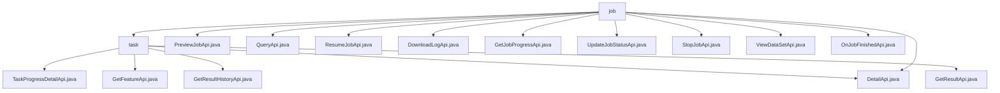

# 基础信息

|      |      |
|------|------|
| 名称 | job |
| 编码语言 | .java |
| 代码路径 | WeFe/board/board-service/src/main/java/com/welab/wefe/board/service/api/project/job |
| 包名 | docs.board.board-service.src.main.java.com.welab.wefe.board.service.api.project.job |
| 概述说明 | 任务管理API模块，提供任务进度查询、详情查看、历史追溯等功能，遵循REST规范，依赖Spring框架，支持全生命周期管理，包括预览、查询、恢复、下载日志、更新状态、停止任务等操作。 |

# 说明

## 概述  
该模块核心职责是实现任务全生命周期管理，提供创建、查询、暂停、恢复及进度监控等功能，类似工单系统的工作流跟踪。接口规范统一采用REST风格，路径前缀为`flow/job/`或`project/job/`，继承`AbstractApi`基类，输入输出均通过校验注解保障数据有效性。关键数据结构包括`TaskProgressOuputModel`、`JobListOutputModel`和`JobOutputModel`，通过`TaskService`等服务层组件实现数据映射。外部依赖集中于Spring框架和内部服务（如`ProjectFlowJobService`）。例如`PreviewJobApi`通过缓存机制优化流程图预览性能。

## 主要业务场景  
模块支持任务创建（如`PreviewJobApi`预生成流程图）、状态管理（如`StopJobApi`暂停任务）、结果查询（如`DetailApi`获取详情）和日志处理（如`DownloadLogApi`下载日志）。交互模式以同步HTTP为主，API类型覆盖GET查询（如`QueryApi`分页检索）和POST操作（如`ResumeJobApi`恢复任务）。典型场景包括：用户通过组合条件（如`flowId+nodeId`）精确查询任务；系统通过`OnJobFinishedApi`回调通知任务完成。例如`GetJobProgressApi`同时支持本地/远程进度聚合，实现分布式监控。

### 包内部结构视图

该流程图展示了项目任务模块的层级结构，顶层为job目录，包含直接接口文件如PreviewJobApi.java等，以及子目录task。task目录下包含多个任务相关接口文件，如TaskProgressDetailApi.java等。整体结构清晰展现了接口文件在项目中的组织方式。

# 文件列表

| 名称   | 类型  | 说明 |
|-------|------|-------------|
| [PreviewJobApi.java](PreviewJobApi.md) | file | 预览流程执行过程的API，输入包含流程ID、是否使用缓存和终止节点，输出包含缓存结果统计和节点详情列表。 |
| [QueryApi.java](QueryApi.md) | file | QueryApi类用于查询流程执行记录，继承AbstractApi，输入包含流程ID、任务ID、名称和状态，输出分页结果。调用flowJobService.query处理请求。 |
| [ResumeJobApi.java](ResumeJobApi.md) | file | 这是一个用于恢复任务的API类，路径为"flow/job/resume"，通过ProjectFlowJobService服务处理输入参数jobId来恢复指定任务，成功后返回空结果。 |
| [DownloadLogApi.java](DownloadLogApi.md) | file | DownloadLogApi类通过GET请求下载任务日志，需提供jobId参数，调用内部接口获取日志数据并返回字节数组响应。 |
| [GetJobProgressApi.java](GetJobProgressApi.md) | file | 获取任务执行进度API，支持本地和远程查询成员进度，返回任务ID对应的所有成员进度列表。 |
| [DetailApi.java](DetailApi.md) | file | 获取任务详情的API，通过flowId和jobId查询任务信息，包括任务列表和节点信息，支持按需返回任务执行结果。输入参数需校验flowId和jobId不能同时为空。 |
| [UpdateJobStatusApi.java](UpdateJobStatusApi.md) | file | 更新任务状态的API接口，接收任务ID、状态和备注信息，调用JobService更新状态并返回成功结果。 |
| [StopJobApi.java](StopJobApi.md) | file | 停止项目流程任务的API，接收任务ID作为必填参数，调用ProjectFlowJobService处理停止操作。 |
| [ViewDataSetApi.java](ViewDataSetApi.md) | file | ViewDataSetApi类处理数据集查看请求，通过任务ID、节点ID和角色获取数据，生成URL并调用内部服务返回结果。 |
| [OnJobFinishedApi.java](OnJobFinishedApi.md) | file | 定义了一个名为OnJobFinishedApi的API类，路径为project/job/finished，用于任务完成回调。需签名访问，接收jobId参数，调用ProjectFlowService处理任务完成逻辑。 |
| [task](task/_module.md) | package | TaskProgressDetailApi获取任务进度详情，路径task/progress/detail。GetFeatureApi获取特征列，路径flow/job/task/feature。DetailApi查询任务详情及结果，路径flow/job/task/detail。GetResultHistoryApi获取历史结果，路径flow/job/task/result_history。GetResultApi获取节点执行结果，路径flow/job/task/result。 |

