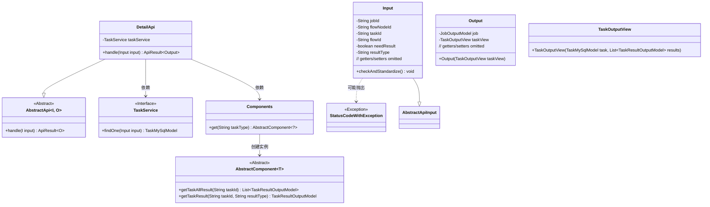
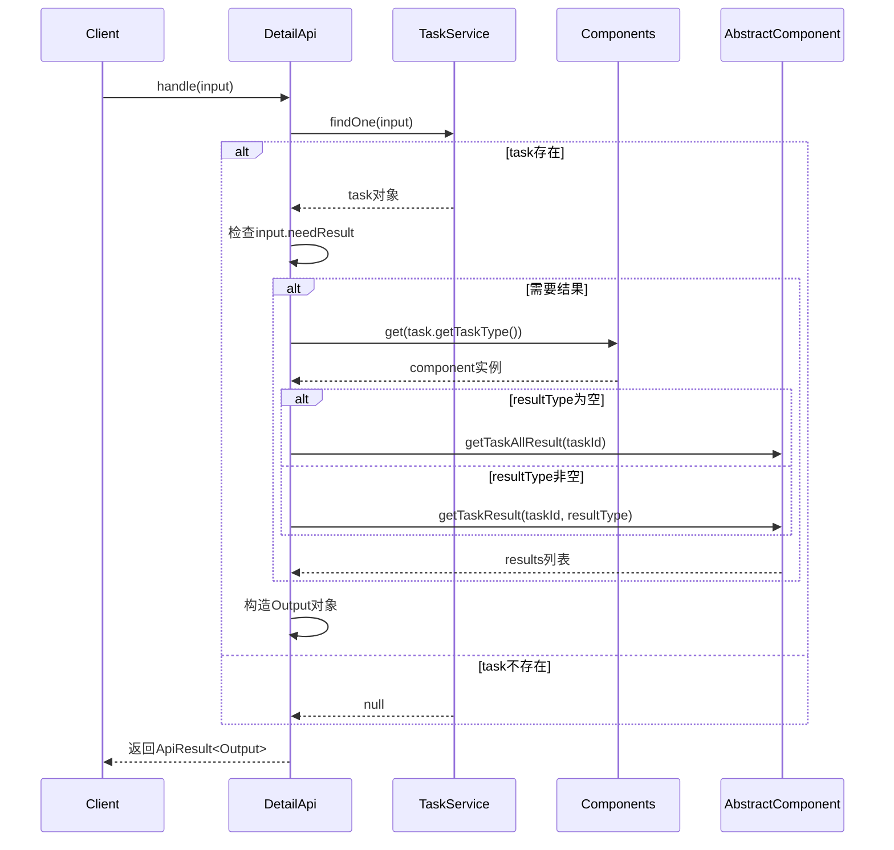

# 基础信息

|      |      |
|------|------|
| 名称 | DetailApi |
| 编码语言 | .java |
| 代码路径 | WeFe/board/board-service/src/main/java/com/welab/wefe/board/service/api/project/job/task/DetailApi.java |
| 包名 | com.welab.wefe.board.service.api.project.job.task |
| 依赖项 | ['com.welab.wefe.board.service.component.Components', 'com.welab.wefe.board.service.component.base.AbstractComponent', 'com.welab.wefe.board.service.database.entity.job.TaskMySqlModel', 'com.welab.wefe.board.service.dto.entity.job.JobOutputModel', 'com.welab.wefe.board.service.dto.entity.job.TaskOutputView', 'com.welab.wefe.board.service.dto.entity.job.TaskResultOutputModel', 'com.welab.wefe.board.service.service.TaskService', 'com.welab.wefe.common.StatusCode', 'com.welab.wefe.common.exception.StatusCodeWithException', 'com.welab.wefe.common.fieldvalidate.annotation.Check', 'com.welab.wefe.common.util.StringUtil', 'com.welab.wefe.common.web.api.base.AbstractApi', 'com.welab.wefe.common.web.api.base.Api', 'com.welab.wefe.common.web.dto.AbstractApiInput', 'com.welab.wefe.common.web.dto.ApiResult', 'org.springframework.beans.factory.annotation.Autowired', 'java.util.Arrays', 'java.util.List'] |
| 概述说明 | DetailApi类用于获取任务详情，通过TaskService查询任务信息，根据输入参数决定是否返回任务结果，并封装成Output输出。输入参数包括任务ID等，需校验必填项。 |

# 说明

DetailApi是一个用于获取任务详情的API类，继承自AbstractApi，处理输入Input和输出Output。通过TaskService查询任务信息，若任务不存在返回空结果。当输入参数needResult为true时，根据任务类型获取任务结果，支持按resultType筛选。输入类Input包含任务ID、流程节点ID等参数，并验证参数有效性。输出类Output包含任务视图TaskOutputView和任务模型JobOutputModel。该API路径为flow/job/task/detail，主要功能是查询任务详情及执行结果。

# 类列表 Class Summary

| 名称   | 类型  | 说明 |
|-------|------|-------------|
| DetailApi | class | 获取任务详情的API，根据输入参数查询任务信息，可选返回执行结果。输入需指定任务ID或流程节点ID，输出包含任务视图和可选结果列表。 |

## 类 DetailApi

|      |      |
|------|------|
| 访问范围 | @Api(path = "flow/job/task/detail", name = "get task detail");public |
| 类型 | class |
| 名称 | DetailApi |
| 说明 | 获取任务详情的API，根据输入参数查询任务信息，可选返回执行结果。输入需指定任务ID或流程节点ID，输出包含任务视图和可选结果列表。 |

### UML类图

类图描述：该图展示了任务详情查询API的类结构，核心是继承自AbstractApi的DetailApi类，通过TaskService获取任务数据，使用Components工厂获取具体组件处理结果。包含输入(Input)和输出(Output)两个嵌套类，其中Input类负责参数校验，Output类包装任务视图。异常处理通过StatusCodeWithException实现，体现了清晰的职责划分和依赖关系。

### 内部方法调用关系图

```mermaid
graph TD
    A["DetailApi类"]
    B["继承关系: AbstractApi<Input, Output>"]
    C["依赖注入: TaskService taskService"]
    D["主方法: handle(Input input)"]
    E["调用: taskService.findOne(input)"]
    F["条件判断: task == null"]
    G["返回: success()"]
    H["条件判断: input.needResult"]
    I["调用: Components.get(task.getTaskType())"]
    J["条件判断: StringUtil.isEmpty(input.resultType)"]
    K["调用: component.getTaskAllResult(task.getTaskId())"]
    L["调用: component.getTaskResult(task.getTaskId(), input.resultType)"]
    M["构造: Output(new TaskOutputView(task, results))"]
    N["返回: success(Output)"]
    O["嵌套类: Output"]
    P["嵌套类: Input"]

    A --> B
    A --> C
    A --> D
    D --> E
    E --> F
    F --是--> G
    F --否--> H
    H --是--> I
    I --> J
    J --是--> K
    J --否--> L
    H --否--> M
    K --> M
    L --> M
    M --> N
    A --> O
    A --> P
```

流程图描述：该流程图展示了DetailApi类的核心处理逻辑，从接收输入参数开始，通过TaskService查询任务数据，根据needResult标志决定是否获取任务结果，最终构造输出对象返回。嵌套类Input和Output分别处理参数校验和数据封装，整体流程包含多个条件分支和外部服务调用。

时序图描述：时序图清晰呈现了客户端调用DetailApi的handle方法后，依次与TaskService、Components等组件的交互过程，包括任务查询、结果获取等关键步骤，最终返回封装后的API结果，体现了各模块间的调用顺序和数据流向。

### 字段列表 Field List

| 名称  | 类型  | 说明 |
|-------|-------|------|
| taskService | TaskService | 使用@Autowired自动注入TaskService实例。 |

### 方法列表

| 名称  | 类型  | 说明 |
|-------|-------|------|
| handle | ApiResult<Output> | 处理输入并返回任务结果。若任务不存在返回成功；若需结果，根据任务类型获取全部或指定类型结果，最后返回包含任务和结果的输出。 |

