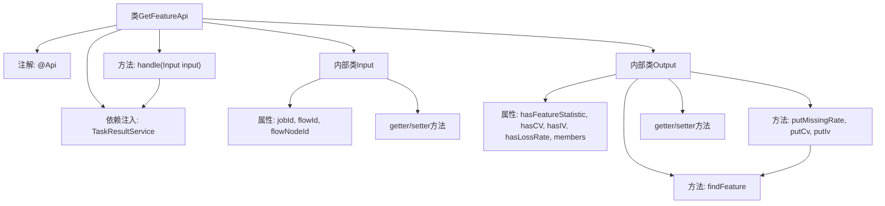

# 基础信息

|      |      |
|------|------|
| 名称 | GetFeatureApi |
| 编码语言 | .java |
| 代码路径 | WeFe/board/board-service/src/main/java/com/welab/wefe/board/service/api/project/job/task/GetFeatureApi.java |
| 包名 | com.welab.wefe.board.service.api.project.job.task |
| 依赖项 | ['com.alibaba.fastjson.annotation.JSONField', 'com.welab.wefe.board.service.dto.entity.MemberFeatureInfoModel', 'com.welab.wefe.board.service.service.TaskResultService', 'com.welab.wefe.common.exception.StatusCodeWithException', 'com.welab.wefe.common.fieldvalidate.annotation.Check', 'com.welab.wefe.common.web.api.base.AbstractApi', 'com.welab.wefe.common.web.api.base.Api', 'com.welab.wefe.common.web.dto.AbstractApiInput', 'com.welab.wefe.common.web.dto.ApiResult', 'com.welab.wefe.common.wefe.enums.JobMemberRole', 'org.springframework.beans.factory.annotation.Autowired', 'java.math.BigDecimal', 'java.math.RoundingMode', 'java.util.List', 'java.util.function.Function'] |
| 概述说明 | 获取特征计算输出结果的API，输入需流程ID和节点ID，输出包含特征统计、CV、IV等信息。 |

# 说明

该API类用于获取特征计算输出结果中的特征列，路径为flow/job/task/feature。输入参数包括jobId、必填的flowId和flowNodeId。输出包含特征统计信息标志、CV值标志、IV值标志、缺失率标志及成员特征信息列表。成员特征信息支持设置缺失率、CV值和IV值，并通过成员ID、角色和特征名查找对应特征对象。处理逻辑调用TaskResultService的getResultFeature方法获取结果。

# 类列表 Class Summary

| 名称   | 类型  | 说明 |
|-------|------|-------------|
| GetFeatureApi | class | 获取特征列表API，输入需流程ID和节点ID，输出包含特征统计、CV、IV、缺失率等信息。 |


## 类 GetFeatureApi

|      |      |
|------|------|
| 访问范围 | @Api(path = "flow/job/task/feature", name = "get feature list", desc = "Get the feature column in the output result of feature calculation in the parent node");public |
| 类型 | class |
| 名称 | GetFeatureApi |
| 说明 | 获取特征列表API，输入需流程ID和节点ID，输出包含特征统计、CV、IV、缺失率等信息。 |


### UML类图

```mermaid
classDiagram
    class GetFeatureApi {
        -TaskResultService taskResultService
        +handle(Input input) ApiResult~Output~
    }
    
    class AbstractApi~I,O~ {
        <<Abstract>>
    }
    
    class AbstractApiInput {
        <<Abstract>>
    }
    
    class Input {
        -String jobId
        -String flowId
        -String flowNodeId
        +getJobId() String
        +setJobId(String jobId)
        +getFlowId() String
        +setFlowId(String flowId)
        +getFlowNodeId() String
        +setFlowNodeId(String flowNodeId)
    }
    
    class Output {
        -boolean hasFeatureStatistic
        -boolean hasCV
        -boolean hasIV
        -boolean hasLossRate
        -List~MemberFeatureInfoModel~ members
        +putMissingRate(String memberId, JobMemberRole role, String featureName, double missingValue)
        +putCv(String memberId, JobMemberRole role, String featureName, double cv)
        +putIv(String memberId, JobMemberRole role, String featureName, double iv)
        +findFeature(String memberId, JobMemberRole role, String featureName) MemberFeatureInfoModel.Feature
        +get/set方法省略...
    }
    
    class MemberFeatureInfoModel {
        +getMemberId() String
        +getMemberRole() JobMemberRole
        +getFeatures() List~Feature~
    }
    
    class MemberFeatureInfoModel.Feature {
        -String name
        -double missingRate
        -double cv
        -double iv
        +getName() String
    }
    
    class TaskResultService {
        +getResultFeature(Input input) Output
    }
    
    AbstractApi~I,O~ <|-- GetFeatureApi : 继承
    AbstractApiInput <|-- Input : 继承
    GetFeatureApi --> TaskResultService : 依赖
    GetFeatureApi --> Input : 使用
    GetFeatureApi --> Output : 使用
    Output --> MemberFeatureInfoModel : 包含
    MemberFeatureInfoModel --> "Feature" : 包含
```

该代码实现了一个获取特征列表的API，核心类GetFeatureApi继承自泛型抽象类AbstractApi，处理Input参数并返回Output结果。Input类包含任务ID、流程ID和节点ID等校验字段，Output类封装了特征统计信息及成员特征数据，通过TaskResultService获取实际结果。MemberFeatureInfoModel及其内部类Feature构成了特征数据的嵌套结构，Output提供多种方法来操作特征值。整体设计采用分层结构，符合面向对象原则，通过服务类解耦业务逻辑。


### 内部方法调用关系图



流程图描述：该流程图展示了GetFeatureApi类的结构，包含主类及其两个内部类Input和Output。主类通过注解定义API路径，依赖注入TaskResultService，并实现核心处理方法handle。Input类包含三个校验字段及其访问方法，Output类则管理特征统计结果，提供多种put方法更新特征值，并通过findFeature方法查找特定特征。箭头清晰展示了类与方法的调用关系。

### 字段列表 Field List

| 名称  | 类型  | 说明 |
|-------|-------|------|
| taskResultService | TaskResultService | 自动注入TaskResultService服务实例。 |

### 方法列表

| 名称  | 类型  | 说明 |
|-------|-------|------|
| handle | ApiResult<Output> | 处理输入并返回任务结果服务的特征输出，成功时封装为ApiResult。 |


