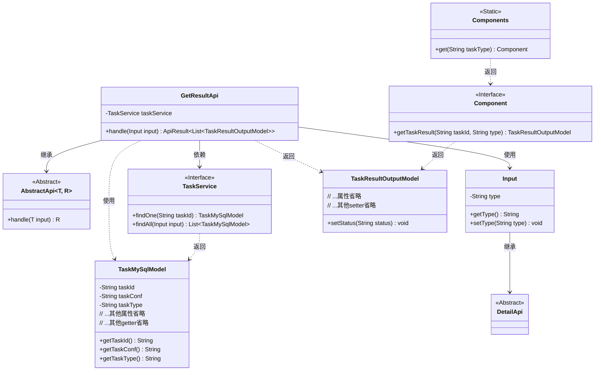
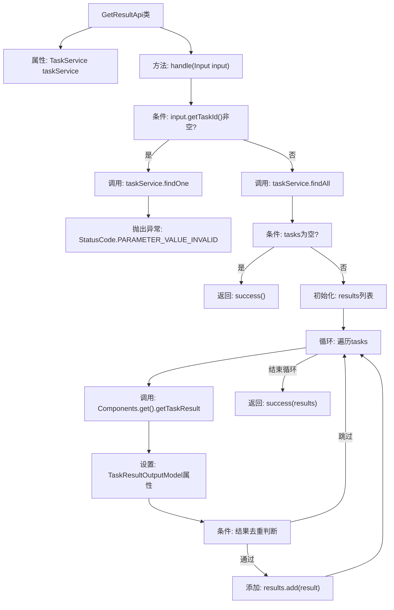

# 基础信息

|      |      |
|------|------|
| 名称 | GetResultApi |
| 编码语言 | .java |
| 代码路径 | WeFe/board/board-service/src/main/java/com/welab/wefe/board/service/api/project/job/task/GetResultApi.java |
| 包名 | com.welab.wefe.board.service.api.project.job.task |
| 依赖项 | ['com.alibaba.fastjson.JSON', 'com.welab.wefe.board.service.component.Components', 'com.welab.wefe.board.service.database.entity.job.TaskMySqlModel', 'com.welab.wefe.board.service.dto.entity.job.TaskResultOutputModel', 'com.welab.wefe.board.service.service.TaskService', 'com.welab.wefe.common.StatusCode', 'com.welab.wefe.common.exception.StatusCodeWithException', 'com.welab.wefe.common.fieldvalidate.annotation.Check', 'com.welab.wefe.common.util.JObject', 'com.welab.wefe.common.util.StringUtil', 'com.welab.wefe.common.web.api.base.AbstractApi', 'com.welab.wefe.common.web.api.base.Api', 'com.welab.wefe.common.web.dto.ApiResult', 'com.welab.wefe.common.wefe.enums.ComponentType', 'com.welab.wefe.common.wefe.enums.JobMemberRole', 'org.springframework.beans.factory.annotation.Autowired', 'java.util'] |
| 概述说明 | 获取任务执行结果的API，通过taskId或flowId加nodeId查询节点执行结果，返回包含任务状态、时间、配置等信息的列表。处理输入参数并调用TaskService获取数据，过滤重复结果后返回。 |

# 说明

该代码定义了一个名为GetResultApi的API类，用于通过taskId或flowId加nodeId获取节点执行结果。API路径为flow/job/task/result。处理逻辑包括：根据输入参数查询任务数据，若taskId存在则查询单个任务，否则查询所有匹配任务。查询结果为空时返回空列表，否则遍历任务数据，提取任务配置和结果信息，构建TaskResultOutputModel对象并填充任务详情。为避免重复结果，对特定类型的任务进行去重处理。输入参数Input继承自DetailApi.Input，包含一个结果类型字段type及其getter/setter方法。最终返回包含任务结果的列表。

# 类列表 Class Summary

| 名称   | 类型  | 说明 |
|-------|------|-------------|
| GetResultApi | class | GetResultApi类通过taskId或flowId+nodeId获取节点执行结果，调用TaskService查询任务数据并转换为TaskResultOutputModel输出列表，处理重复结果和异常情况。 |

## 类 GetResultApi

|      |      |
|------|------|
| 访问范围 | @Api(path = "flow/job/task/result", name = "get task result", desc = "Use taskId or flowId + nodeId to get the node execution result.");public |
| 类型 | class |
| 名称 | GetResultApi |
| 说明 | GetResultApi类通过taskId或flowId+nodeId获取节点执行结果，调用TaskService查询任务数据并转换为TaskResultOutputModel输出列表，处理重复结果和异常情况。 |

### UML类图

这段代码展示了一个获取任务结果的API类`GetResultApi`，它继承自泛型抽象类`AbstractApi`，通过`TaskService`查询任务数据，并将`TaskMySqlModel`转换为`TaskResultOutputModel`输出。类图清晰地呈现了核心类之间的关系：`GetResultApi`依赖服务层接口`TaskService`，使用嵌套类`Input`作为参数，通过静态类`Components`获取具体组件实现来处理不同类型任务的结果生成。整个设计体现了分层架构和依赖倒置原则，通过接口隔离具体实现。

### 内部方法调用关系图

流程图描述：该流程图展示了GetResultApi类的核心处理逻辑，从接收输入参数开始，根据taskId是否存在分别查询单个或多个任务数据，进行空值检查后遍历处理每个任务，通过Components组件获取任务结果并组装输出模型，最后进行结果去重判断并返回最终结果列表。整个过程包含异常处理和数据校验机制。

### 字段列表 Field List

| 名称  | 类型  | 说明 |
|-------|-------|------|
| taskService | TaskService | 自动注入TaskService实例。 |

### 方法列表

| 名称  | 类型  | 说明 |
|-------|-------|------|
| handle | ApiResult<List<TaskResultOutputModel>> | 方法根据输入查询任务列表，处理任务结果并返回。若指定taskId则查单个任务，否则查全部。结果包含任务状态、时间、配置等信息，并避免重复结果。 |

