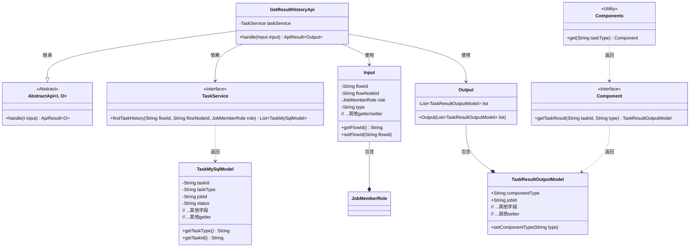
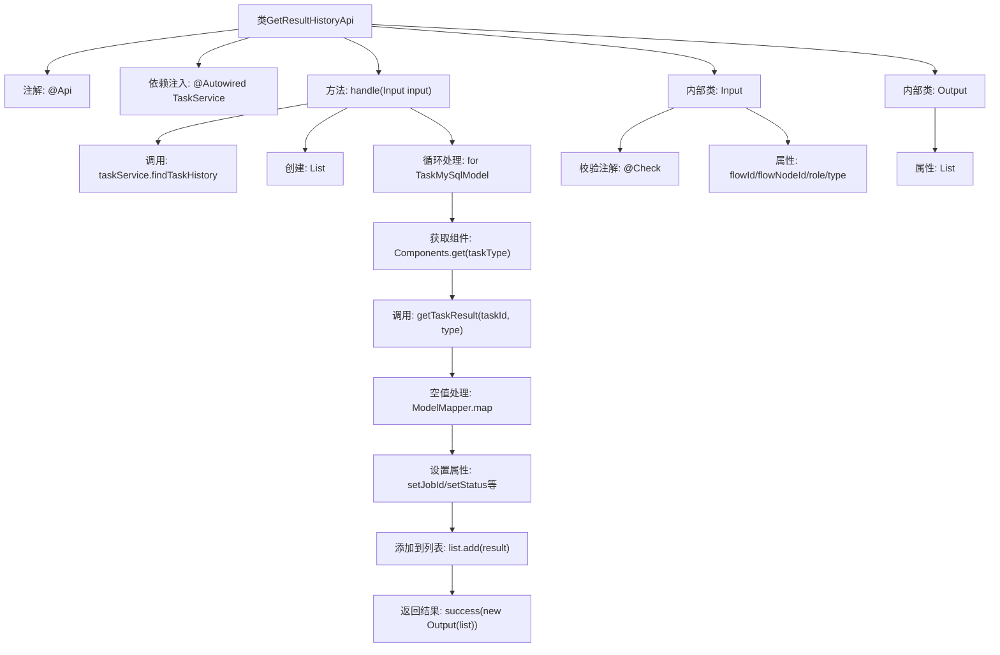

# 基础信息

|      |      |
|------|------|
| 名称 | GetResultHistoryApi |
| 编码语言 | .java |
| 代码路径 | WeFe/board/board-service/src/main/java/com/welab/wefe/board/service/api/project/job/task/GetResultHistoryApi.java |
| 包名 | com.welab.wefe.board.service.api.project.job.task |
| 依赖项 | ['com.alibaba.fastjson.JSON', 'com.welab.wefe.board.service.component.Components', 'com.welab.wefe.board.service.database.entity.job.TaskMySqlModel', 'com.welab.wefe.board.service.dto.entity.job.TaskResultOutputModel', 'com.welab.wefe.board.service.service.TaskService', 'com.welab.wefe.common.exception.StatusCodeWithException', 'com.welab.wefe.common.fieldvalidate.annotation.Check', 'com.welab.wefe.common.web.api.base.AbstractApi', 'com.welab.wefe.common.web.api.base.Api', 'com.welab.wefe.common.web.dto.AbstractApiInput', 'com.welab.wefe.common.web.dto.ApiResult', 'com.welab.wefe.common.web.util.ModelMapper', 'com.welab.wefe.common.wefe.enums.JobMemberRole', 'org.springframework.beans.factory.annotation.Autowired', 'java.util.ArrayList', 'java.util.List'] |
| 概述说明 | 获取任务历史执行结果的API，通过flowId、flowNodeId和role查询任务历史记录，返回包含任务详细信息的列表。 |

# 说明

GetResultHistoryApi类是一个用于获取任务历史执行结果的API接口，路径为flow/job/task/result_history。它继承自AbstractApi，处理输入Input和输出Output。通过TaskService查询指定流程ID、节点ID和角色的历史任务列表，并将每个任务的结果映射为TaskResultOutputModel对象，填充任务详情如状态、时间、错误信息等。输入参数包括必填的flowId、flowNodeId、role和可选的type，输出为包含任务结果列表的Output对象。

# 类列表 Class Summary

| 名称   | 类型  | 说明 |
|-------|------|-------------|
| GetResultHistoryApi | class | 获取任务历史执行结果的API，输入包含流程ID、节点ID、角色和结果类型，输出为任务结果列表。通过TaskService查询历史任务并映射为输出模型。 |

## 类 GetResultHistoryApi

|      |      |
|------|------|
| 访问范围 | @Api(path = "flow/job/task/result_history", name = "Get all historical execution results of task");public |
| 类型 | class |
| 名称 | GetResultHistoryApi |
| 说明 | 获取任务历史执行结果的API，输入包含流程ID、节点ID、角色和结果类型，输出为任务结果列表。通过TaskService查询历史任务并映射为输出模型。 |

### UML类图

该代码实现了一个获取任务历史执行结果的API。GetResultHistoryApi继承自AbstractApi，通过TaskService查询历史任务数据，并使用Components获取具体任务类型处理器来生成结果。Input类封装了流程ID、节点ID等查询参数，Output类包装了返回的任务结果列表。整个流程涉及任务查询、结果转换和数据组装，最终返回统一格式的API响应。

### 内部方法调用关系图

这段代码是获取任务历史执行结果的API实现，主要流程为：通过TaskService查询历史任务列表，遍历每个任务获取其执行结果，若结果不存在则映射基础信息，最后组装所有结果返回。Input类包含流程ID、节点ID等必要参数校验，Output类包装结果列表。流程图清晰展示了从参数校验到结果返回的完整处理链条。

### 字段列表 Field List

| 名称  | 类型  | 说明 |
|-------|-------|------|
| taskService | TaskService | 自动注入TaskService实例。 |

### 方法列表

| 名称  | 类型  | 说明 |
|-------|-------|------|
| handle | ApiResult<Output> | 该方法根据输入参数查询任务历史记录，遍历任务列表并生成结果输出模型。若结果为空则映射基础信息，填充任务详情后返回成功响应。 |

