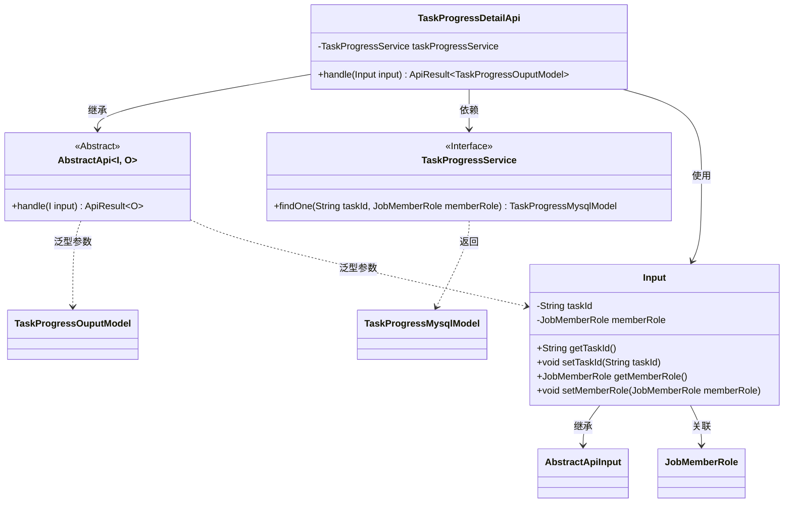

# 基础信息

|      |      |
|------|------|
| 名称 | TaskProgressDetailApi |
| 编码语言 | .java |
| 代码路径 | WeFe/board/board-service/src/main/java/com/welab/wefe/board/service/api/project/job/task/TaskProgressDetailApi.java |
| 包名 | com.welab.wefe.board.service.api.project.job.task |
| 依赖项 | ['com.welab.wefe.board.service.database.entity.job.TaskProgressMysqlModel', 'com.welab.wefe.board.service.dto.entity.job.TaskProgressOuputModel', 'com.welab.wefe.board.service.service.TaskProgressService', 'com.welab.wefe.common.exception.StatusCodeWithException', 'com.welab.wefe.common.fieldvalidate.annotation.Check', 'com.welab.wefe.common.web.api.base.AbstractApi', 'com.welab.wefe.common.web.api.base.Api', 'com.welab.wefe.common.web.dto.AbstractApiInput', 'com.welab.wefe.common.web.dto.ApiResult', 'com.welab.wefe.common.web.util.ModelMapper', 'com.welab.wefe.common.wefe.enums.JobMemberRole', 'org.springframework.beans.factory.annotation.Autowired'] |
| 概述说明 | 任务进度详情API类，通过任务ID和角色查询进度，返回映射后的输出模型。输入需校验任务ID和角色字段。 |

# 说明

该代码定义了一个名为TaskProgressDetailApi的API类，用于获取任务进度详情。API路径为task/progress/detail，继承自AbstractApi，输入类型为内部类Input，输出类型为TaskProgressOuputModel。通过TaskProgressService查询数据库中的任务进度信息，并映射为输出模型返回。输入参数包括必填的任务ID和成员角色，均通过校验注解确保非空。处理逻辑封装在handle方法中，成功时返回包含输出模型的ApiResult。

# 类列表 Class Summary

| 名称   | 类型  | 说明 |
|-------|------|-------------|
| TaskProgressDetailApi | class | 任务进度详情API，通过任务ID和角色查询进度，返回映射后的输出模型。 |

## 类 TaskProgressDetailApi

|      |      |
|------|------|
| 访问范围 | @Api(path = "task/progress/detail", name = "task progress details");public |
| 类型 | class |
| 名称 | TaskProgressDetailApi |
| 说明 | 任务进度详情API，通过任务ID和角色查询进度，返回映射后的输出模型。 |

### UML类图

这段代码展示了一个任务进度详情API的实现结构。TaskProgressDetailApi继承自泛型抽象类AbstractApi，处理Input输入并返回TaskProgressOuputModel结果。核心业务逻辑通过TaskProgressService接口实现，其中Input类封装了任务ID和成员角色参数，并进行了参数校验。整体设计采用了分层架构，通过泛型和依赖注入实现松耦合，符合现代Java API开发的最佳实践。

### 内部方法调用关系图

```mermaid
graph TD
    A["类TaskProgressDetailApi"]
    B["注解: @Api"]
    C["继承: AbstractApi<Input, TaskProgressOuputModel>"]
    D["依赖注入: @Autowired TaskProgressService"]
    E["重写方法: handle(Input input)"]
    F["嵌套类: Input"]
    G["属性: String taskId"]
    H["属性: JobMemberRole memberRole"]
    I["方法: getTaskId/setTaskId"]
    J["方法: getMemberRole/setMemberRole"]
    K["流程: taskProgressService.findOne"]
    L["流程: ModelMapper.map"]
    M["流程: return success(output)"]

    A --> B
    A --> C
    A --> D
    A --> E
    A --> F
    F --> G
    F --> H
    F --> I
    F --> J
    E --> K
    K --> L
    L --> M
```

这段代码定义了一个任务进度详情API类，继承自抽象API模板类，通过注解配置接口路径。核心处理逻辑在handle方法中：先通过任务ID和角色查询数据库记录，再转换为输出模型并返回成功响应。嵌套类Input定义了带校验规则的请求参数结构，包含任务ID和角色枚举两个必填字段。流程图清晰展示了类结构、依赖关系及主要处理流程。

### 字段列表 Field List

| 名称  | 类型  | 说明 |
|-------|-------|------|
| taskProgressService | TaskProgressService | 代码片段使用@Autowired自动注入TaskProgressService实例。 |

### 方法列表

| 名称  | 类型  | 说明 |
|-------|-------|------|
| handle | ApiResult<TaskProgressOuputModel> | 重写方法，根据输入查询任务进度并映射为输出模型，返回成功结果。 |

