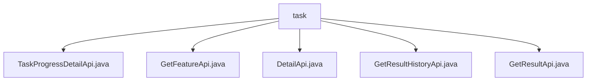

# 基础信息

|      |      |
|------|------|
| 名称 | task |
| 编码语言 | .java |
| 代码路径 | WeFe/board/board-service/src/main/java/com/welab/wefe/board/service/api/project/job/task |
| 包名 | docs.board.board-service.src.main.java.com.welab.wefe.board.service.api.project.job.task |
| 概述说明 | TaskProgressDetailApi获取任务进度详情，路径task/progress/detail。GetFeatureApi获取特征列，路径flow/job/task/feature。DetailApi查询任务详情及结果，路径flow/job/task/detail。GetResultHistoryApi获取历史结果，路径flow/job/task/result_history。GetResultApi获取节点执行结果，路径flow/job/task/result。 |

# 说明

## 概述  
该模块核心职责是提供任务管理相关API，包括进度查询、特征获取、详情查看和历史结果追溯等功能。接口规范遵循REST风格，路径均以`flow/job/task`或`task/progress`为前缀，继承`AbstractApi`基类，输入输出通过校验注解确保数据有效性。关键数据结构包含`TaskProgressOuputModel`（进度）、`TaskResultOutputModel`（结果）和`JobOutputModel`（任务模型），均通过服务层如`TaskProgressService`或`TaskService`从数据库映射。外部依赖仅涉及Spring框架和内部服务层组件。例如`GetFeatureApi`通过`TaskResultService`获取特征统计信息。

## 主要业务场景  
模块支持任务全生命周期管理，类似工单系统的工作流跟踪。典型场景包括：用户通过`DetailApi`查看任务详情及执行结果（如设置`needResult=true`获取结果）；通过`GetResultHistoryApi`追溯历史记录（按角色/类型筛选）；通过`TaskProgressDetailApi`监控实时进度。交互模式均为同步HTTP请求，API类型涵盖查询（GET）和条件检索（POST）。例如`GetResultApi`支持双参数查询策略：优先按`taskId`精确匹配，其次按`flowId+nodeId`组合查询，并对结果智能去重。

### 包内部结构视图

该流程图展示了WeFe项目中任务相关API的层级结构。根节点为task文件夹，包含5个Java文件节点：TaskProgressDetailApi、GetFeatureApi、DetailApi、GetResultHistoryApi和GetResultApi。所有API文件均直接隶属于task目录，没有中间子目录层级，形成清晰的扁平化结构。每个节点代表一个具体的API实现类，用于处理任务进度、特征获取、详情查询等不同功能。

# 文件列表

| 名称   | 类型  | 说明 |
|-------|------|-------------|
| [TaskProgressDetailApi.java](TaskProgressDetailApi.md) | file | 任务进度详情API类，通过任务ID和角色查询进度，返回映射后的输出模型。输入需校验任务ID和角色字段。 |
| [GetFeatureApi.java](GetFeatureApi.md) | file | 获取特征计算输出结果的API，输入需流程ID和节点ID，输出包含特征统计、CV、IV等信息。 |
| [DetailApi.java](DetailApi.md) | file | DetailApi类用于获取任务详情，通过TaskService查询任务信息，根据输入参数决定是否返回任务结果，并封装成Output输出。输入参数包括任务ID等，需校验必填项。 |
| [GetResultHistoryApi.java](GetResultHistoryApi.md) | file | 获取任务历史执行结果的API，通过flowId、flowNodeId和role查询任务历史记录，返回包含任务详细信息的列表。 |
| [GetResultApi.java](GetResultApi.md) | file | 获取任务执行结果的API，通过taskId或flowId加nodeId查询节点执行结果，返回包含任务状态、时间、配置等信息的列表。处理输入参数并调用TaskService获取数据，过滤重复结果后返回。 |

