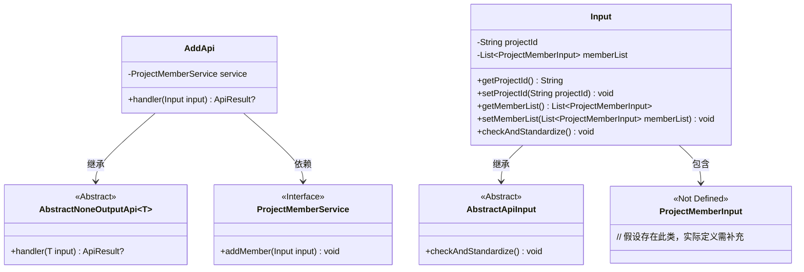
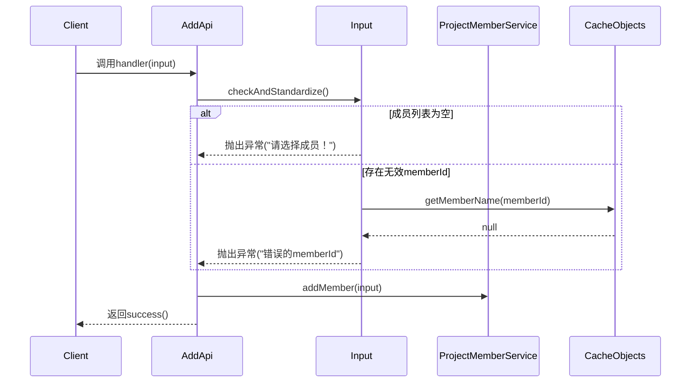

# 基础信息

|      |      |
|------|------|
| 名称 | AddApi |
| 编码语言 | .java |
| 代码路径 | WeFe/board/board-service/src/main/java/com/welab/wefe/board/service/api/project/member/AddApi.java |
| 包名 | com.welab.wefe.board.service.api.project.member |
| 依赖项 | ['com.welab.wefe.board.service.dto.entity.ProjectMemberInput', 'com.welab.wefe.board.service.service.CacheObjects', 'com.welab.wefe.board.service.service.ProjectMemberService', 'com.welab.wefe.common.StatusCode', 'com.welab.wefe.common.exception.StatusCodeWithException', 'com.welab.wefe.common.fieldvalidate.annotation.Check', 'com.welab.wefe.common.web.api.base.AbstractNoneOutputApi', 'com.welab.wefe.common.web.api.base.Api', 'com.welab.wefe.common.web.dto.AbstractApiInput', 'com.welab.wefe.common.web.dto.ApiResult', 'org.apache.commons.collections4.CollectionUtils', 'org.springframework.beans.factory.annotation.Autowired', 'java.util.List'] |
| 概述说明 | 这是一个添加项目成员的API类，包含项目ID和成员列表的输入验证，调用ProjectMemberService添加成员，成功返回空结果。 |

# 说明

这是一个名为AddApi的Java类，用于添加项目成员。它继承自AbstractNoneOutputApi，处理输入类型为Input。类中包含一个ProjectMemberService的自动注入实例，handler方法调用service.addMember处理输入并返回成功结果。Input内部类继承AbstractApiInput，包含两个必填字段：projectId和memberList，分别表示项目ID和成员列表。checkAndStandardize方法验证输入，确保memberList非空且每个成员的memberId有效，否则抛出异常。

# 类列表 Class Summary

| 名称   | 类型  | 说明 |
|-------|------|-------------|
| AddApi | class | 这是一个添加项目成员的API类，路径为"project/member/add"。它接收项目ID和成员列表作为输入，验证输入有效性后调用服务添加成员。输入校验包括非空检查和成员ID有效性检查。 |

## 类 AddApi

|      |      |
|------|------|
| 访问范围 | @Api(path = "project/member/add", name = "add project member");public |
| 类型 | class |
| 名称 | AddApi |
| 说明 | 这是一个添加项目成员的API类，路径为"project/member/add"。它接收项目ID和成员列表作为输入，验证输入有效性后调用服务添加成员。输入校验包括非空检查和成员ID有效性检查。 |

### UML类图

该类图展示了AddApi及其相关类的结构关系。AddApi继承自泛型类AbstractNoneOutputApi，并依赖ProjectMemberService接口实现成员添加功能。Input作为嵌套类继承AbstractApiInput，包含项目ID和成员列表字段，通过checkAndStandardize方法验证参数有效性。ProjectMemberInput作为成员项的数据载体，具体定义需补充。整体结构体现了API层对输入参数的标准化校验和业务逻辑处理的分层设计。

### 内部方法调用关系图

```mermaid
graph TD
    A["类AddApi"]
    B["注解: @Api(path='project/member/add', name='add project member')"]
    C["继承: AbstractNoneOutputApi<Input>"]
    D["依赖注入: @Autowired ProjectMemberService service"]
    E["重写方法: handler(Input input)"]
    F["静态内部类: Input"]
    G["属性: String projectId"]
    H["属性: List<ProjectMemberInput> memberList"]
    I["方法: getProjectId/setProjectId"]
    J["方法: getMemberList/setMemberList"]
    K["重写方法: checkAndStandardize()"]
    L["校验逻辑: CollectionUtils.isEmpty(memberList)"]
    M["循环校验: CacheObjects.getMemberName(item.memberId)"]
    N["抛出异常: StatusCodeWithException"]

    A --> B
    A --> C
    A --> D
    A --> E
    A --> F
    F --> G
    F --> H
    F --> I
    F --> J
    F --> K
    K --> L
    K --> M
    L --> N
    M --> N
```

流程图描述：该流程图展示了AddApi类的结构及其内部类Input的详细组成。AddApi作为API入口继承抽象类，通过ProjectMemberService执行业务逻辑。Input类包含项目ID和成员列表属性，并在checkAndStandardize方法中进行参数校验，包括非空检查和成员ID有效性验证，任何校验失败都会抛出特定异常。

时序图描述：时序图描述了从客户端调用到最终响应的完整流程。首先进行输入参数校验，若成员列表为空或存在无效成员ID则立即返回错误，否则通过ProjectMemberService添加成员后返回成功结果。校验过程涉及与CacheObjects的交互以验证成员ID有效性。

### 字段列表 Field List

| 名称  | 类型  | 说明 |
|-------|-------|------|
| service | ProjectMemberService | 自动注入ProjectMemberService服务实例。 |

### 方法列表

| 名称  | 类型  | 说明 |
|-------|-------|------|
| handler | ApiResult<?> | 处理输入并调用服务添加成员，成功后返回结果。 |

