# 基础信息

|      |      |
|------|------|
| 名称 | ExitProjectApi |
| 编码语言 | .java |
| 代码路径 | WeFe/board/board-service/src/main/java/com/welab/wefe/board/service/api/project/member/ExitProjectApi.java |
| 包名 | com.welab.wefe.board.service.api.project.member |
| 依赖项 | ['com.welab.wefe.board.service.service.ProjectService', 'com.welab.wefe.common.exception.StatusCodeWithException', 'com.welab.wefe.common.fieldvalidate.annotation.Check', 'com.welab.wefe.common.web.api.base.AbstractNoneOutputApi', 'com.welab.wefe.common.web.api.base.Api', 'com.welab.wefe.common.web.dto.AbstractApiInput', 'com.welab.wefe.common.web.dto.ApiResult', 'org.springframework.beans.factory.annotation.Autowired'] |
| 概述说明 | 定义退出项目API，需传入项目ID，调用ProjectService处理退出逻辑，无返回数据。 |

# 说明

该代码定义了一个名为ExitProjectApi的API类，用于处理用户退出项目的请求。API路径为"project/exit"，名称为"退出项目"。它继承自AbstractNoneOutputApi，输入参数为内部类Input，包含一个必填字段projectId（项目id）。处理逻辑通过ProjectService的exitProject方法实现，成功后返回空结果。整个API封装了退出项目的功能，包含输入验证和业务逻辑调用。

# 类列表 Class Summary

| 名称   | 类型  | 说明 |
|-------|------|-------------|
| ExitProjectApi | class | 定义退出项目API，需传入项目ID，调用ProjectService处理退出逻辑，无返回数据。 |


## 类 ExitProjectApi

|      |      |
|------|------|
| 访问范围 | @Api(path = "project/exit", name = "退出项目", desc = "exit project");public |
| 类型 | class |
| 名称 | ExitProjectApi |
| 说明 | 定义退出项目API，需传入项目ID，调用ProjectService处理退出逻辑，无返回数据。 |


### UML类图

```mermaid
classDiagram
    class ExitProjectApi {
        -ProjectService projectService
        +handler(Input input) ApiResult~?~
    }
    class AbstractNoneOutputApi~T~ {
        <<Abstract>>
        +handler(T input) ApiResult~?~
    }
    class ProjectService {
        <<Interface>>
        +exitProject(ExitProjectApi$Input input)
    }
    class ExitProjectApi$Input {
        -String projectId
        +String getProjectId()
        +void setProjectId(String projectId)
    }
    class AbstractApiInput {
        <<Abstract>>
    }

    ExitProjectApi --> AbstractNoneOutputApi~Input~ : 继承
    ExitProjectApi --> ProjectService : 依赖
    ExitProjectApi$Input --> AbstractApiInput : 继承
```

这段类图展示了退出项目API的结构设计。ExitProjectApi继承自泛型类AbstractNoneOutputApi，并依赖ProjectService接口实现业务逻辑。输入参数Input是嵌套静态类，继承自AbstractApiInput基类，包含项目ID字段及其访问方法。整个设计遵循了分层架构原则，通过继承实现代码复用，依赖接口降低耦合度，输入参数通过继承基础类获得通用校验能力。


### 内部方法调用关系图

```mermaid
graph TD
    A["类ExitProjectApi"]
    B["注解: @Api(path='project/exit', name='退出项目', desc='exit project')"]
    C["继承: AbstractNoneOutputApi<Input>"]
    D["依赖注入: @Autowired ProjectService"]
    E["重写方法: handler(Input input)"]
    F["内部类: Input"]
    G["校验注解: @Check(name='项目id', require=true)"]
    H["属性: String projectId"]
    I["方法: getProjectId()"]
    J["方法: setProjectId(String)"]
    K["调用: projectService.exitProject(input)"]
    L["返回: success()"]

    A --> B
    A --> C
    A --> D
    A --> E
    E --> K
    E --> L
    A --> F
    F --> G
    F --> H
    F --> I
    F --> J
```



该流程图展示了ExitProjectApi类的完整结构，从类注解、继承关系到内部类Input的细节。主要流程是handler方法接收输入参数后，调用projectService.exitProject()服务并返回成功结果。Input内部类包含项目ID字段及其getter/setter方法，并使用@Check注解进行参数校验。整个设计体现了清晰的层级关系和API处理逻辑。

### 字段列表 Field List

| 名称  | 类型  | 说明 |
|-------|-------|------|
| projectService | ProjectService | 使用@Autowired自动注入ProjectService实例。 |

### 方法列表

| 名称  | 类型  | 说明 |
|-------|-------|------|
| handler | ApiResult<?> | 该方法重写父类handler，调用projectService退出项目，输入为Input对象，成功返回空结果，异常抛出StatusCodeWithException。 |


