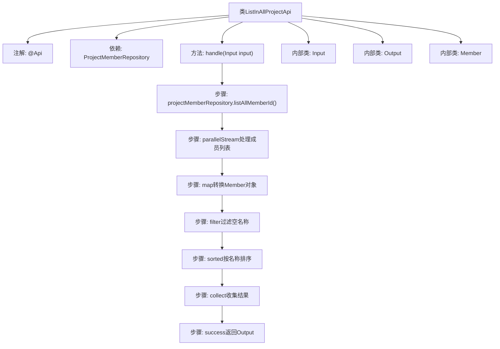

# 基础信息

|      |      |
|------|------|
| 名称 | ListInAllProjectApi |
| 编码语言 | .java |
| 代码路径 | WeFe/board/board-service/src/main/java/com/welab/wefe/board/service/api/project/member/ListInAllProjectApi.java |
| 包名 | com.welab.wefe.board.service.api.project.member |
| 依赖项 | ['com.welab.wefe.board.service.database.repository.ProjectMemberRepository', 'com.welab.wefe.board.service.service.CacheObjects', 'com.welab.wefe.common.exception.StatusCodeWithException', 'com.welab.wefe.common.util.StringUtil', 'com.welab.wefe.common.web.api.base.AbstractApi', 'com.welab.wefe.common.web.api.base.Api', 'com.welab.wefe.common.web.dto.AbstractApiInput', 'com.welab.wefe.common.web.dto.ApiResult', 'org.springframework.beans.factory.annotation.Autowired', 'java.util.Comparator', 'java.util.List', 'java.util.stream.Collectors'] |
| 概述说明 | 获取与我合作的所有成员列表的API，通过项目成员仓库查询并返回排序后的成员信息列表。 |

# 说明

该代码定义了一个名为ListInAllProjectApi的API类，用于获取与当前用户合作的所有成员列表。API路径为project/member/all，通过ProjectMemberRepository获取所有成员ID，并行处理后将ID与名称映射为Member对象，过滤掉名称为空的成员并按名称排序。输入类Input为空，输出类Output包含排序后的Member列表。Member类包含memberId和memberName两个字段。

# 类列表 Class Summary

| 名称   | 类型  | 说明 |
|-------|------|-------------|
| ListInAllProjectApi | class | 获取与我合作的所有成员列表的API，通过并行流处理成员ID，过滤并排序后返回成员信息列表。 |


## 类 ListInAllProjectApi

|      |      |
|------|------|
| 访问范围 | @Api(path = "project/member/all", name = "Get a list of all the members who work with me");public |
| 类型 | class |
| 名称 | ListInAllProjectApi |
| 说明 | 获取与我合作的所有成员列表的API，通过并行流处理成员ID，过滤并排序后返回成员信息列表。 |


### UML类图

```mermaid
classDiagram
    class ListInAllProjectApi {
        -ProjectMemberRepository projectMemberRepository
        +handle(Input input) ApiResult~Output~
    }
    <<interface>> AbstractApi~Input, Output~
    ListInAllProjectApi --|> AbstractApi~Input, Output~ : 继承
    ListInAllProjectApi --> ProjectMemberRepository : 依赖
    ListInAllProjectApi --> Input : 包含
    ListInAllProjectApi --> Output : 包含
    ListInAllProjectApi --> Member : 包含

    class AbstractApi~T, R~ {
        <<Interface>>
        +handle(T input) ApiResult~R~
    }

    class Input {
    }
    Input --|> AbstractApiInput : 继承

    class Output {
        -List~Member~ list
        +Output(List~Member~ list)
        +getList() List~Member~
        +setList(List~Member~ list) void
    }

    class Member {
        +String memberId
        +String memberName
        +Member()
        +Member(String memberId, String memberName)
    }

    class ProjectMemberRepository {
        +listAllMemberId() List~String~
    }
```

这段代码描述了一个用于获取所有项目成员列表的API类`ListInAllProjectApi`，它继承自泛型抽象类`AbstractApi`，包含输入参数`Input`和输出结果`Output`两个内部类。主要功能是通过`ProjectMemberRepository`获取成员ID列表，并行处理后将结果封装为包含`Member`对象的列表输出。类图中清晰地展示了继承关系、依赖关系和内部类结构，其中`Member`类存储成员ID和名称，`Output`封装结果列表，`ProjectMemberRepository`提供数据访问能力。


### 内部方法调用关系图



这段代码定义了一个API类，用于获取与当前用户合作的所有项目成员列表。流程图展示了从数据库查询成员ID开始，经过并行流处理、对象转换、空名过滤、按名称排序，最终返回结果列表的完整流程。内部类结构清晰，Input为空输入，Output包含成员列表，Member类存储成员ID和名称信息。

### 字段列表 Field List

| 名称  | 类型  | 说明 |
|-------|-------|------|
| projectMemberRepository | ProjectMemberRepository | 使用@Autowired自动注入ProjectMemberRepository实例。 |

### 方法列表

| 名称  | 类型  | 说明 |
|-------|-------|------|
| handle | ApiResult<Output> | 该方法从项目成员库获取所有成员ID，并行处理生成成员对象，过滤空名并按名称排序后返回结果列表。 |


