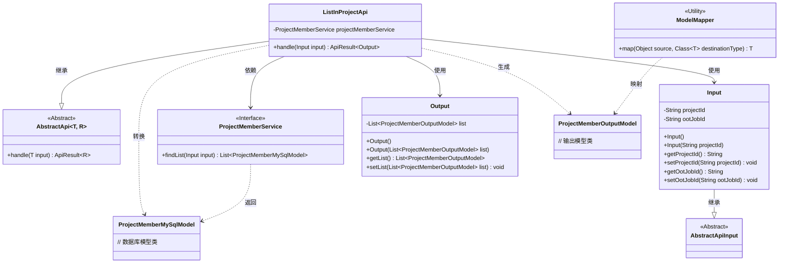
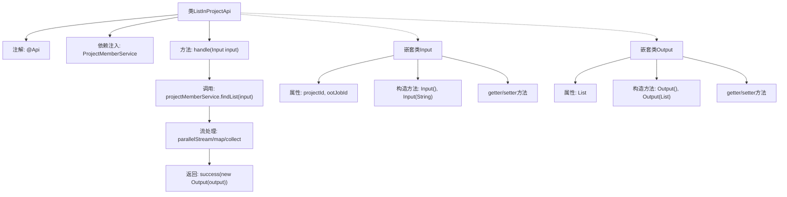

# 基础信息

|      |      |
|------|------|
| 名称 | ListInProjectApi |
| 编码语言 | .java |
| 代码路径 | WeFe/board/board-service/src/main/java/com/welab/wefe/board/service/api/project/member/ListInProjectApi.java |
| 包名 | com.welab.wefe.board.service.api.project.member |
| 依赖项 | ['com.welab.wefe.board.service.database.entity.job.ProjectMemberMySqlModel', 'com.welab.wefe.board.service.dto.entity.project.ProjectMemberOutputModel', 'com.welab.wefe.board.service.service.ProjectMemberService', 'com.welab.wefe.common.exception.StatusCodeWithException', 'com.welab.wefe.common.fieldvalidate.annotation.Check', 'com.welab.wefe.common.web.api.base.AbstractApi', 'com.welab.wefe.common.web.api.base.Api', 'com.welab.wefe.common.web.dto.AbstractApiInput', 'com.welab.wefe.common.web.dto.ApiResult', 'com.welab.wefe.common.web.util.ModelMapper', 'org.springframework.beans.factory.annotation.Autowired', 'java.util.List', 'java.util.stream.Collectors'] |
| 概述说明 | 获取项目成员列表的API，输入需项目ID，输出成员列表。使用ProjectMemberService查询数据并转换为输出模型。 |

# 说明

该代码定义了一个名为ListInProjectApi的API类，用于获取项目成员列表。它继承自AbstractApi，接受Input参数并返回Output结果。Input类包含必填的项目ID和可选的ootJobId字段。Output类包含项目成员列表。API通过projectMemberService查询成员数据，并使用并行流转换为输出模型。处理成功后返回包含成员列表的ApiResult。

# 类列表 Class Summary

| 名称   | 类型  | 说明 |
|-------|------|-------------|
| ListInProjectApi | class | 获取项目成员列表的API类，包含输入参数项目Id和输出成员列表，通过ProjectMemberService查询并映射结果。 |

## 类 ListInProjectApi

|      |      |
|------|------|
| 访问范围 | @Api(path = "project/member/list", name = "Get the list of members in the project");public |
| 类型 | class |
| 名称 | ListInProjectApi |
| 说明 | 获取项目成员列表的API类，包含输入参数项目Id和输出成员列表，通过ProjectMemberService查询并映射结果。 |

### UML类图

这段代码描述了一个项目成员列表查询API的实现结构。ListInProjectApi继承自泛型抽象类AbstractApi，处理Input参数并返回包含ProjectMemberOutputModel列表的Output结果。通过ProjectMemberService获取数据库模型后，使用ModelMapper转换为输出模型。Input类包含项目ID和作业ID字段，Output类封装输出列表。整个流程展现了从数据获取到结果转换的完整处理链，体现了清晰的层次结构和职责分离。

### 内部方法调用关系图

该流程图展示了ListInProjectApi类的核心结构和执行流程。类通过@Api注解定义接口，包含主要处理方法handle()，该方法首先调用服务层获取数据，然后通过并行流进行模型转换，最后返回封装结果。嵌套类Input和Output分别处理输入参数和输出数据，包含必要的属性和访问方法。整体呈现清晰的API处理链路和类结构关系。

### 字段列表 Field List

| 名称  | 类型  | 说明 |
|-------|-------|------|
| projectMemberService | ProjectMemberService | 自动注入ProjectMemberService实例。 |

### 方法列表

| 名称  | 类型  | 说明 |
|-------|-------|------|
| handle | ApiResult<Output> | 处理输入数据，查询项目成员列表并转换为输出模型，返回成功结果。 |

