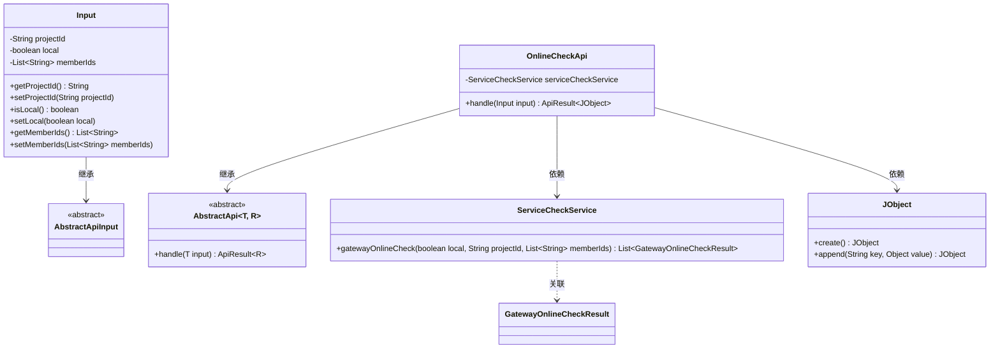

# 基础信息

|      |      |
|------|------|
| 名称 | OnlineCheckApi |
| 编码语言 | .java |
| 代码路径 | WeFe/board/board-service/src/main/java/com/welab/wefe/board/service/api/project/member/OnlineCheckApi.java |
| 包名 | com.welab.wefe.board.service.api.project.member |
| 依赖项 | ['com.welab.wefe.board.service.service.ServiceCheckService', 'com.welab.wefe.common.exception.StatusCodeWithException', 'com.welab.wefe.common.fieldvalidate.annotation.Check', 'com.welab.wefe.common.util.JObject', 'com.welab.wefe.common.web.api.base.AbstractApi', 'com.welab.wefe.common.web.api.base.Api', 'com.welab.wefe.common.web.dto.AbstractApiInput', 'com.welab.wefe.common.web.dto.ApiResult', 'org.springframework.beans.factory.annotation.Autowired', 'java.util.List'] |
| 概述说明 | OnlineCheckApi接口用于检查其他成员的网关和板卡连接状态。输入参数包括项目ID、是否本地和成员ID列表，返回连接状态结果列表。 |

# 说明

该代码定义了一个名为OnlineCheckApi的API类，用于检查其他成员的网关和板是否连接。API路径为project/member/online_check，接受包含项目ID、本地标志和成员ID列表的输入参数。通过调用serviceCheckService的gatewayOnlineCheck方法执行检查，并返回包含检查结果的JObject。输入类Input继承自AbstractApiInput，包含项目ID、本地标志和成员ID列表的字段及其getter和setter方法。

# 类列表 Class Summary

| 名称   | 类型  | 说明 |
|-------|------|-------------|
| OnlineCheckApi | class | 在线检查API，用于验证其他成员的网关和板连接状态。输入包括项目ID、本地标志和成员ID列表，返回连接检查结果列表。 |

## 类 OnlineCheckApi

|      |      |
|------|------|
| 访问范围 | @Api(;        path = "project/member/online_check",;        name = "Check if the gateway and board of other members are connected";);public |
| 类型 | class |
| 名称 | OnlineCheckApi |
| 说明 | 在线检查API，用于验证其他成员的网关和板连接状态。输入包括项目ID、本地标志和成员ID列表，返回连接检查结果列表。 |

### UML类图

这段代码描述了一个在线检查API的实现，用于验证其他成员的网关和板卡是否连接。OnlineCheckApi继承自泛型抽象类AbstractApi，处理输入参数Input并返回JObject格式的结果。Input类继承自AbstractApiInput，包含项目ID、本地标志和成员ID列表等字段。ServiceCheckService提供网关在线检查的核心功能，JObject用于构建JSON格式的响应结果。整个设计体现了清晰的层次结构和职责分离。

### 内部方法调用关系图

```mermaid
graph TD
    A["类OnlineCheckApi"]
    B["继承: AbstractApi<Input, JObject>"]
    C["注解: @Api"]
    D["依赖注入: @Autowired ServiceCheckService"]
    E["重写方法: handle(Input input)"]
    F["调用: serviceCheckService.gatewayOnlineCheck()"]
    G["返回: success(JObject)"]
    H["静态内部类Input"]
    I["属性: String projectId"]
    J["属性: boolean local"]
    K["属性: List<String> memberIds"]
    L["Getter/Setter方法"]

    A --> B
    A --> C
    A --> D
    A --> E
    E --> F
    E --> G
    A --> H
    H --> I
    H --> J
    H --> K
    H --> L
```

这段代码定义了一个名为OnlineCheckApi的API类，用于检查其他成员的网关和板卡是否连接。该类继承自AbstractApi，通过@ServiceCheckService执行实际的在线检查逻辑。流程图展示了类结构、依赖关系和方法调用流程，包括输入参数处理和服务调用过程。静态内部类Input封装了项目ID、本地标志和成员ID列表等请求参数。

### 字段列表 Field List

| 名称  | 类型  | 说明 |
|-------|-------|------|
| serviceCheckService | ServiceCheckService | 代码片段使用@Autowired注解自动注入ServiceCheckService实例。 |

### 方法列表

| 名称  | 类型  | 说明 |
|-------|-------|------|
| handle | ApiResult<JObject> | 方法处理网关在线检查请求，返回检查结果列表。输入参数包括本地标志、项目ID和成员ID。结果封装为ApiResult对象。 |

