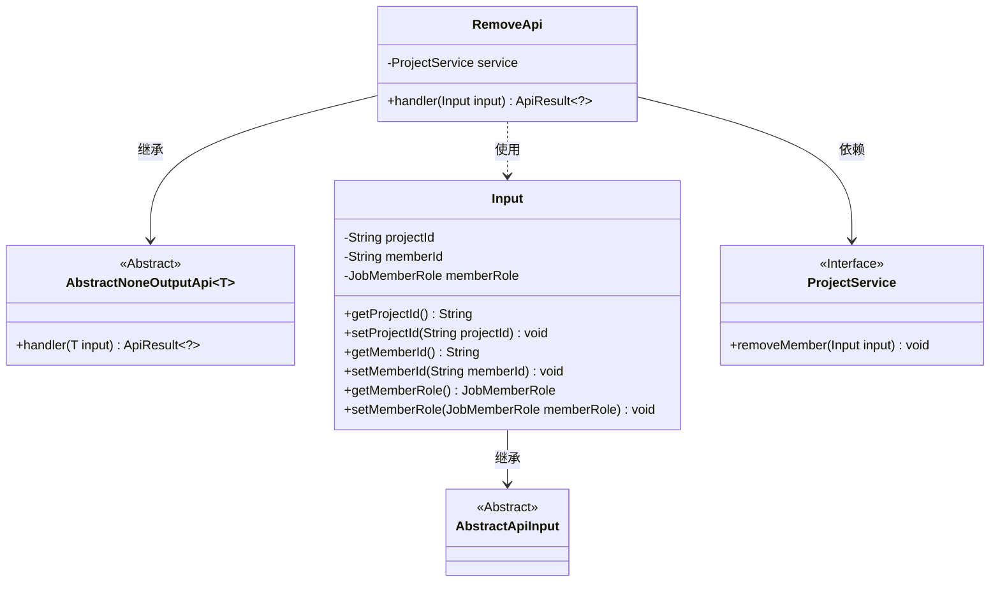

# 基础信息

|      |      |
|------|------|
| 名称 | RemoveApi |
| 编码语言 | .java |
| 代码路径 | WeFe/board/board-service/src/main/java/com/welab/wefe/board/service/api/project/member/RemoveApi.java |
| 包名 | com.welab.wefe.board.service.api.project.member |
| 依赖项 | ['com.welab.wefe.board.service.service.ProjectService', 'com.welab.wefe.common.exception.StatusCodeWithException', 'com.welab.wefe.common.fieldvalidate.annotation.Check', 'com.welab.wefe.common.web.api.base.AbstractNoneOutputApi', 'com.welab.wefe.common.web.api.base.Api', 'com.welab.wefe.common.web.dto.AbstractApiInput', 'com.welab.wefe.common.web.dto.ApiResult', 'com.welab.wefe.common.wefe.enums.JobMemberRole', 'org.springframework.beans.factory.annotation.Autowired'] |
| 概述说明 | 移除项目成员的API类，需提供项目ID、成员ID和角色，调用ProjectService执行移除操作。 |

# 说明

这段代码定义了一个名为RemoveApi的API类，用于移除项目成员。API路径为project/member/remove，继承自AbstractNoneOutputApi，输入参数为内部类Input。Input包含三个必填字段：项目ID、成员ID和成员角色（需指定角色以处理自联邦情况）。通过ProjectService的removeMember方法处理请求，成功后返回ApiResult。类中提供了各字段的getter和setter方法。

# 类列表 Class Summary

| 名称   | 类型  | 说明 |
|-------|------|-------------|
| RemoveApi | class | 移除项目成员API，需项目ID、成员ID和角色，调用ProjectService处理。 |

## 类 RemoveApi

|      |      |
|------|------|
| 访问范围 | @Api(path = "project/member/remove", name = "remove project member");public |
| 类型 | class |
| 名称 | RemoveApi |
| 说明 | 移除项目成员API，需项目ID、成员ID和角色，调用ProjectService处理。 |

### UML类图

这段代码展示了一个项目成员移除API的实现结构。RemoveApi继承自泛型抽象类AbstractNoneOutputApi，处理Input类型的参数，并通过ProjectService接口执行实际业务逻辑。Input类包含项目ID、成员ID和角色等校验字段，继承自AbstractApiInput基类。类图清晰地反映了各组件间的继承、依赖和使用关系，体现了Spring风格的依赖注入和分层设计模式。

### 内部方法调用关系图

```mermaid
graph TD
    A["类RemoveApi"]
    B["注解: @Api"]
    C["继承: AbstractNoneOutputApi<Input>"]
    D["依赖注入: @Autowired ProjectService"]
    E["重写方法: handler(Input input)"]
    F["内部类: Input"]
    G["校验注解: @Check projectId"]
    H["校验注解: @Check memberId"]
    I["校验注解: @Check memberRole"]
    J["getter/setter方法"]

    A --> B
    A --> C
    A --> D
    A --> E
    A --> F
    F --> G
    F --> H
    F --> I
    F --> J
```

这段代码定义了一个名为RemoveApi的API类，用于移除项目成员。该类继承自AbstractNoneOutputApi，包含一个内部类Input用于接收参数，并通过ProjectService执行成员移除操作。流程图展示了类的主要结构，包括注解、继承关系、依赖注入、核心方法以及参数校验逻辑。Input类中定义了三个必填字段，并通过@Check注解进行参数校验。

### 字段列表 Field List

| 名称  | 类型  | 说明 |
|-------|-------|------|
| service | ProjectService | 自动注入ProjectService实例。 |

### 方法列表

| 名称  | 类型  | 说明 |
|-------|-------|------|
| handler | ApiResult<?> | Java方法重写，调用服务移除成员并返回成功结果。 |

