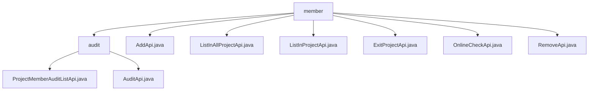

# 基础信息

|      |      |
|------|------|
| 名称 | member |
| 编码语言 | .java |
| 代码路径 | WeFe/board/board-service/src/main/java/com/welab/wefe/board/service/api/project/member |
| 包名 | docs.board.board-service.src.main.java.com.welab.wefe.board.service.api.project.member |
| 概述说明 | 该模块管理项目成员审核流程，提供查询待审列表和提交审核结果的API。支持按项目或成员ID筛选，拒绝需填写意见。包含成员添加、列表查询、退出、在线检查和移除等功能，均通过特定API实现，依赖统一基类和服务层处理业务逻辑。 |

# 说明

## 概述  
该模块核心职责是管理项目成员全生命周期操作，包括成员增删改查、审核流程及在线状态检查。接口规范遵循RESTful风格，包含7个API：成员添加(AddApi)、列表查询(ListInProjectApi/ListInAllProjectApi)、移除(RemoveApi)、退出(ExitProjectApi)、在线检查(OnlineCheckApi)及审核流程相关API。关键数据结构包括Member（基础成员信息）、Input/Output通用参数模型及ProjectMemberAudit系列结构。依赖项涉及ProjectMemberService、ProjectService等业务服务层，以及AbstractApi基类。例如成员添加需校验ID有效性，列表查询采用并行流优化性能。

## 主要业务场景  
典型场景覆盖成员管理全流程：管理员通过审核API处理加入申请，使用增删API维护成员关系，成员可主动触发退出操作。交互模式类似CRM系统，包含状态查询-操作执行-结果反馈闭环。功能完整性体现在支持单条操作与批量处理，例如ListInAllProjectApi实现跨项目成员聚合。API分为数据操作型（如POST类型的AddApi）和状态查询型（如GET类型的OnlineCheckApi），集成案例包括成员管理面板和自动化审核系统。强制校验设计（如RemoveApi需角色参数）类似权限管理系统。

### 包内部结构视图

该流程图展示了WeFe项目中board-service模块下project/member目录的API文件结构。顶层是member目录，包含7个直接子文件和1个audit子目录。audit目录下又包含2个审计相关的API文件。整个结构清晰地反映了项目成员管理功能的API分层设计。

# 文件列表

| 名称   | 类型  | 说明 |
|-------|------|-------------|
| [AddApi.java](AddApi.md) | file | 这是一个添加项目成员的API类，包含项目ID和成员列表的输入验证，调用ProjectMemberService添加成员，成功返回空结果。 |
| [ListInAllProjectApi.java](ListInAllProjectApi.md) | file | 获取与我合作的所有成员列表的API，通过项目成员仓库查询并返回排序后的成员信息列表。 |
| [ListInProjectApi.java](ListInProjectApi.md) | file | 获取项目成员列表的API，输入需项目ID，输出成员列表。使用ProjectMemberService查询数据并转换为输出模型。 |
| [ExitProjectApi.java](ExitProjectApi.md) | file | 定义退出项目API，需传入项目ID，调用ProjectService处理退出逻辑，无返回数据。 |
| [OnlineCheckApi.java](OnlineCheckApi.md) | file | OnlineCheckApi接口用于检查其他成员的网关和板卡连接状态。输入参数包括项目ID、是否本地和成员ID列表，返回连接状态结果列表。 |
| [RemoveApi.java](RemoveApi.md) | file | 移除项目成员的API类，需提供项目ID、成员ID和角色，调用ProjectService执行移除操作。 |
| [audit](audit/_module.md) | package | ProjectMemberAuditListApi类用于查询项目成员审核状态，路径为project/member/add/audit/list，输入项目Id和可选成员Id，输出审核列表。AuditApi类用于审核新成员，路径为project/member/add/audit，输入项目ID、成员ID、审核结果和意见，拒绝时意见必填。 |

