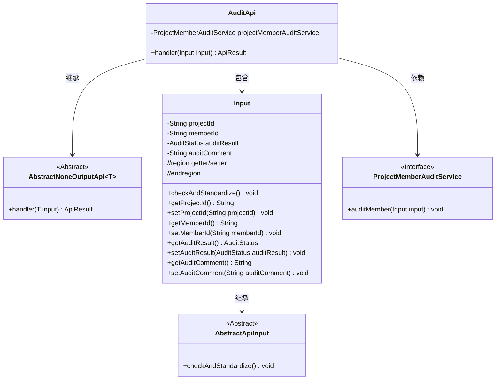

# 基础信息

|      |      |
|------|------|
| 名称 | AuditApi |
| 编码语言 | .java |
| 代码路径 | WeFe/board/board-service/src/main/java/com/welab/wefe/board/service/api/project/member/audit/AuditApi.java |
| 包名 | com.welab.wefe.board.service.api.project.member.audit |
| 依赖项 | ['com.welab.wefe.board.service.service.ProjectMemberAuditService', 'com.welab.wefe.common.StatusCode', 'com.welab.wefe.common.exception.StatusCodeWithException', 'com.welab.wefe.common.fieldvalidate.annotation.Check', 'com.welab.wefe.common.util.StringUtil', 'com.welab.wefe.common.web.api.base.AbstractNoneOutputApi', 'com.welab.wefe.common.web.api.base.Api', 'com.welab.wefe.common.web.dto.AbstractApiInput', 'com.welab.wefe.common.web.dto.ApiResult', 'com.welab.wefe.common.wefe.enums.AuditStatus', 'org.springframework.beans.factory.annotation.Autowired'] |
| 概述说明 | 审计新增项目成员的API类，包含项目ID、成员ID、审核结果和意见的输入参数，拒绝时需填写理由。调用审计服务处理请求并返回成功结果。 |

# 说明

该代码定义了一个名为AuditApi的API类，用于审核新加入的项目成员。API路径为"project/member/add/audit"。该类继承自AbstractNoneOutputApi，输入参数为内部类Input。Input包含项目ID、成员ID、审核结果和审批意见等必填字段，其中审核结果为拒绝时必须填写审批意见。处理逻辑通过ProjectMemberAuditService的auditMember方法实现审核功能。

# 类列表 Class Summary

| 名称   | 类型  | 说明 |
|-------|------|-------------|
| AuditApi | class | AuditApi类用于审核新加入项目成员，包含项目ID、成员ID、审核结果和意见等必填字段，拒绝时需填写理由。调用ProjectMemberAuditService处理审核逻辑。 |

## 类 AuditApi

|      |      |
|------|------|
| 访问范围 | @Api(path = "project/member/add/audit", name = "audit newly added project members");public |
| 类型 | class |
| 名称 | AuditApi |
| 说明 | AuditApi类用于审核新加入项目成员，包含项目ID、成员ID、审核结果和意见等必填字段，拒绝时需填写理由。调用ProjectMemberAuditService处理审核逻辑。 |

### UML类图

这段代码展示了一个项目成员审核API的实现结构。AuditApi继承自泛型抽象类AbstractNoneOutputApi，处理Input类型的参数，并通过ProjectMemberAuditService接口执行审核操作。Input类继承AbstractApiInput，包含项目ID、成员ID等审核参数，并实现了参数校验逻辑。类图清晰地呈现了继承、依赖和组合关系，体现了分层设计和接口隔离原则。

### 内部方法调用关系图

```mermaid
graph TD
    A["类AuditApi"]
    B["继承: AbstractNoneOutputApi<Input>"]
    C["注解: @Api"]
    D["依赖注入: ProjectMemberAuditService"]
    E["重写方法: handler(Input input)"]
    F["内部类Input"]
    G["继承: AbstractApiInput"]
    H["属性: projectId, memberId, auditResult, auditComment"]
    I["方法: checkAndStandardize()"]
    J["getter/setter方法"]
    K["调用: projectMemberAuditService.auditMember(input)"]
    L["返回: success()"]
    M["校验: 拒绝时需填写理由"]

    A --> B
    A --> C
    A --> D
    A --> E
    A --> F
    F --> G
    F --> H
    F --> I
    F --> J
    E --> K
    K --> L
    I --> M
```

流程图描述：该流程图展示了审计API类的结构和工作流程。AuditApi继承抽象类并重写handler方法，通过ProjectMemberAuditService执行成员审计。Input内部类包含审计参数和校验逻辑，特别在拒绝审核时强制要求填写理由。整个流程从API入口开始，经过参数校验后调用服务层完成审计操作。

### 字段列表 Field List

| 名称  | 类型  | 说明 |
|-------|-------|------|
| projectMemberAuditService | ProjectMemberAuditService | 使用@Autowired自动注入ProjectMemberAuditService服务实例。 |

### 方法列表

| 名称  | 类型  | 说明 |
|-------|-------|------|
| handler | ApiResult<?> | 方法重写，调用审核服务处理输入，成功返回结果。 |

