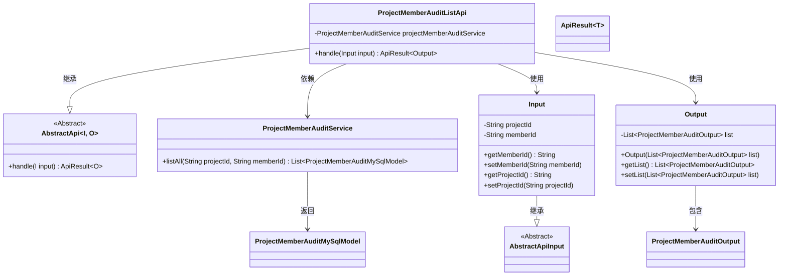

# 基础信息

|      |      |
|------|------|
| 名称 | ProjectMemberAuditListApi |
| 编码语言 | .java |
| 代码路径 | WeFe/board/board-service/src/main/java/com/welab/wefe/board/service/api/project/member/audit/ProjectMemberAuditListApi.java |
| 包名 | com.welab.wefe.board.service.api.project.member.audit |
| 依赖项 | ['com.welab.wefe.board.service.database.entity.job.ProjectMemberAuditMySqlModel', 'com.welab.wefe.board.service.dto.entity.ProjectMemberAuditOutput', 'com.welab.wefe.board.service.service.ProjectMemberAuditService', 'com.welab.wefe.common.exception.StatusCodeWithException', 'com.welab.wefe.common.fieldvalidate.annotation.Check', 'com.welab.wefe.common.web.api.base.AbstractApi', 'com.welab.wefe.common.web.api.base.Api', 'com.welab.wefe.common.web.dto.AbstractApiInput', 'com.welab.wefe.common.web.dto.ApiResult', 'com.welab.wefe.common.web.util.ModelMapper', 'org.springframework.beans.factory.annotation.Autowired', 'java.util.List', 'java.util.stream.Collectors'] |
| 概述说明 | 项目成员审核列表API，通过项目Id和成员Id查询新成员审核状态，返回审核结果列表。 |

# 说明

该代码定义了一个名为ProjectMemberAuditListApi的API类，用于获取项目中新成员的审核状态。API路径为project/member/add/audit/list。输入参数包括必填的项目Id和可选的成员Id，当成员Id为空时查询所有成员。处理逻辑通过projectMemberAuditService获取审核列表，并使用并行流转换为输出对象列表。输出包含一个ProjectMemberAuditOutput类型的列表。整个API继承自AbstractApi，实现了输入输出泛型处理。

# 类列表 Class Summary

| 名称   | 类型  | 说明 |
|-------|------|-------------|
| ProjectMemberAuditListApi | class | API类ProjectMemberAuditListApi，用于获取项目新成员审核状态。输入参数为项目Id和可选成员Id，输出为审核列表。通过projectMemberAuditService处理数据并返回结果。 |

## 类 ProjectMemberAuditListApi

|      |      |
|------|------|
| 访问范围 | @Api(path = "project/member/add/audit/list", name = "Get the review status of new members in the project");public |
| 类型 | class |
| 名称 | ProjectMemberAuditListApi |
| 说明 | API类ProjectMemberAuditListApi，用于获取项目新成员审核状态。输入参数为项目Id和可选成员Id，输出为审核列表。通过projectMemberAuditService处理数据并返回结果。 |

### UML类图

该代码是一个处理项目成员审核列表的API类，继承自泛型抽象类AbstractApi，包含输入(Input)和输出(Output)两个嵌套类。主要功能是通过ProjectMemberAuditService获取审核列表数据，并使用并行流进行模型转换。类图展示了继承关系、依赖关系和包含关系，其中Input继承自AbstractApiInput，Output包含ProjectMemberAuditOutput列表，ProjectMemberAuditService返回ProjectMemberAuditMySqlModel列表。整体结构清晰，职责明确，符合面向对象设计原则。

### 内部方法调用关系图

这段代码定义了一个处理项目成员审核列表的API类，继承自抽象基类并实现核心业务逻辑。流程图展示了从请求处理到结果返回的完整流程：首先通过服务层获取数据，然后使用并行流进行高效映射转换，最终封装返回结果。嵌套的Input和Output类分别处理请求参数和响应数据结构，体现了清晰的职责划分。整个过程包含参数校验、数据查询、模型转换和结果封装等关键步骤。

### 字段列表 Field List

| 名称  | 类型  | 说明 |
|-------|-------|------|
| projectMemberAuditService | ProjectMemberAuditService | 使用@Autowired自动注入ProjectMemberAuditService实例。 |

### 方法列表

| 名称  | 类型  | 说明 |
|-------|-------|------|
| handle | ApiResult<Output> | 方法处理输入参数，查询项目成员审核列表，并行映射为输出类型后返回成功结果。 |

