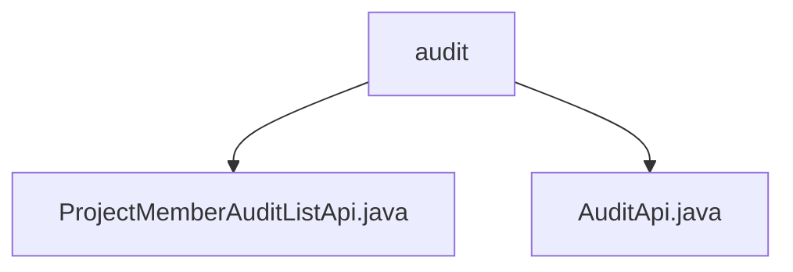

# 基础信息

|      |      |
|------|------|
| 名称 | audit |
| 编码语言 | .java |
| 代码路径 | WeFe/board/board-service/src/main/java/com/welab/wefe/board/service/api/project/member/audit |
| 包名 | docs.board.board-service.src.main.java.com.welab.wefe.board.service.api.project.member.audit |
| 概述说明 | ProjectMemberAuditListApi类用于查询项目成员审核状态，路径为project/member/add/audit/list，输入项目Id和可选成员Id，输出审核列表。AuditApi类用于审核新成员，路径为project/member/add/audit，输入项目ID、成员ID、审核结果和意见，拒绝时意见必填。 |

# 说明

## 概述  
该模块核心职责是管理项目成员加入的审核流程，包括查询待审列表和执行业务审核操作。接口规范包含两个API：`ProjectMemberAuditListApi`通过`project/member/add/audit/list`路径查询审核状态列表，支持按项目或成员ID筛选；`AuditApi`通过`project/member/add/audit`路径提交审核结果，强制要求拒绝时填写意见。关键数据结构包括`ProjectMemberAuditOutput`（列表项输出）和`AuditApi.Input`（审核输入参数）。依赖项为统一的`AbstractApi`基类和`ProjectMemberAuditService`服务层。例如列表查询使用并行流优化数据转换，审核操作需校验意见完整性。

## 主要业务场景  
典型场景为项目管理员处理成员加入申请，先通过列表API查看待审请求，再调用审核API批准或拒绝。交互模式类似工单系统，包含查询-决策-反馈闭环。功能完整性体现在支持批量查询与单条审核，例如成员ID为空时返回全量列表。API类型分为数据获取型（RESTful GET）和操作执行型（POST），集成案例包括前端审批台和自动化审核流程。拒绝操作强制关联审批意见的设计类似风控系统规则。

### 包内部结构视图

该流程图展示了项目成员审核模块的API文件结构。顶层节点为"audit"目录，包含两个Java API文件：ProjectMemberAuditListApi.java用于处理审核列表功能，AuditApi.java提供基础审核操作。这种简洁的层级关系清晰地反映了审核功能模块的核心文件组成。

# 文件列表

| 名称   | 类型  | 说明 |
|-------|------|-------------|
| [ProjectMemberAuditListApi.java](ProjectMemberAuditListApi.md) | file | 项目成员审核列表API，通过项目Id和成员Id查询新成员审核状态，返回审核结果列表。 |
| [AuditApi.java](AuditApi.md) | file | 审计新增项目成员的API类，包含项目ID、成员ID、审核结果和意见的输入参数，拒绝时需填写理由。调用审计服务处理请求并返回成功结果。 |

