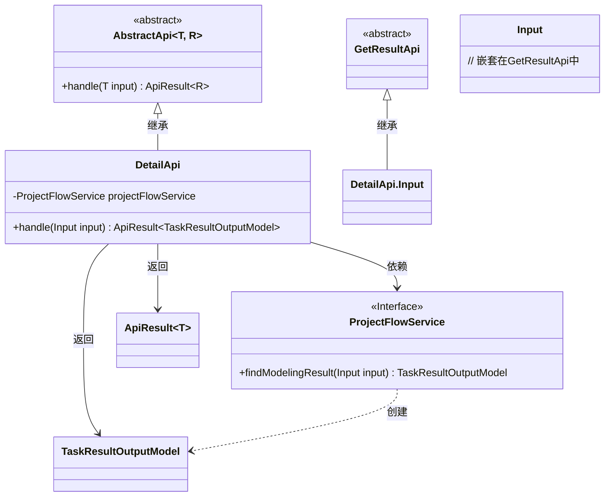
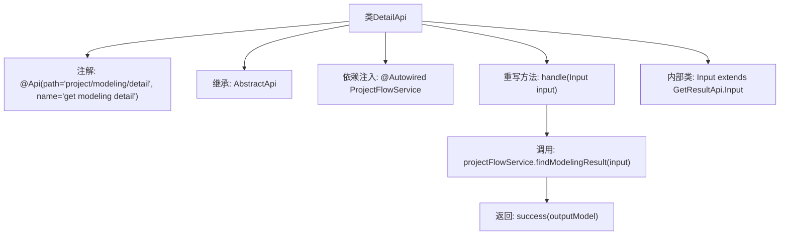

# 基础信息

|      |      |
|------|------|
| 名称 | DetailApi |
| 编码语言 | .java |
| 代码路径 | WeFe/board/board-service/src/main/java/com/welab/wefe/board/service/api/project/modeling/DetailApi.java |
| 包名 | com.welab.wefe.board.service.api.project.modeling |
| 依赖项 | ['com.welab.wefe.board.service.api.project.job.task.GetResultApi', 'com.welab.wefe.board.service.dto.entity.job.TaskResultOutputModel', 'com.welab.wefe.board.service.service.ProjectFlowService', 'com.welab.wefe.common.exception.StatusCodeWithException', 'com.welab.wefe.common.web.api.base.AbstractApi', 'com.welab.wefe.common.web.api.base.Api', 'com.welab.wefe.common.web.dto.ApiResult', 'org.springframework.beans.factory.annotation.Autowired'] |
| 概述说明 | 获取建模详情的API类，继承AbstractApi，使用ProjectFlowService查询结果并返回TaskResultOutputModel。输入类继承GetResultApi.Input。 |

# 说明

这是一个名为DetailApi的Java类，继承自AbstractApi，用于获取建模详情。类上标注了Api注解，指定路径为"project/modeling/detail"，名称为"get modeling detail"。它使用ProjectFlowService服务来处理请求，输入参数为Input类（继承自GetResultApi.Input），输出类型为TaskResultOutputModel。handle方法调用projectFlowService的findModelingResult方法获取结果并返回成功响应。

# 类列表 Class Summary

| 名称   | 类型  | 说明 |
|-------|------|-------------|
| DetailApi | class | DetailApi类继承AbstractApi，通过projectFlowService获取建模结果，输入为GetResultApi.Input的扩展，输出TaskResultOutputModel。 |

## 类 DetailApi

|      |      |
|------|------|
| 访问范围 | @Api(path = "project/modeling/detail", name = "get modeling detail");public |
| 类型 | class |
| 名称 | DetailApi |
| 说明 | DetailApi类继承AbstractApi，通过projectFlowService获取建模结果，输入为GetResultApi.Input的扩展，输出TaskResultOutputModel。 |

### UML类图

这段类图展示了DetailApi继承自AbstractApi，并依赖ProjectFlowService接口获取建模结果。DetailApi处理Input参数（继承自GetResultApi.Input），返回包含TaskResultOutputModel的ApiResult。ProjectFlowService接口负责业务逻辑，通过findModelingResult方法生成输出模型。整体结构体现了清晰的层级关系和依赖方向，符合API设计模式。

### 内部方法调用关系图

该流程图展示了DetailApi类的结构和工作流程。类通过@Api注解定义API路径，继承AbstractApi模板类并实现handle方法，内部使用ProjectFlowService查询建模结果后返回成功响应。Input作为嵌套类继承了GetResultApi.Input的字段。整体流程清晰展现了从请求处理到结果返回的完整链路。

### 字段列表 Field List

| 名称  | 类型  | 说明 |
|-------|-------|------|
| projectFlowService | ProjectFlowService | 使用@Autowired自动注入ProjectFlowService实例。 |

### 方法列表

| 名称  | 类型  | 说明 |
|-------|-------|------|
| handle | ApiResult<TaskResultOutputModel> | 该方法重写父类逻辑，调用服务获取任务结果并封装返回。输入参数为Input，输出为ApiResult<TaskResultOutputModel>，可能抛出StatusCodeWithException异常。 |

