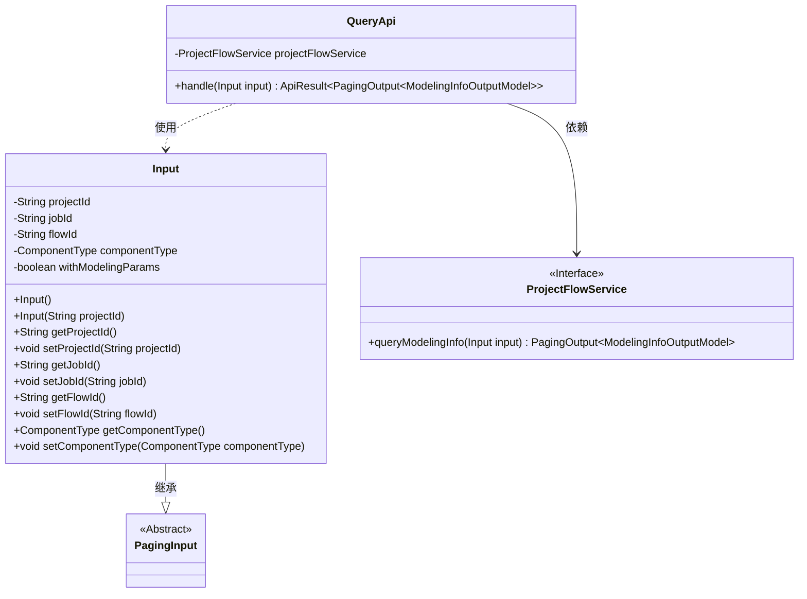

# 基础信息

|      |      |
|------|------|
| 名称 | QueryApi |
| 编码语言 | .java |
| 代码路径 | WeFe/board/board-service/src/main/java/com/welab/wefe/board/service/api/project/modeling/QueryApi.java |
| 包名 | com.welab.wefe.board.service.api.project.modeling |
| 依赖项 | ['com.welab.wefe.board.service.dto.base.PagingInput', 'com.welab.wefe.board.service.dto.base.PagingOutput', 'com.welab.wefe.board.service.dto.entity.modeling_config.ModelingInfoOutputModel', 'com.welab.wefe.board.service.service.ProjectFlowService', 'com.welab.wefe.common.exception.StatusCodeWithException', 'com.welab.wefe.common.fieldvalidate.annotation.Check', 'com.welab.wefe.common.web.api.base.AbstractApi', 'com.welab.wefe.common.web.api.base.Api', 'com.welab.wefe.common.web.dto.ApiResult', 'com.welab.wefe.common.wefe.enums.ComponentType', 'org.springframework.beans.factory.annotation.Autowired'] |
| 概述说明 | QueryApi类用于分页查询建模信息，包含项目ID、任务ID等输入参数，调用ProjectFlowService处理请求并返回分页结果。 |

# 说明

这是一个名为QueryApi的分页查询建模信息的API类，继承自AbstractApi。它使用ProjectFlowService处理查询请求，返回分页的ModelingInfoOutputModel结果。输入类Input包含项目ID、任务ID、流程ID、组件类型等可选的查询条件，以及一个是否包含建模节点参数的布尔标志。所有输入字段都有校验注解，并提供getter和setter方法。API路径为"project/modeling/query"。

# 类列表 Class Summary

| 名称   | 类型  | 说明 |
|-------|------|-------------|
| QueryApi | class | 分页查询建模信息的API类，包含项目ID、任务ID等输入参数，调用ProjectFlowService处理并返回分页结果。 |

## 类 QueryApi

|      |      |
|------|------|
| 访问范围 | @Api(path = "project/modeling/query", name = "query modeling by pagination");public |
| 类型 | class |
| 名称 | QueryApi |
| 说明 | 分页查询建模信息的API类，包含项目ID、任务ID等输入参数，调用ProjectFlowService处理并返回分页结果。 |

### UML类图

类图描述：该图展示了QueryApi类及其相关结构，QueryApi继承自AbstractApi并包含一个内部类Input。Input继承自PagingInput，包含多个属性和对应的getter/setter方法。QueryApi通过依赖ProjectFlowService接口来执行queryModelingInfo操作，返回分页建模信息结果。整体结构体现了分层设计和依赖关系。

### 内部方法调用关系图

```mermaid
graph TD
    A["类QueryApi"]
    B["注解: @Api(path='project/modeling/query', name='query modeling by pagination')"]
    C["继承: AbstractApi<Input, PagingOutput<ModelingInfoOutputModel>>"]
    D["依赖注入: @Autowired ProjectFlowService projectFlowService"]
    E["重写方法: handle(Input input)"]
    F["内部类: Input extends PagingInput"]
    G["Input属性: String projectId, String jobId, String flowId, ComponentType componentType, boolean withModelingParams"]
    H["Input方法: getter/setter对每个属性"]
    I["Input构造方法: Input(), Input(String projectId)"]
    J["Input校验注解: @Check(name='项目id')等"]

    A --> B
    A --> C
    A --> D
    A --> E
    A --> F
    F --> G
    F --> H
    F --> I
    F --> J
    E --> D
    E --> F
```

这段代码定义了一个名为QueryApi的API类，用于分页查询建模信息。该类继承自AbstractApi，包含一个处理请求的handle方法，该方法调用ProjectFlowService的queryModelingInfo方法。内部类Input定义了查询参数，包括项目ID、任务ID等字段，并带有校验注解。流程图展示了类结构、继承关系、依赖注入、方法调用和内部类组成，清晰地呈现了代码的组织结构和数据流向。

### 字段列表 Field List

| 名称  | 类型  | 说明 |
|-------|-------|------|
| projectFlowService | ProjectFlowService | 自动注入ProjectFlowService服务实例。 |

### 方法列表

| 名称  | 类型  | 说明 |
|-------|-------|------|
| handle | ApiResult<PagingOutput<ModelingInfoOutputModel>> | 重写方法处理建模信息查询，返回分页结果或异常。 |

