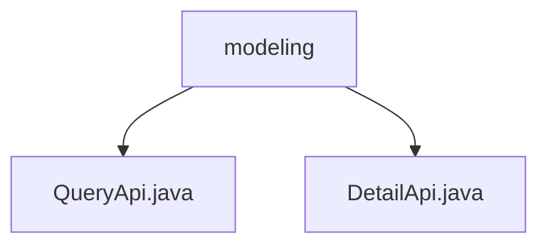

# 基础信息

|      |      |
|------|------|
| 名称 | modeling |
| 编码语言 | .java |
| 代码路径 | WeFe/board/board-service/src/main/java/com/welab/wefe/board/service/api/project/modeling |
| 包名 | docs.board.board-service.src.main.java.com.welab.wefe.board.service.api.project.modeling |
| 概述说明 | QueryApi是分页查询建模信息的API，路径为"project/modeling/query"，输入包含可选条件和布尔标志，输出分页结果。DetailApi是获取建模详情的API，路径为"project/modeling/detail"，输入继承自GetResultApi.Input，输出TaskResultOutputModel。 |

# 说明

## 概述  
该模块核心职责是提供建模信息的查询与详情获取功能，包含分页查询和详情查询两个API。接口规范遵循RESTful风格，路径分别为"project/modeling/query"和"project/modeling/detail"。关键数据结构包括ModelingInfoOutputModel（分页结果）和TaskResultOutputModel（详情结果），输入参数均使用校验注解确保数据有效性。外部依赖仅为ProjectFlowService服务。例如QueryApi支持通过项目ID、任务ID等多条件组合查询，DetailApi通过继承GetResultApi.Input获取单一结果。

## 主要业务场景  
模块主要处理建模信息的检索场景：分页查询支持多条件筛选（类似数据库WHERE子句），详情查询提供精确结果获取。交互模式均为同步请求-响应，功能完整性体现在覆盖列表与详情两种数据维度。典型应用包括建模任务监控台的数据展示。API类型包含查询类（QueryApi）和获取类（DetailApi），例如前端可通过组合调用先获取列表再查看详情。

### 包内部结构视图

该流程图展示了WeFe项目中建模模块的API文件结构。根节点"modeling"下包含两个Java接口文件：QueryApi.java用于查询操作，DetailApi.java用于详情获取。这种结构体现了典型的API分层设计，将不同功能的接口文件组织在同一模块目录下，便于维护和扩展。

# 文件列表

| 名称   | 类型  | 说明 |
|-------|------|-------------|
| [QueryApi.java](QueryApi.md) | file | QueryApi类用于分页查询建模信息，包含项目ID、任务ID等输入参数，调用ProjectFlowService处理请求并返回分页结果。 |
| [DetailApi.java](DetailApi.md) | file | 获取建模详情的API类，继承AbstractApi，使用ProjectFlowService查询结果并返回TaskResultOutputModel。输入类继承GetResultApi.Input。 |

