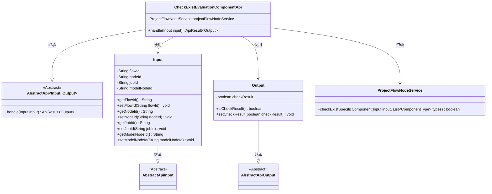
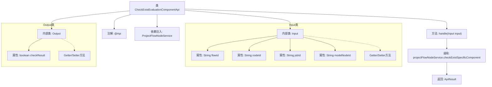

# 基础信息

|      |      |
|------|------|
| 名称 | CheckExistEvaluationComponentApi |
| 编码语言 | .java |
| 代码路径 | WeFe/board/board-service/src/main/java/com/welab/wefe/board/service/api/project/node/CheckExistEvaluationComponentApi.java |
| 包名 | com.welab.wefe.board.service.api.project.node |
| 依赖项 | ['com.welab.wefe.board.service.service.ProjectFlowNodeService', 'com.welab.wefe.common.exception.StatusCodeWithException', 'com.welab.wefe.common.fieldvalidate.annotation.Check', 'com.welab.wefe.common.web.api.base.AbstractApi', 'com.welab.wefe.common.web.api.base.Api', 'com.welab.wefe.common.web.dto.AbstractApiInput', 'com.welab.wefe.common.web.dto.AbstractApiOutput', 'com.welab.wefe.common.web.dto.ApiResult', 'com.welab.wefe.common.wefe.enums.ComponentType', 'org.springframework.beans.factory.annotation.Autowired', 'java.util.Arrays'] |
| 概述说明 | 检查流程中是否存在评估组件的API，输入含流程ID、节点ID等参数，输出为布尔值检查结果。 |

# 说明

该API用于检查流程中是否存在评估组件。它继承自抽象API类，处理输入输出参数。输入参数包括流程ID、节点ID（非OOT模式使用）、任务ID和模型节点ID（OOT模式使用）。输出参数为布尔值，表示检查结果。API内部调用ProjectFlowNodeService服务进行具体检查，返回结果封装为ApiResult对象。

# 类列表 Class Summary

| 名称   | 类型  | 说明 |
|-------|------|-------------|
| CheckExistEvaluationComponentApi | class | 检查流程中是否存在评估组件的API，输入含流程ID、节点ID、任务ID和模型节点ID，输出为布尔值检查结果。 |

## 类 CheckExistEvaluationComponentApi

|      |      |
|------|------|
| 访问范围 | @Api(path = "project/flow/node/check_exist_evaluation_component", name = "Check whether there are evaluation components in the process");public |
| 类型 | class |
| 名称 | CheckExistEvaluationComponentApi |
| 说明 | 检查流程中是否存在评估组件的API，输入含流程ID、节点ID、任务ID和模型节点ID，输出为布尔值检查结果。 |

### UML类图

该代码展示了一个检查流程中是否存在评估组件的API实现。核心类CheckExistEvaluationComponentApi继承自泛型抽象类AbstractApi，处理Input输入并返回Output输出结果。Input类包含流程ID、节点ID等参数，Output类包含布尔型检查结果。API通过ProjectFlowNodeService服务完成实际检查逻辑，整体采用分层设计模式，输入输出类均继承自对应的抽象基类，体现了良好的封装性和扩展性。

### 内部方法调用关系图

该流程图展示了CheckExistEvaluationComponentApi类的核心结构，包含API注解、服务依赖、输入输出内部类和处理方法。handle方法通过调用projectFlowNodeService检查特定组件存在性，最终返回封装结果的ApiResult。Input类包含流程ID、节点ID等参数，Output类则封装布尔型检查结果，整体实现了流程节点中评估组件的存在性检查功能。

### 字段列表 Field List

| 名称  | 类型  | 说明 |
|-------|-------|------|
| projectFlowNodeService | ProjectFlowNodeService | 自动注入ProjectFlowNodeService服务实例。 |

### 方法列表

| 名称  | 类型  | 说明 |
|-------|-------|------|
| handle | ApiResult<Output> | 该方法重写父类逻辑，检查输入中是否存在特定组件类型（如Evaluation），并返回包含检查结果的ApiResult。处理异常StatusCodeWithException。 |

