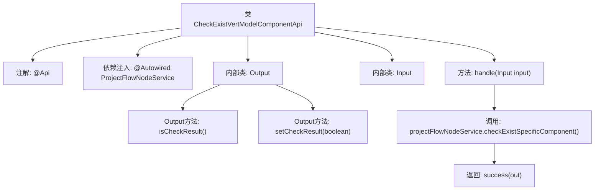

# 基础信息

|      |      |
|------|------|
| 名称 | CheckExistVertModelComponentApi |
| 编码语言 | .java |
| 代码路径 | WeFe/board/board-service/src/main/java/com/welab/wefe/board/service/api/project/node/CheckExistVertModelComponentApi.java |
| 包名 | com.welab.wefe.board.service.api.project.node |
| 依赖项 | ['com.welab.wefe.board.service.service.ProjectFlowNodeService', 'com.welab.wefe.common.exception.StatusCodeWithException', 'com.welab.wefe.common.fieldvalidate.annotation.Check', 'com.welab.wefe.common.web.api.base.AbstractApi', 'com.welab.wefe.common.web.api.base.Api', 'com.welab.wefe.common.web.dto.AbstractApiOutput', 'com.welab.wefe.common.web.dto.ApiResult', 'com.welab.wefe.common.wefe.enums.ComponentType', 'org.springframework.beans.factory.annotation.Autowired', 'java.util.Arrays'] |
| 概述说明 | 检查流程中是否存在垂直模型组件的API，输入继承自检查评估组件API，输出包含布尔型检查结果。 |

# 说明

该API类用于检查流程中是否存在垂直模型组件，路径为"project/flow/node/check_exist_vert_model_component"。它继承自抽象API类，输入参数继承自CheckExistEvaluationComponentApi.Input，输出包含一个布尔类型的检查结果字段。通过ProjectFlowNodeService服务检查输入参数中是否包含特定组件类型（VertLR和VertSecureBoost），并将检查结果封装在输出对象中返回。整个处理过程可能抛出StatusCodeWithException异常。

# 类列表 Class Summary

| 名称   | 类型  | 说明 |
|-------|------|-------------|
| CheckExistVertModelComponentApi | class | 检查流程中是否存在垂直模型组件的API，输入继承自检查评估组件API，输出包含布尔检查结果。 |


## 类 CheckExistVertModelComponentApi

|      |      |
|------|------|
| 访问范围 | @Api(path = "project/flow/node/check_exist_vert_model_component", name = "Check whether there are vert model components in the process");public |
| 类型 | class |
| 名称 | CheckExistVertModelComponentApi |
| 说明 | 检查流程中是否存在垂直模型组件的API，输入继承自检查评估组件API，输出包含布尔检查结果。 |


### UML类图

```mermaid
classDiagram
    class CheckExistVertModelComponentApi {
        -ProjectFlowNodeService projectFlowNodeService
        +handle(Input input) ApiResult~Output~
    }
    <<Interface>> CheckExistVertModelComponentApi {
    }

    class AbstractApi~T, R~ {
        <<Abstract>>
    }

    class ProjectFlowNodeService {
        +checkExistSpecificComponent(Input input, List~ComponentType~ types) boolean
    }

    class Input {
    }

    class CheckExistEvaluationComponentApi {
    }

    class Output {
        -boolean checkResult
        +isCheckResult() boolean
        +setCheckResult(boolean checkResult) void
    }

    class AbstractApiOutput {
        <<Abstract>>
    }

    class ComponentType {
        <<Enum>>
        +VertLR
        +VertSecureBoost
    }

    CheckExistVertModelComponentApi --|> AbstractApi : 继承
    CheckExistVertModelComponentApi --> ProjectFlowNodeService : 依赖
    CheckExistVertModelComponentApi --> Input : 使用
    CheckExistVertModelComponentApi --> Output : 使用
    Input --|> CheckExistEvaluationComponentApi.Input : 继承
    Output --|> AbstractApiOutput : 继承
    ProjectFlowNodeService ..> ComponentType : 使用
```

这段代码展示了一个检查流程节点中是否存在垂直模型组件的API实现。CheckExistVertModelComponentApi继承自泛型抽象类AbstractApi，依赖ProjectFlowNodeService进行业务逻辑处理，使用嵌套类Input和Output作为参数和返回类型。Input继承自另一个API的输入类，Output继承自基础API输出类并包含布尔检查结果。该设计体现了清晰的层级关系和职责分离，通过服务类封装核心业务逻辑，同时保持API层的简洁性。


### 内部方法调用关系图



该流程图展示了CheckExistVertModelComponentApi类的结构及其关键方法调用关系。类通过@Api注解定义接口路径，继承AbstractApi并实现handle方法处理输入输出。内部类Input继承自父类输入，Output包含校验结果字段及其getter/setter。核心逻辑是通过projectFlowNodeService检查是否存在特定组件类型，最终返回封装结果。流程清晰呈现了从请求处理到服务调用的完整链路。

### 字段列表 Field List

| 名称  | 类型  | 说明 |
|-------|-------|------|
| projectFlowNodeService | ProjectFlowNodeService | 自动注入项目流程节点服务实例。 |

### 方法列表

| 名称  | 类型  | 说明 |
|-------|-------|------|
| handle | ApiResult<Output> | 该方法重写父类逻辑，调用服务检查输入中是否存在特定组件类型（VertLR或VertSecureBoost），并将检查结果封装为Output对象返回。若成功返回包含结果的ApiResult。 |


