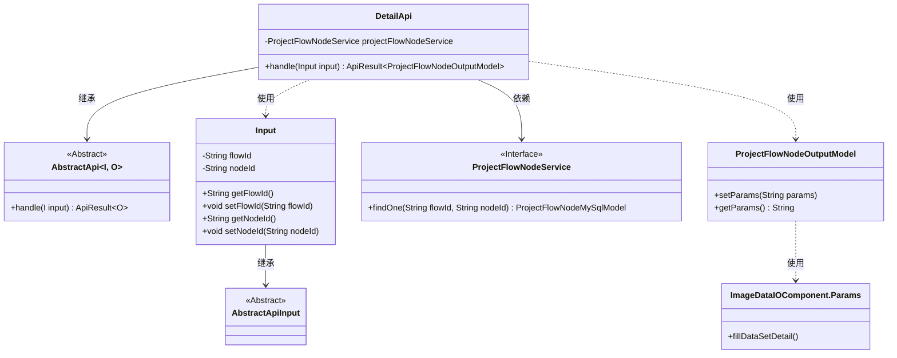

# 基础信息

|      |      |
|------|------|
| 名称 | DetailApi |
| 编码语言 | .java |
| 代码路径 | WeFe/board/board-service/src/main/java/com/welab/wefe/board/service/api/project/node/DetailApi.java |
| 包名 | com.welab.wefe.board.service.api.project.node |
| 依赖项 | ['com.welab.wefe.board.service.component.deep_learning.ImageDataIOComponent', 'com.welab.wefe.board.service.database.entity.job.ProjectFlowNodeMySqlModel', 'com.welab.wefe.board.service.dto.entity.job.ProjectFlowNodeOutputModel', 'com.welab.wefe.board.service.service.ProjectFlowNodeService', 'com.welab.wefe.common.exception.StatusCodeWithException', 'com.welab.wefe.common.fieldvalidate.annotation.Check', 'com.welab.wefe.common.util.JObject', 'com.welab.wefe.common.web.api.base.AbstractApi', 'com.welab.wefe.common.web.api.base.Api', 'com.welab.wefe.common.web.dto.AbstractApiInput', 'com.welab.wefe.common.web.dto.ApiResult', 'com.welab.wefe.common.web.util.ModelMapper', 'com.welab.wefe.common.wefe.enums.ComponentType', 'org.springframework.beans.factory.annotation.Autowired'] |
| 概述说明 | 获取流程节点详情的API类，通过flowId和nodeId查询节点信息，若节点类型为ImageDataIO则补充数据集详情。 |

# 说明

该代码定义了一个名为DetailApi的API类，用于获取项目流程节点详情。API路径为"project/flow/node/detail"，接受包含流程ID和节点ID的输入参数。通过ProjectFlowNodeService查询节点数据，若不存在则返回空结果。存在则将MySql模型映射为输出模型，并保留原始参数。对于ImageDataIO类型的节点，会额外处理并填充数据集详情信息。输入类Input继承自AbstractApiInput，包含必填的flowId和nodeId字段及其getter/setter方法。

# 类列表 Class Summary

| 名称   | 类型  | 说明 |
|-------|------|-------------|
| DetailApi | class | 获取节点详情的API类，输入流程ID和节点ID，查询节点信息并返回。若节点类型为ImageDataIO，额外填充数据集信息。 |

## 类 DetailApi

|      |      |
|------|------|
| 访问范围 | @Api(path = "project/flow/node/detail", name = "get node detail");public |
| 类型 | class |
| 名称 | DetailApi |
| 说明 | 获取节点详情的API类，输入流程ID和节点ID，查询节点信息并返回。若节点类型为ImageDataIO，额外填充数据集信息。 |

### UML类图

该代码展示了一个获取项目流程节点详情的API实现，核心类DetailApi继承自泛型抽象类AbstractApi，处理输入参数Input并返回ProjectFlowNodeOutputModel结果。通过ProjectFlowNodeService查询节点数据，特别处理了ImageDataIO类型节点的数据集信息填充。类图清晰地呈现了继承关系、依赖关系和使用关系，包含6个主要类和1个内部类，体现了API处理流程中的数据转换和业务逻辑。

### 内部方法调用关系图

```mermaid
graph TD
    A["类DetailApi"]
    B["继承: AbstractApi<Input, ProjectFlowNodeOutputModel>"]
    C["依赖注入: ProjectFlowNodeService"]
    D["方法: handle(Input input)"]
    E["调用: projectFlowNodeService.findOne"]
    F["判断: one == null?"]
    G["返回: success()"]
    H["映射: ModelMapper.map"]
    I["设置: output.setParams"]
    J["判断: componentType == ImageDataIO?"]
    K["转换: params.toJavaObject"]
    L["填充: params.fillDataSetDetail"]
    M["序列化: JObject.create"]
    N["返回: success(output)"]
    O["内部类Input"]
    P["属性: String flowId"]
    Q["属性: String nodeId"]
    R["getter/setter方法"]

    A --> B
    A --> C
    A --> D
    D --> E
    E --> F
    F --是--> G
    F --否--> H
    H --> I
    I --> J
    J --是--> K
    K --> L
    L --> M
    M --> I
    J --否--> N
    A --> O
    O --> P
    O --> Q
    O --> R
```

流程图描述：该流程图展示了DetailApi类的处理逻辑，从继承关系和依赖注入开始，到handle方法的核心流程。首先通过projectFlowNodeService查询节点数据，若不存在则返回空成功结果；存在则进行模型映射和参数设置。特别处理ImageDataIO类型的节点，填充数据集信息并重新序列化参数。最后返回包含处理结果的响应。内部类Input包含流程ID和节点ID两个必要参数及其访问方法。

### 字段列表 Field List

| 名称  | 类型  | 说明 |
|-------|-------|------|
| projectFlowNodeService | ProjectFlowNodeService | 自动注入项目流程节点服务实例。 |

### 方法列表

| 名称  | 类型  | 说明 |
|-------|-------|------|
| handle | ApiResult<ProjectFlowNodeOutputModel> | 该方法处理项目流程节点查询请求，若节点不存在返回空结果，存在则映射输出模型。若节点类型为ImageDataIO，补充数据集信息后返回结果。 |

