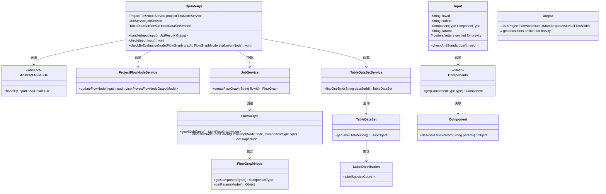

# 基础信息

|      |      |
|------|------|
| 名称 | UpdateApi |
| 编码语言 | .java |
| 代码路径 | WeFe/board/board-service/src/main/java/com/welab/wefe/board/service/api/project/node/UpdateApi.java |
| 包名 | com.welab.wefe.board.service.api.project.node |
| 依赖项 | ['com.welab.wefe.board.service.component.Components', 'com.welab.wefe.board.service.component.DataIOComponent', 'com.welab.wefe.board.service.component.EvaluationComponent', 'com.welab.wefe.board.service.component.enums.EvaluationType', 'com.welab.wefe.board.service.dto.entity.job.ProjectFlowNodeOutputModel', 'com.welab.wefe.board.service.dto.vo.data_set.table_data_set.LabelDistribution', 'com.welab.wefe.board.service.exception.FlowNodeException', 'com.welab.wefe.board.service.model.FlowGraph', 'com.welab.wefe.board.service.model.FlowGraphNode', 'com.welab.wefe.board.service.service.JobService', 'com.welab.wefe.board.service.service.ProjectFlowNodeService', 'com.welab.wefe.board.service.service.data_resource.table_data_set.TableDataSetService', 'com.welab.wefe.common.exception.StatusCodeWithException', 'com.welab.wefe.common.fieldvalidate.annotation.Check', 'com.welab.wefe.common.web.api.base.AbstractApi', 'com.welab.wefe.common.web.api.base.Api', 'com.welab.wefe.common.web.dto.AbstractApiInput', 'com.welab.wefe.common.web.dto.ApiResult', 'com.welab.wefe.common.wefe.enums.ComponentType', 'org.springframework.beans.factory.annotation.Autowired', 'java.util.Arrays', 'java.util.List', 'java.util.stream.Collectors'] |
| 概述说明 | 更新节点信息的API类，检查评估组件与数据集分类数是否匹配，不匹配时提醒。输入含流程ID、节点ID、组件类型和参数，输出为节点列表。 |

# 说明

该代码定义了一个名为UpdateApi的API类，用于更新项目流程节点信息。API路径为project/flow/node/update，继承自AbstractApi，处理输入Input和输出Output。主要功能包括：通过projectFlowNodeService更新流程节点，并在编辑流程时检查分类数与评估组件选择的模式是否匹配。检查逻辑涉及构建graph，遍历评估组件，验证数据集分类数与评估模式的一致性，不匹配时抛出异常提示。输入类Input包含流程ID、节点ID、组件类型和参数等字段，并进行有效性检查。输出类Output包含参数为空的流程节点列表。

# 类列表 Class Summary

| 名称   | 类型  | 说明 |
|-------|------|-------------|
| UpdateApi | class | 更新节点信息的API类，包含输入输出处理及评估组件与数据集匹配检查逻辑。 |

## 类 UpdateApi

|      |      |
|------|------|
| 访问范围 | @Api(path = "project/flow/node/update", name = "update node info");public |
| 类型 | class |
| 名称 | UpdateApi |
| 说明 | 更新节点信息的API类，包含输入输出处理及评估组件与数据集匹配检查逻辑。 |

### UML类图

该图展示了UpdateApi及其相关类的结构关系。UpdateApi继承自泛型抽象类AbstractApi，依赖三个服务类处理核心业务逻辑。Input类负责参数校验，Output类封装响应数据。系统通过多个服务类协作完成流程节点更新操作，涉及流程图的构建、数据集的查询和组件参数的校验等核心功能。类图清晰地呈现了各组件间的协作关系，特别是通过泛型和接口实现的灵活架构设计。

### 内部方法调用关系图

这段代码实现了一个流程节点更新API，主要功能包括更新节点信息和对评估组件与数据集匹配性的校验。流程图展示了类结构和方法调用关系，时序图详细描述了从客户端请求到返回结果的完整调用链。核心校验逻辑通过遍历流程图的评估节点，检查其与关联数据集的分类数是否匹配，若不匹配则抛出异常提示用户。

### 字段列表 Field List

| 名称  | 类型  | 说明 |
|-------|-------|------|
| projectFlowNodeService | ProjectFlowNodeService | 使用@Autowired自动注入ProjectFlowNodeService实例。 |
| tableDataSetService | TableDataSetService | 使用@Autowired自动注入TableDataSetService实例。 |
| jobService | JobService | 使用@Autowired自动注入JobService实例。 |

### 方法列表

| 名称  | 类型  | 说明 |
|-------|-------|------|
| handle | ApiResult<Output> | 该方法重写父类逻辑，接收Input参数，调用服务更新流程节点并生成Output。执行校验后返回成功结果，可能抛出状态码异常。 |
| check | void | 检查输入组件类型，仅处理DataIO和Evaluation类型。若非网关发起，遍历流程图中所有Evaluation节点并逐一校验。 |
| checkByEvaluationNode | void | 检查评估节点与数据集分类数是否匹配。若评估模式为二分类但数据集分类数超过2，或非二分类但数据集分类数不超过2，则抛出异常提示不匹配。 |

