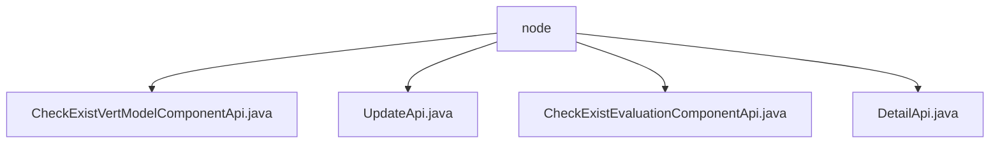

# 基础信息

|      |      |
|------|------|
| 名称 | node |
| 编码语言 | .java |
| 代码路径 | WeFe/board/board-service/src/main/java/com/welab/wefe/board/service/api/project/node |
| 包名 | docs.board.board-service.src.main.java.com.welab.wefe.board.service.api.project.node |
| 概述说明 | 检查垂直模型组件API，路径project/flow/node/check_exist_vert_model_component，返回布尔结果。更新流程节点API，路径project/flow/node/update，检查分类数与评估模式匹配。检查评估组件API，返回布尔结果。获取节点详情API，路径project/flow/node/detail，查询并返回节点数据。 |

# 说明

## 概述  
该模块核心职责是管理项目流程节点，包括检查垂直模型/评估组件存在性、更新节点信息及获取节点详情。接口规范统一继承抽象API类，输入输出均包含流程ID和节点ID等核心字段，例如CheckExistEvaluationComponentApi验证评估组件存在性。关键数据结构包括流程节点参数列表、组件类型枚举（如VertLR/ImageDataIO）及异常封装对象。外部依赖项主要为ProjectFlowNodeService服务，类似中央处理器协调节点操作。

## 主要业务场景  
主要业务流程包括节点信息维护（更新/查询）和组件合规检查。交互模式采用标准API调用，例如UpdateApi在编辑流程时验证分类数与评估模式匹配性。功能完整性体现在全生命周期管理，从节点创建（检查组件）到更新（参数校验）再到查询（详情填充）。典型应用如模型训练流程中，DetailApi获取节点参数后，UpdateApi调整配置并触发CheckExistVertModelComponentApi验证合规性。API类型涵盖CRUD操作和校验类接口。

### 包内部结构视图

该流程图展示了项目节点模块下的API文件结构。根节点"node"下包含四个API实现类，分别处理垂直模型组件检查、更新操作、评估组件检查和详情查询功能。所有API文件均位于同一层级，没有嵌套关系，体现了项目节点模块的扁平化设计结构。

# 文件列表

| 名称   | 类型  | 说明 |
|-------|------|-------------|
| [CheckExistVertModelComponentApi.java](CheckExistVertModelComponentApi.md) | file | 检查流程中是否存在垂直模型组件的API，输入继承自检查评估组件API，输出包含布尔型检查结果。 |
| [UpdateApi.java](UpdateApi.md) | file | 更新节点信息的API类，检查评估组件与数据集分类数是否匹配，不匹配时提醒。输入含流程ID、节点ID、组件类型和参数，输出为节点列表。 |
| [CheckExistEvaluationComponentApi.java](CheckExistEvaluationComponentApi.md) | file | 检查流程中是否存在评估组件的API，输入含流程ID、节点ID等参数，输出为布尔值检查结果。 |
| [DetailApi.java](DetailApi.md) | file | 获取流程节点详情的API类，通过flowId和nodeId查询节点信息，若节点类型为ImageDataIO则补充数据集详情。 |

