# 基础信息

|      |      |
|------|------|
| 名称 | AddApi |
| 编码语言 | .java |
| 代码路径 | WeFe/board/board-service/src/main/java/com/welab/wefe/board/service/api/project/project/AddApi.java |
| 包名 | com.welab.wefe.board.service.api.project.project |
| 依赖项 | ['com.welab.wefe.board.service.database.entity.job.ProjectMySqlModel', 'com.welab.wefe.board.service.database.repository.ProjectRepository', 'com.welab.wefe.board.service.dto.entity.ProjectDataSetInput', 'com.welab.wefe.board.service.dto.entity.ProjectMemberInput', 'com.welab.wefe.board.service.service.CacheObjects', 'com.welab.wefe.board.service.service.ProjectService', 'com.welab.wefe.common.StatusCode', 'com.welab.wefe.common.exception.StatusCodeWithException', 'com.welab.wefe.common.fieldvalidate.annotation.Check', 'com.welab.wefe.common.web.Launcher', 'com.welab.wefe.common.web.api.base.AbstractApi', 'com.welab.wefe.common.web.api.base.Api', 'com.welab.wefe.common.web.dto.AbstractApiInput', 'com.welab.wefe.common.web.dto.ApiResult', 'com.welab.wefe.common.wefe.enums.JobMemberRole', 'com.welab.wefe.common.wefe.enums.ProjectType', 'org.apache.commons.collections4.CollectionUtils', 'org.springframework.beans.factory.annotation.Autowired', 'java.util.HashSet', 'java.util.List', 'java.util.Set'] |
| 概述说明 | AddApi类用于添加新项目，包含输入输出处理。输入需校验项目名称唯一性、合作方非空及成员不重复。输出返回项目ID。 |

# 说明

该代码定义了一个名为AddApi的类，用于处理新增项目的API请求。类继承自AbstractApi，包含输入参数Input和输出结果Output。Input类包含项目名称、类型、描述、成员列表、数据集等字段，并进行了严格的参数校验，如项目名称不能重复、合作方不能为空、成员不能重复等。Output类仅包含项目ID。处理逻辑通过ProjectService添加项目并返回项目ID。

# 类列表 Class Summary

| 名称   | 类型  | 说明 |
|-------|------|-------------|
| AddApi | class | AddApi类用于添加新项目，包含输入参数校验和项目名称查重逻辑，输出项目ID。输入参数包括项目名称、类型、描述、成员列表等，要求必填且成员不能重复。 |


## 类 AddApi

|      |      |
|------|------|
| 访问范围 | @Api(path = "project/add", name = "add new project");public |
| 类型 | class |
| 名称 | AddApi |
| 说明 | AddApi类用于添加新项目，包含输入参数校验和项目名称查重逻辑，输出项目ID。输入参数包括项目名称、类型、描述、成员列表等，要求必填且成员不能重复。 |


### UML类图

```mermaid
classDiagram
    class AbstractApi~T, R~ {
        <<Abstract>>
        +handle(T input) ApiResult~R~
    }
    
    class AddApi {
        -ProjectService service
        +handle(Input input) ApiResult~Output~
    }
    
    class ProjectService {
        +addProject(AddApi$Input input) String
    }
    
    class AddApi$Input {
        -String projectId
        -List~ProjectMemberInput~ members
        -String name
        -ProjectType projectType
        -String desc
        -List~ProjectDataSetInput~ promoterDataSetList
        -List~ProjectMemberInput~ providerList
        -List~ProjectMemberInput~ promoterList
        -JobMemberRole role
        +checkAndStandardize() void
        // 省略getter/setter方法
    }
    
    class AddApi$Output {
        -String projectId
        +Output(String projectId)
        +getProjectId() String
        +setProjectId(String projectId) void
    }
    
    class ProjectMemberInput {
        // 省略具体实现
    }
    
    class ProjectDataSetInput {
        // 省略具体实现
    }
    
    class ProjectType {
        // 枚举类型
    }
    
    class JobMemberRole {
        // 枚举类型
    }
    
    class StatusCodeWithException {
        // 异常类
    }
    
    class ApiResult~T~ {
        // 泛型结果类
    }
    
    AbstractApi <|-- AddApi
    AddApi --> ProjectService : 依赖
    AddApi *-- AddApi$Input
    AddApi *-- AddApi$Output
    AddApi$Input --> ProjectMemberInput : 包含
    AddApi$Input --> ProjectDataSetInput : 包含
    AddApi$Input --> ProjectType : 使用
    AddApi$Input --> JobMemberRole : 使用
    AddApi$Input ..|> AbstractApiInput : 实现
    AddApi ..|> AbstractApi : 实现
```

这段代码展示了一个添加项目的API实现，包含输入参数校验和业务处理逻辑。类图清晰地呈现了AddApi继承自AbstractApi，并包含Input和Output两个内部类的关系。Input类负责参数校验，包含多个项目相关字段；Output类封装返回结果。ProjectService被注入用于实际业务操作。整个设计体现了清晰的职责分离，输入校验与业务处理解耦，符合良好的API设计规范。


### 内部方法调用关系图

```mermaid
graph TD
    A["类AddApi"]
    B["注解: @Api(path='project/add', name='add new project')"]
    C["继承: AbstractApi<Input, Output>"]
    D["依赖注入: @Autowired ProjectService service"]
    E["重写方法: handle(Input input)"]
    F["静态内部类: Output"]
    G["静态内部类: Input"]
    H["方法: service.addProject(input)"]
    I["返回: success(new Output(projectId))"]
    J["Output构造方法: Output(String projectId)"]
    K["Input方法: checkAndStandardize()"]
    L["Input属性: 多个@Check标注字段"]
    M["校验: 项目名称唯一性"]
    N["校验: 合作方非空"]
    O["校验: 发起方成员不重复"]
    P["校验: 成员角色不冲突"]

    A --> B
    A --> C
    A --> D
    A --> E
    A --> F
    A --> G
    E --> H
    E --> I
    F --> J
    G --> K
    G --> L
    K --> M
    K --> N
    K --> O
    K --> P
```



该流程图展示了AddApi类的完整结构，包含API注解、服务注入、请求处理流程和嵌套的Input/Output类。核心逻辑是handle方法通过ProjectService创建项目，Input类包含复杂的校验逻辑：验证项目名称唯一性（通过数据库查询）、检查必填字段、确保合作方列表非空、检测成员重复以及角色冲突。所有校验通过后才会创建包含projectId的Output响应。流程图清晰呈现了从API入口到业务校验的完整调用链。

### 字段列表 Field List

| 名称  | 类型  | 说明 |
|-------|-------|------|
| service | ProjectService | 自动注入ProjectService服务实例。 |

### 方法列表

| 名称  | 类型  | 说明 |
|-------|-------|------|
| handle | ApiResult<Output> | 该方法处理输入并调用服务添加项目，返回包含项目ID的成功结果。 |


