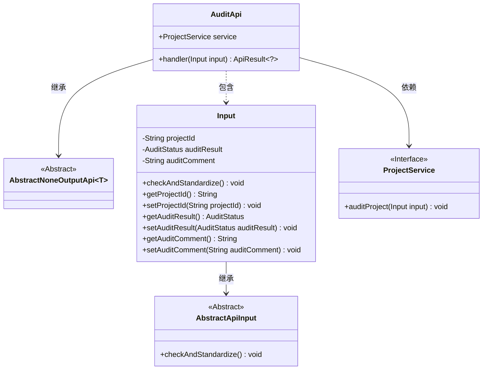

# 基础信息

|      |      |
|------|------|
| 名称 | AuditApi |
| 编码语言 | .java |
| 代码路径 | WeFe/board/board-service/src/main/java/com/welab/wefe/board/service/api/project/project/AuditApi.java |
| 包名 | com.welab.wefe.board.service.api.project.project |
| 依赖项 | ['com.welab.wefe.board.service.service.ProjectService', 'com.welab.wefe.common.StatusCode', 'com.welab.wefe.common.exception.StatusCodeWithException', 'com.welab.wefe.common.fieldvalidate.annotation.Check', 'com.welab.wefe.common.util.StringUtil', 'com.welab.wefe.common.web.api.base.AbstractNoneOutputApi', 'com.welab.wefe.common.web.api.base.Api', 'com.welab.wefe.common.web.dto.AbstractApiInput', 'com.welab.wefe.common.web.dto.ApiResult', 'com.welab.wefe.common.wefe.enums.AuditStatus', 'org.springframework.beans.factory.annotation.Autowired'] |
| 概述说明 | 审计API，用于处理用户是否同意加入项目的请求。输入包括项目ID、审核结果和审批意见。若拒绝需填写意见。调用ProjectService完成审核。 |

# 说明

AuditApi是一个用于处理项目加入审核的API类，路径为"project/add/audit"。它继承自AbstractNoneOutputApi，输入参数为内部类Input。Input包含项目ID、审核结果和审批意见三个字段，其中项目ID和审核结果为必填项。当审核结果为不同意时，必须填写审批意见。该API通过ProjectService的auditProject方法处理审核请求，成功后返回空结果。Input类还包含字段的getter和setter方法，并实现了参数校验逻辑。

# 类列表 Class Summary

| 名称   | 类型  | 说明 |
|-------|------|-------------|
| AuditApi | class | 审核项目加入请求的API，需提供项目ID和审核结果，拒绝时需填写审批意见。调用ProjectService处理请求并返回结果。 |

## 类 AuditApi

|      |      |
|------|------|
| 访问范围 | @Api(path = "project/add/audit", name = "Check whether you agree to join a project by yourself");public |
| 类型 | class |
| 名称 | AuditApi |
| 说明 | 审核项目加入请求的API，需提供项目ID和审核结果，拒绝时需填写审批意见。调用ProjectService处理请求并返回结果。 |

### UML类图

这段代码描述了一个审计API的实现，主要用于处理用户是否同意加入项目的请求。AuditApi继承自AbstractNoneOutputApi，包含一个内部类Input用于封装请求参数，并通过ProjectService接口执行业务逻辑。Input类继承自AbstractApiInput，实现了参数校验逻辑，特别在审核结果为不同意时强制要求填写审批意见。类图清晰地展示了类之间的继承、依赖和组合关系，体现了良好的分层设计。

### 内部方法调用关系图

```mermaid
graph TD
    A["类AuditApi"]
    B["继承: AbstractNoneOutputApi<Input>"]
    C["注解: @Api"]
    D["依赖注入: @Autowired ProjectService"]
    E["重写方法: handler(Input input)"]
    F["静态内部类Input"]
    G["继承: AbstractApiInput"]
    H["字段: projectId, auditResult, auditComment"]
    I["方法: checkAndStandardize()"]
    J["getter/setter方法"]
    K["调用: service.auditProject(input)"]
    L["返回: success()"]
    M["校验: StringUtil.isBlank(auditComment)"]
    N["抛出异常: StatusCodeWithException"]

    A --> B
    A --> C
    A --> D
    A --> E
    E --> K
    E --> L
    A --> F
    F --> G
    F --> H
    F --> I
    F --> J
    I --> M
    M -->|true| N
```

流程图描述：该流程图展示了AuditApi类的结构及其内部关系。主类继承AbstractNoneOutputApi，包含ProjectService依赖注入和handler方法实现。静态内部类Input继承AbstractApiInput，包含三个字段及其校验逻辑。当审核结果为不同意且意见为空时，会抛出参数无效异常。handler方法调用服务层审核方法后返回成功结果，整体构成一个完整的API处理流程。

### 字段列表 Field List

| 名称  | 类型  | 说明 |
|-------|-------|------|
| service | ProjectService | 自动注入ProjectService服务实例。 |

### 方法列表

| 名称  | 类型  | 说明 |
|-------|-------|------|
| handler | ApiResult<?> | 代码重写handler方法，调用service.auditProject处理输入，成功返回空结果，异常抛出StatusCodeWithException。 |

