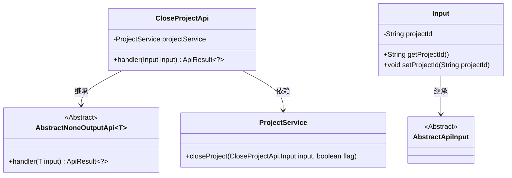
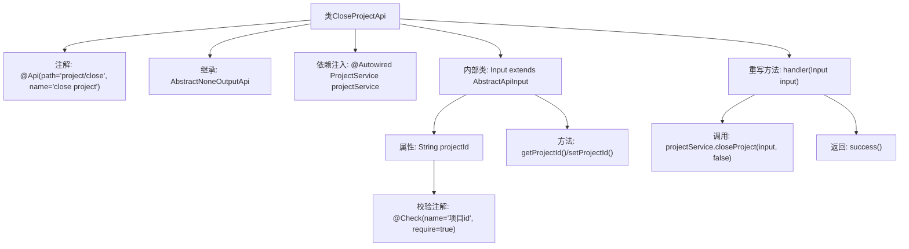
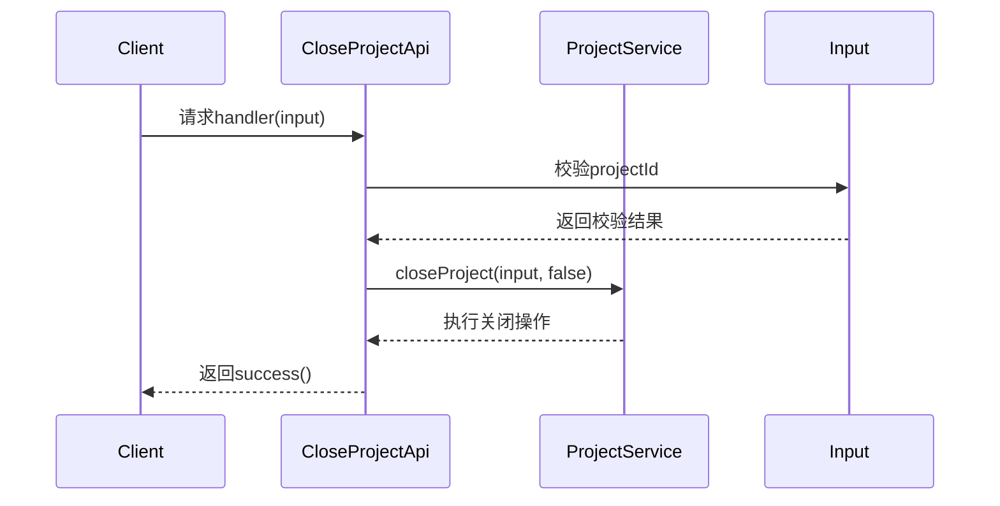

# 基础信息

|      |      |
|------|------|
| 名称 | CloseProjectApi |
| 编码语言 | .java |
| 代码路径 | WeFe/board/board-service/src/main/java/com/welab/wefe/board/service/api/project/project/CloseProjectApi.java |
| 包名 | com.welab.wefe.board.service.api.project.project |
| 依赖项 | ['com.welab.wefe.board.service.service.ProjectService', 'com.welab.wefe.common.exception.StatusCodeWithException', 'com.welab.wefe.common.fieldvalidate.annotation.Check', 'com.welab.wefe.common.web.api.base.AbstractNoneOutputApi', 'com.welab.wefe.common.web.api.base.Api', 'com.welab.wefe.common.web.dto.AbstractApiInput', 'com.welab.wefe.common.web.dto.ApiResult', 'org.springframework.beans.factory.annotation.Autowired'] |
| 概述说明 | 关闭项目API类，继承无输出抽象API，调用项目服务关闭指定ID项目，输入需包含必要项目ID参数。 |

# 说明

该代码定义了一个关闭项目的API接口，路径为"project/close"。API继承自无输出的抽象基类，接收包含项目ID的输入参数。核心逻辑通过ProjectService执行项目关闭操作，输入参数会进行非空校验。成功执行后返回成功状态，异常时抛出状态码异常。

# 类列表 Class Summary

| 名称   | 类型  | 说明 |
|-------|------|-------------|
| CloseProjectApi | class | 这是一个关闭项目的API类，路径为"project/close"，通过ProjectService执行关闭操作，输入参数为必填的项目ID。 |

## 类 CloseProjectApi

|      |      |
|------|------|
| 访问范围 | @Api(path = "project/close", name = "close project");public |
| 类型 | class |
| 名称 | CloseProjectApi |
| 说明 | 这是一个关闭项目的API类，路径为"project/close"，通过ProjectService执行关闭操作，输入参数为必填的项目ID。 |

### UML类图

类图描述：该图展示了CloseProjectApi类继承自泛型类AbstractNoneOutputApi<Input>，并依赖ProjectService。Input作为内部类继承自AbstractApiInput，包含projectId属性和getter/setter方法。AbstractNoneOutputApi和AbstractApiInput均为抽象类，提供基础功能扩展。整体结构体现了API处理器的典型分层设计。

### 内部方法调用关系图

这段代码定义了一个关闭项目的API接口，通过继承抽象类实现无输出响应的处理逻辑。流程图展示了类结构关系，包含注解、依赖注入、内部输入类和核心业务调用；时序图描述了从客户端请求到服务调用的完整流程，重点呈现了参数校验和服务层交互过程。代码通过注解实现路径映射和参数校验，最终调用ProjectService完成项目关闭操作。

### 字段列表 Field List

| 名称  | 类型  | 说明 |
|-------|-------|------|
| projectService | ProjectService | 使用@Autowired自动注入ProjectService实例。 |

### 方法列表

| 名称  | 类型  | 说明 |
|-------|-------|------|
| handler | ApiResult<?> | 方法重写，调用projectService关闭项目，返回成功结果。 |

