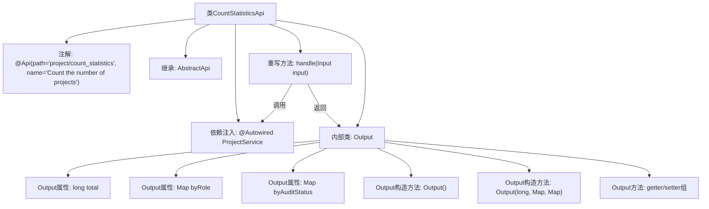

# 基础信息

|      |      |
|------|------|
| 名称 | CountStatisticsApi |
| 编码语言 | .java |
| 代码路径 | WeFe/board/board-service/src/main/java/com/welab/wefe/board/service/api/project/project/CountStatisticsApi.java |
| 包名 | com.welab.wefe.board.service.api.project.project |
| 依赖项 | ['com.welab.wefe.board.service.service.ProjectService', 'com.welab.wefe.common.exception.StatusCodeWithException', 'com.welab.wefe.common.web.api.base.AbstractApi', 'com.welab.wefe.common.web.api.base.Api', 'com.welab.wefe.common.web.dto.ApiResult', 'com.welab.wefe.common.wefe.enums.AuditStatus', 'com.welab.wefe.common.wefe.enums.JobMemberRole', 'org.springframework.beans.factory.annotation.Autowired', 'java.util.Map'] |
| 概述说明 | CountStatisticsApi类用于统计项目数量，包含总数、按角色和审核状态的分类统计，通过ProjectService处理输入并返回结果。 |

# 说明

CountStatisticsApi是一个用于统计项目数量的API类，继承自AbstractApi。它通过ProjectService处理输入参数并返回统计结果。输出类Output包含三个字段：total表示项目总数，byRole按角色统计项目数量，byAuditStatus按审核状态统计项目数量。Output类提供了无参构造方法和带参构造方法，以及各字段的getter和setter方法。该API路径为project/count_statistics，主要功能是统计项目数量。

# 类列表 Class Summary

| 名称   | 类型  | 说明 |
|-------|------|-------------|
| CountStatisticsApi | class | CountStatisticsApi类用于统计项目数量，返回总数、按角色和审核状态的分类统计。通过ProjectService处理输入并输出结果。 |


## 类 CountStatisticsApi

|      |      |
|------|------|
| 访问范围 | @Api(path = "project/count_statistics", name = "Count the number of projects");public |
| 类型 | class |
| 名称 | CountStatisticsApi |
| 说明 | CountStatisticsApi类用于统计项目数量，返回总数、按角色和审核状态的分类统计。通过ProjectService处理输入并输出结果。 |


### UML类图

```mermaid
classDiagram
    class CountStatisticsApi {
        -ProjectService projectService
        +handle(QueryApi~Input~ input) ApiResult~Output~
    }
    CountStatisticsApi --> ProjectService : 依赖
    CountStatisticsApi --> QueryApi~Input~ : 依赖
    CountStatisticsApi --> ApiResult~Output~ : 依赖

    class Output {
        -long total
        -Map~JobMemberRole, Long~ byRole
        -Map~AuditStatus, Long~ byAuditStatus
        +Output()
        +Output(long total, Map~JobMemberRole, Long~ byRole, Map~AuditStatus, Long~ byAuditStatus)
        +getTotal() long
        +setTotal(long total) void
        +getByRole() Map~JobMemberRole, Long~
        +setByRole(Map~JobMemberRole, Long~ byRole) void
        +getByAuditStatus() Map~AuditStatus, Long~
        +setByAuditStatus(Map~AuditStatus, Long~ byAuditStatus) void
    }
    CountStatisticsApi *-- Output : 包含

    class ProjectService {
        <<Interface>>
        +statistics(QueryApi~Input~ input) CountStatisticsApi~Output~
    }
    CountStatisticsApi ..|> AbstractApi~QueryApi~Input~, CountStatisticsApi~Output~~ : 实现
```

这段代码展示了一个统计项目数量的API类`CountStatisticsApi`，它继承自`AbstractApi`并处理项目统计请求。类图清晰地呈现了`CountStatisticsApi`与`ProjectService`接口的依赖关系，以及其内部静态类`Output`的结构。`Output`类封装了统计结果，包含总数、按角色和审核状态的分类统计。整个设计体现了清晰的职责划分，通过泛型参数和依赖注入实现松耦合。


### 内部方法调用关系图



该流程图展示了CountStatisticsApi类的完整结构，包含API注解、父类继承、服务注入和内部输出类。核心处理流程为：handle方法通过projectService统计项目数据后，封装成包含总量、角色分布和审核状态的Output对象返回。内部类Output通过双构造方法和getter/setter实现数据封装，支持统计结果的多维度展示。

### 字段列表 Field List

| 名称  | 类型  | 说明 |
|-------|-------|------|
| projectService | ProjectService | 使用@Autowired自动注入ProjectService实例。 |

### 方法列表

| 名称  | 类型  | 说明 |
|-------|-------|------|
| handle | ApiResult<Output> | Java方法重写，调用projectService统计输入数据并返回成功结果。 |


