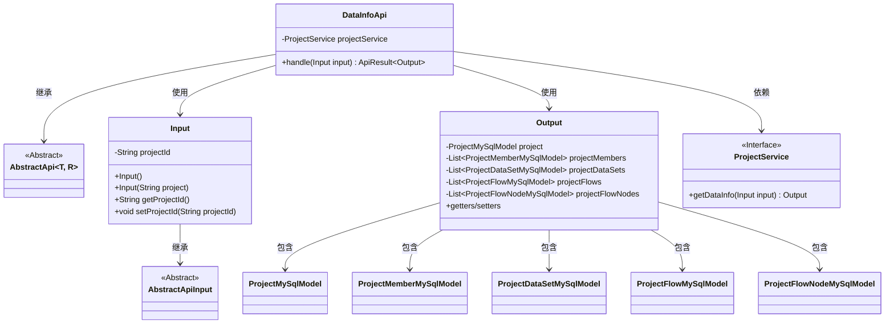

# 基础信息

|      |      |
|------|------|
| 名称 | DataInfoApi |
| 编码语言 | .java |
| 代码路径 | WeFe/board/board-service/src/main/java/com/welab/wefe/board/service/api/project/project/DataInfoApi.java |
| 包名 | com.welab.wefe.board.service.api.project.project |
| 依赖项 | ['com.welab.wefe.board.service.database.entity.job', 'com.welab.wefe.board.service.service.ProjectService', 'com.welab.wefe.common.exception.StatusCodeWithException', 'com.welab.wefe.common.fieldvalidate.annotation.Check', 'com.welab.wefe.common.web.api.base.AbstractApi', 'com.welab.wefe.common.web.api.base.Api', 'com.welab.wefe.common.web.dto.AbstractApiInput', 'com.welab.wefe.common.web.dto.ApiResult', 'org.springframework.beans.factory.annotation.Autowired', 'java.util.List'] |
| 概述说明 | API类DataInfoApi，路径project/data/info，获取项目信息，包括数据集、成员、流程及节点。输入需项目ID，输出包含项目详情及相关数据列表。 |

# 说明

该代码定义了一个名为DataInfoApi的API类，用于获取项目及其相关信息。API路径为project/data/info，功能包括获取项目数据集、项目成员、项目流程及流程节点信息。输入参数Input包含必填的项目ID字段，输出Output包含项目模型、成员列表、数据集列表、流程列表及流程节点列表。通过ProjectService处理请求并返回结果。

# 类列表 Class Summary

| 名称   | 类型  | 说明 |
|-------|------|-------------|
| DataInfoApi | class | 获取项目及其数据集、成员、流程和节点信息的API接口，需提供项目ID。 |

## 类 DataInfoApi

|      |      |
|------|------|
| 访问范围 | @Api(;        path = "project/data/info",;        name = "Get the project and the information in the project",;        desc = "Get the project and the data set, project members, project process, project process node information in the project.";);public |
| 类型 | class |
| 名称 | DataInfoApi |
| 说明 | 获取项目及其数据集、成员、流程和节点信息的API接口，需提供项目ID。 |

### UML类图

该图展示了DataInfoApi类的结构及其关联关系。DataInfoApi继承自泛型类AbstractApi，使用Input和Output作为类型参数。Input类继承自AbstractApiInput，包含项目ID字段；Output类包含项目相关模型集合。DataInfoApi依赖ProjectService接口获取数据，并通过handle方法处理请求。各类模型如ProjectMySqlModel等被Output类聚合，形成完整项目信息响应结构。

### 内部方法调用关系图

```mermaid
graph TD
    A["类DataInfoApi"]
    B["注解: @Api"]
    C["继承: AbstractApi<Input, Output>"]
    D["依赖注入: @Autowired ProjectService"]
    E["重写方法: handle(Input input)"]
    F["内部类: Input"]
    G["内部类: Output"]
    H["Input属性: String projectId"]
    I["Input方法: get/setProjectId()"]
    J["Output属性: ProjectMySqlModel等5类数据"]
    K["Output方法: 各属性的get/set方法"]

    A --> B
    A --> C
    A --> D
    A --> E
    A --> F
    A --> G
    F --> D
    F --> G
    F --> H
    H --> I
    G --> J
    J --> K
```

该流程图展示了DataInfoApi类的完整结构，包含API注解、父类继承关系、服务注入和核心处理方法。重点描述了handle方法如何通过ProjectService获取项目数据，并详细映射了Input和Output两个内部类的属性与方法结构，其中Input负责接收项目ID参数，Output封装了项目相关的五类数据模型。整个流程体现了从请求处理到数据返回的完整链路。

### 字段列表 Field List

| 名称  | 类型  | 说明 |
|-------|-------|------|
| projectService | ProjectService | 使用@Autowired自动注入ProjectService实例。 |

### 方法列表

| 名称  | 类型  | 说明 |
|-------|-------|------|
| handle | ApiResult<Output> | 代码重写handle方法，调用projectService.getDataInfo处理输入并返回成功结果。 |

