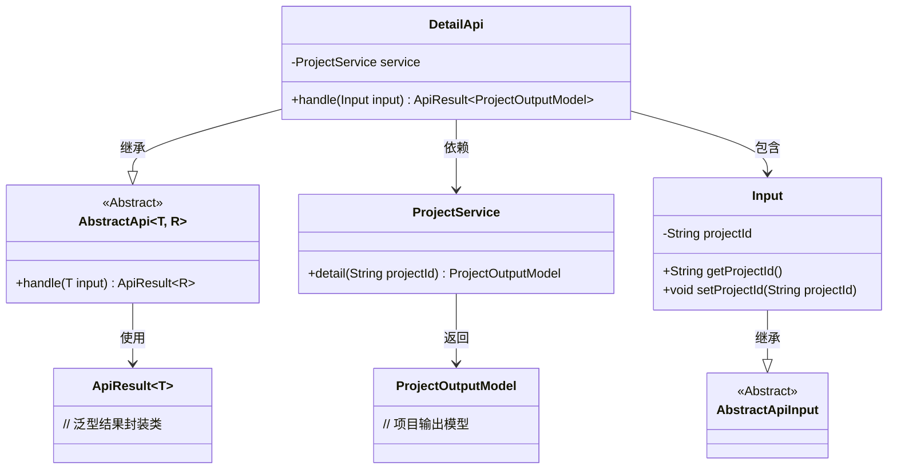
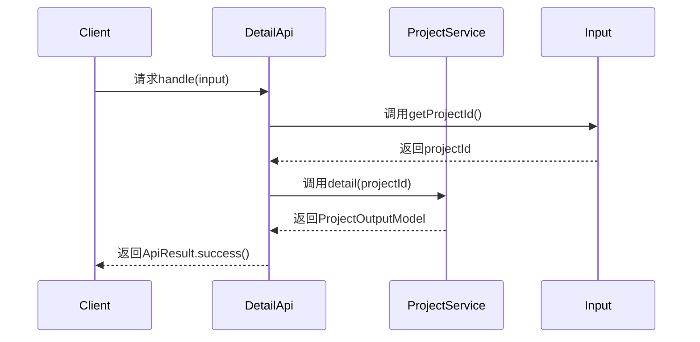

# 基础信息

|      |      |
|------|------|
| 名称 | DetailApi |
| 编码语言 | .java |
| 代码路径 | WeFe/board/board-service/src/main/java/com/welab/wefe/board/service/api/project/project/DetailApi.java |
| 包名 | com.welab.wefe.board.service.api.project.project |
| 依赖项 | ['com.welab.wefe.board.service.dto.entity.project.ProjectOutputModel', 'com.welab.wefe.board.service.service.ProjectService', 'com.welab.wefe.common.exception.StatusCodeWithException', 'com.welab.wefe.common.fieldvalidate.annotation.Check', 'com.welab.wefe.common.web.api.base.AbstractApi', 'com.welab.wefe.common.web.api.base.Api', 'com.welab.wefe.common.web.dto.AbstractApiInput', 'com.welab.wefe.common.web.dto.ApiResult', 'org.springframework.beans.factory.annotation.Autowired'] |
| 概述说明 | DetailApi类处理项目详情请求，通过projectId调用ProjectService获取详情并返回ProjectOutputModel结果。输入参数Input包含必填项目主键projectId。 |

# 说明

该代码定义了一个名为DetailApi的API类，用于处理项目详情查询请求。类注解指定了API路径为"project/detail"，名称为"Project details"。该类继承自AbstractApi，使用泛型指定输入类型为内部类Input，输出类型为ProjectOutputModel。通过Autowired注入了ProjectService服务。核心方法handle接收Input参数，调用service.detail方法获取项目详情并返回成功结果。Input内部类继承AbstractApiInput，包含一个必填的projectId字段，带有"项目主键"的校验注解，并提供了getter和setter方法。

# 类列表 Class Summary

| 名称   | 类型  | 说明 |
|-------|------|-------------|
| DetailApi | class | 项目详情API，路径为project/detail，通过projectId查询项目详情，返回ProjectOutputModel。输入参数projectId必填。 |

## 类 DetailApi

|      |      |
|------|------|
| 访问范围 | @Api(path = "project/detail", name = "Project details");public |
| 类型 | class |
| 名称 | DetailApi |
| 说明 | 项目详情API，路径为project/detail，通过projectId查询项目详情，返回ProjectOutputModel。输入参数projectId必填。 |

### UML类图

类图描述：该结构展示了一个基于抽象模板的API实现体系，DetailApi继承自泛型抽象类AbstractApi，处理Input参数并返回ProjectOutputModel结果。Input作为嵌套类继承AbstractApiInput，包含项目ID字段及访问方法。DetailApi通过依赖注入使用ProjectService获取项目详情，体现了清晰的层次结构和类型安全的数据流转。

### 内部方法调用关系图

```mermaid
graph TD
    A["类DetailApi"]
    B["注解: @Api"]
    C["继承: AbstractApi<Input, ProjectOutputModel>"]
    D["依赖注入: @Autowired ProjectService"]
    E["重写方法: handle(Input input)"]
    F["内部类: Input"]
    G["校验注解: @Check"]
    H["方法: getProjectId/setProjectId"]
    I["调用: service.detail(input.getProjectId())"]
    J["返回: ApiResult.success()"]

    A --> B
    A --> C
    A --> D
    A --> E
    E --> I
    I --> J
    A --> F
    F --> G
    F --> H
```

这段代码定义了一个处理项目详情的API类DetailApi，继承自抽象模板类AbstractApi。主要流程是通过handle方法接收输入参数Input，从中提取projectId后调用ProjectService获取详情数据，最后包装成成功结果返回。内部类Input包含项目ID字段及其getter/setter，并用@Check注解实现参数校验。流程图展示了类结构和调用关系，时序图描述了请求处理过程。

### 字段列表 Field List

| 名称  | 类型  | 说明 |
|-------|-------|------|
| service | ProjectService | 使用@Autowired自动注入ProjectService实例。 |

### 方法列表

| 名称  | 类型  | 说明 |
|-------|-------|------|
| handle | ApiResult<ProjectOutputModel> | 处理输入并返回项目详情，成功时调用服务获取项目ID对应的详细信息。 |

