# 基础信息

|      |      |
|------|------|
| 名称 | QueryApi |
| 编码语言 | .java |
| 代码路径 | WeFe/board/board-service/src/main/java/com/welab/wefe/board/service/api/project/project/QueryApi.java |
| 包名 | com.welab.wefe.board.service.api.project.project |
| 依赖项 | ['com.welab.wefe.board.service.dto.base.PagingInput', 'com.welab.wefe.board.service.dto.base.PagingOutput', 'com.welab.wefe.board.service.dto.entity.project.ProjectQueryOutputModel', 'com.welab.wefe.board.service.service.ProjectService', 'com.welab.wefe.common.exception.StatusCodeWithException', 'com.welab.wefe.common.fieldvalidate.annotation.Check', 'com.welab.wefe.common.web.api.base.AbstractApi', 'com.welab.wefe.common.web.api.base.Api', 'com.welab.wefe.common.web.dto.ApiResult', 'com.welab.wefe.common.wefe.enums.AuditStatus', 'com.welab.wefe.common.wefe.enums.JobMemberRole', 'com.welab.wefe.common.wefe.enums.ProjectType', 'org.springframework.beans.factory.annotation.Autowired'] |
| 概述说明 | 查询项目列表的API，包含分页和多种过滤条件如名称、状态、时间、角色等，调用ProjectService处理请求。 |

# 说明

该代码定义了一个名为QueryApi的类，用于查询项目列表。它继承自AbstractApi，处理输入类型为Input，输出为分页的ProjectQueryOutputModel。类中注入了ProjectService服务，并通过handle方法调用service.query处理查询请求。Input类继承自PagingInput，包含多个查询条件字段，如项目名称、合作方ID、审核状态、创建时间范围、角色类型、项目状态和项目类型等。每个字段都有相应的getter和setter方法，部分字段还带有防SQL注入的校验注解。

# 类列表 Class Summary

| 名称   | 类型  | 说明 |
|-------|------|-------------|
| QueryApi | class | 查询项目列表的API，包含分页和多种过滤条件如名称、合作方、状态、时间范围等。 |


## 类 QueryApi

|      |      |
|------|------|
| 访问范围 | @Api(path = "project/query", name = "Query project list");public |
| 类型 | class |
| 名称 | QueryApi |
| 说明 | 查询项目列表的API，包含分页和多种过滤条件如名称、合作方、状态、时间范围等。 |


### UML类图

```mermaid
classDiagram
    class QueryApi {
        -ProjectService service
        +handle(Input input) ApiResult~PagingOutput~ProjectQueryOutputModel~~
    }
    QueryApi --> ProjectService : 依赖
    QueryApi --|> AbstractApi~Input, PagingOutput~ProjectQueryOutputModel~~ : 继承

    class AbstractApi~T, R~ {
        <<Abstract>>
        +handle(T input) ApiResult~R~
    }

    class PagingOutput~T~ {
        <<GenericType>>
    }

    class ProjectQueryOutputModel {
        <<DataModel>>
    }

    class Input {
        -String name
        -String memberId
        -AuditStatus auditStatus
        -String startCreateTime
        -String endCreateTime
        -JobMemberRole myRole
        -JobMemberRole memberRole
        -Boolean exited
        -Boolean closed
        -ProjectType projectType
        +getter/setter methods
    }
    Input --|> PagingInput : 继承

    class PagingInput {
        <<BaseClass>>
    }

    class ProjectService {
        +query(Input input) PagingOutput~ProjectQueryOutputModel~
    }
```

这段代码展示了一个项目查询API的实现结构。QueryApi继承自泛型抽象类AbstractApi，处理Input参数并返回分页的项目查询结果。Input类继承PagingInput，包含多个带校验注解的查询条件字段。ProjectService提供实际的查询功能，QueryApi通过依赖注入使用该服务。整体架构体现了清晰的层次划分和职责分离，Input类封装了所有可能的查询条件，通过泛型和继承实现了类型安全的API设计模式。


### 内部方法调用关系图

```mermaid
graph TD
    A["类QueryApi"]
    B["注解: @Api(path='project/query', name='Query project list')"]
    C["继承: AbstractApi<Input, PagingOutput<ProjectQueryOutputModel>>"]
    D["依赖注入: @Autowired ProjectService service"]
    E["重写方法: handle(Input input)"]
    F["内部类: Input extends PagingInput"]
    G["属性: String name (带@Check注解)"]
    H["属性: String memberId (带@Check注解)"]
    I["属性: AuditStatus auditStatus (带@Check注解)"]
    J["属性: String startCreateTime (带@Check注解)"]
    K["属性: String endCreateTime (带@Check注解)"]
    L["属性: JobMemberRole myRole (带@Check注解)"]
    M["属性: JobMemberRole memberRole (带@Check注解)"]
    N["属性: Boolean exited (带@Check注解)"]
    O["属性: Boolean closed (带@Check注解)"]
    P["属性: ProjectType projectType (带@Check注解)"]
    Q["getter/setter方法组"]

    A --> B
    A --> C
    A --> D
    A --> E
    A --> F
    F --> G
    F --> H
    F --> I
    F --> J
    F --> K
    F --> L
    F --> M
    F --> N
    F --> O
    F --> P
    F --> Q
    E --> D
    E --> F
```



这段代码展示了一个项目查询API的实现，包含主类QueryApi和嵌套参数类Input。主类继承抽象API模板，通过handle方法调用ProjectService进行查询，Input类继承分页参数并包含12个带校验注解的查询条件字段，每个字段都有对应的getter/setter方法。流程图清晰展示了类继承关系、依赖注入、方法重写以及参数类的完整结构。

### 字段列表 Field List

| 名称  | 类型  | 说明 |
|-------|-------|------|
| service | ProjectService | 自动注入ProjectService实例到当前类。 |

### 方法列表

| 名称  | 类型  | 说明 |
|-------|-------|------|
| handle | ApiResult<PagingOutput<ProjectQueryOutputModel>> | 重写方法处理输入并返回分页查询结果。 |


