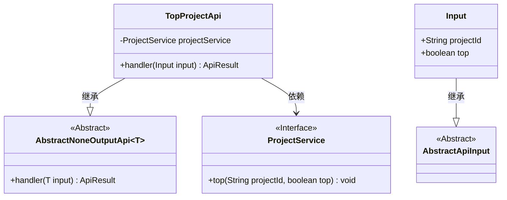
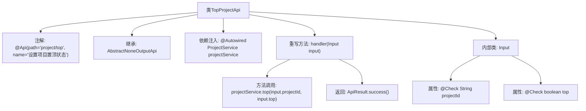

# 基础信息

|      |      |
|------|------|
| 名称 | TopProjectApi |
| 编码语言 | .java |
| 代码路径 | WeFe/board/board-service/src/main/java/com/welab/wefe/board/service/api/project/project/TopProjectApi.java |
| 包名 | com.welab.wefe.board.service.api.project.project |
| 依赖项 | ['com.welab.wefe.board.service.service.ProjectService', 'com.welab.wefe.common.exception.StatusCodeWithException', 'com.welab.wefe.common.fieldvalidate.annotation.Check', 'com.welab.wefe.common.web.api.base.AbstractNoneOutputApi', 'com.welab.wefe.common.web.api.base.Api', 'com.welab.wefe.common.web.dto.AbstractApiInput', 'com.welab.wefe.common.web.dto.ApiResult', 'org.springframework.beans.factory.annotation.Autowired'] |
| 概述说明 | TopProjectApi用于设置项目置顶状态，接收项目ID和置顶标志，调用ProjectService处理，无返回数据。输入参数需校验非空。 |

# 说明

这是一个名为TopProjectApi的API类，用于设置项目的置顶状态。它继承自AbstractNoneOutputApi，使用泛型Input作为输入参数。类中注入了ProjectService来处理业务逻辑。handler方法接收Input对象，调用projectService的top方法更新项目置顶状态，并返回成功结果。Input内部类继承自AbstractApiInput，包含两个必填字段：projectId（项目ID）和top（是否置顶布尔值）。该API路径为"project/top"，名称为"设置项目置顶状态"。

# 类列表 Class Summary

| 名称   | 类型  | 说明 |
|-------|------|-------------|
| TopProjectApi | class | TopProjectApi用于设置项目置顶状态，接收项目ID和置顶标志，调用ProjectService处理，无返回数据。输入需校验非空。 |

## 类 TopProjectApi

|      |      |
|------|------|
| 访问范围 | @Api(path = "project/top", name = "设置项目置顶状态");public |
| 类型 | class |
| 名称 | TopProjectApi |
| 说明 | TopProjectApi用于设置项目置顶状态，接收项目ID和置顶标志，调用ProjectService处理，无返回数据。输入需校验非空。 |

### UML类图

这段代码描述了一个设置项目置顶状态的API类TopProjectApi，它继承自AbstractNoneOutputApi泛型类并处理Input类型的输入。Input是继承自AbstractApiInput的内部类，包含projectId和top两个字段。TopProjectApi通过依赖注入的ProjectService接口实现置顶功能。类图清晰地展示了继承关系和依赖关系，体现了API处理请求的基本架构。

### 内部方法调用关系图

这段代码描述了一个名为TopProjectApi的API类，用于处理项目置顶状态设置。类通过继承AbstractNoneOutputApi并实现handler方法，调用ProjectService的top方法完成核心逻辑。内部类Input定义了必需的请求参数projectId和top，并通过@Check注解进行校验。流程图清晰展示了类结构、依赖关系和方法调用链，突出了从请求处理到服务调用的完整流程。

### 字段列表 Field List

| 名称  | 类型  | 说明 |
|-------|-------|------|
| projectService | ProjectService | 使用@Autowired自动注入ProjectService实例。 |

### 方法列表

| 名称  | 类型  | 说明 |
|-------|-------|------|
| handler | ApiResult | 该方法重写父类handler，调用projectService的top方法处理输入参数projectId和top，成功时返回ApiResult。 |

