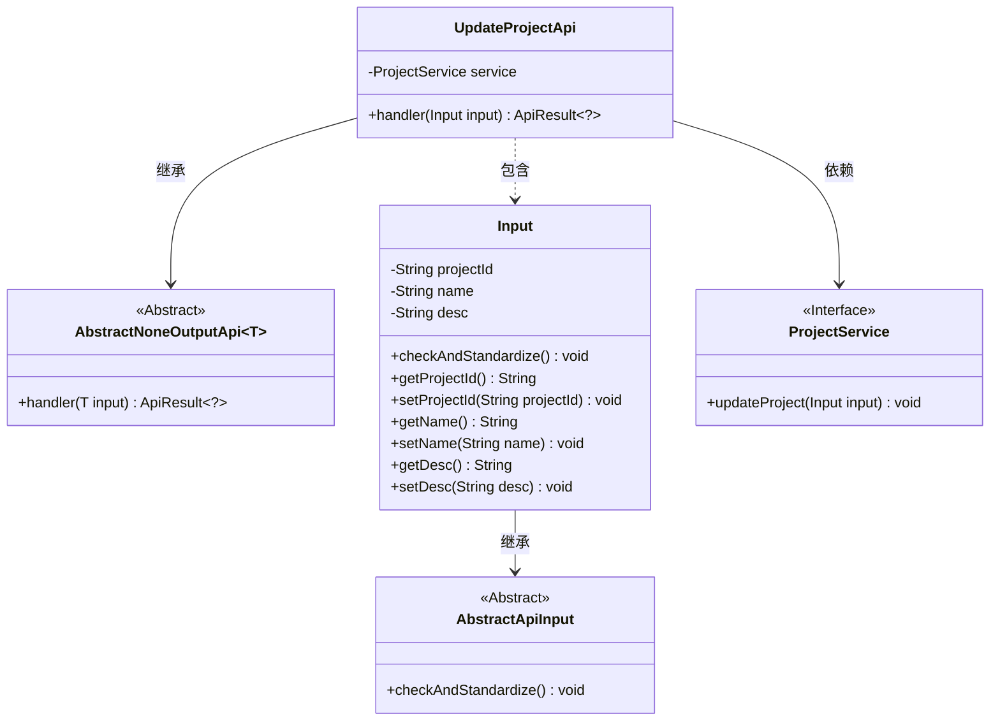
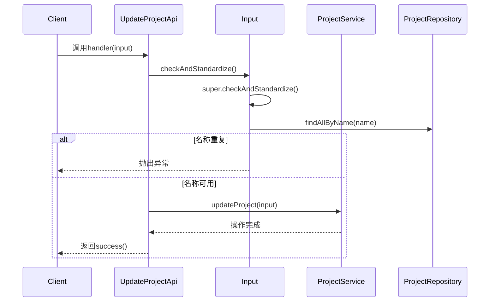

# 基础信息

|      |      |
|------|------|
| 名称 | UpdateProjectApi |
| 编码语言 | .java |
| 代码路径 | WeFe/board/board-service/src/main/java/com/welab/wefe/board/service/api/project/project/UpdateProjectApi.java |
| 包名 | com.welab.wefe.board.service.api.project.project |
| 依赖项 | ['com.welab.wefe.board.service.database.entity.job.ProjectMySqlModel', 'com.welab.wefe.board.service.database.repository.ProjectRepository', 'com.welab.wefe.board.service.service.ProjectService', 'com.welab.wefe.common.StatusCode', 'com.welab.wefe.common.exception.StatusCodeWithException', 'com.welab.wefe.common.fieldvalidate.annotation.Check', 'com.welab.wefe.common.web.Launcher', 'com.welab.wefe.common.web.api.base.AbstractNoneOutputApi', 'com.welab.wefe.common.web.api.base.Api', 'com.welab.wefe.common.web.dto.AbstractApiInput', 'com.welab.wefe.common.web.dto.ApiResult', 'org.springframework.beans.factory.annotation.Autowired', 'java.util.List'] |
| 概述说明 | 更新项目信息的API类，包含项目ID、名称和描述字段，名称不可重复，校验后调用服务更新项目。 |

# 说明

这是一个用于更新项目信息的API类，路径为"project/update"。它继承自AbstractNoneOutputApi，输入参数为内部类Input。Input包含项目ID、名称和描述字段，其中项目ID和名称为必填项。在参数校验中，会检查项目名称是否重复，若重复则抛出异常。处理逻辑是通过ProjectService更新项目信息。

# 类列表 Class Summary

| 名称   | 类型  | 说明 |
|-------|------|-------------|
| UpdateProjectApi | class | UpdateProjectApi用于更新项目信息，包含项目ID、名称和描述，名称不可重复。输入参数校验后调用service更新项目。 |

## 类 UpdateProjectApi

|      |      |
|------|------|
| 访问范围 | @Api(path = "project/update", name = "update project info");public |
| 类型 | class |
| 名称 | UpdateProjectApi |
| 说明 | UpdateProjectApi用于更新项目信息，包含项目ID、名称和描述，名称不可重复。输入参数校验后调用service更新项目。 |

### UML类图

该类图展示了更新项目信息的API结构。UpdateProjectApi继承自泛型类AbstractNoneOutputApi，包含一个内部类Input用于处理请求参数。Input继承自AbstractApiInput，并实现了参数校验逻辑。UpdateProjectApi通过依赖ProjectService接口来执行项目更新操作，整体结构体现了清晰的层级关系和职责分离。

### 内部方法调用关系图

```mermaid
graph TD
    A["类UpdateProjectApi"]
    B["注解: @Api(path='project/update', name='update project info')"]
    C["继承: AbstractNoneOutputApi<Input>"]
    D["依赖注入: @Autowired ProjectService service"]
    E["重写方法: handler(Input input)"]
    F["嵌套类Input"]
    G["属性: String projectId @Check"]
    H["属性: String name @Check"]
    I["属性: String desc @Check"]
    J["方法: checkAndStandardize()"]
    K["方法: getter/setter"]
    L["调用: service.updateProject(input)"]
    M["返回: success()"]
    N["校验: super.checkAndStandardize()"]
    O["查询: ProjectRepository.findAllByName(name)"]
    P["异常: StatusCode.PARAMETER_VALUE_INVALID"]

    A --> B
    A --> C
    A --> D
    A --> E
    A --> F
    F --> G
    F --> H
    F --> I
    F --> J
    F --> K
    E --> L
    E --> M
    J --> N
    J --> O
    J --> P
```

这段代码实现了一个项目更新API，主要包含输入参数校验和项目更新两个核心功能。流程图展示了类结构关系，其中UpdateProjectApi继承抽象类并注入ProjectService，Input嵌套类负责参数校验。时序图描述了API调用流程：先进行输入校验（检查项目名称唯一性），通过后调用服务层更新项目数据。校验过程涉及数据库查询和业务规则验证，确保项目名称不重复。整个设计体现了分层校验思想，网关层做基础校验，业务层做深度校验。

### 字段列表 Field List

| 名称  | 类型  | 说明 |
|-------|-------|------|
| service | ProjectService | 使用@Autowired自动注入ProjectService实例。 |

### 方法列表

| 名称  | 类型  | 说明 |
|-------|-------|------|
| handler | ApiResult<?> | 重写handler方法，调用service更新项目并返回成功结果，可能抛出StatusCodeWithException异常。 |

