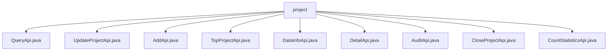

# 基础信息

|      |      |
|------|------|
| 名称 | project |
| 编码语言 | .java |
| 代码路径 | WeFe/board/board-service/src/main/java/com/welab/wefe/board/service/api/project/project |
| 包名 | docs.board.board-service.src.main.java.com.welab.wefe.board.service.api.project.project |
| 概述说明 | QueryApi查询项目列表，UpdateProjectApi更新项目信息，AddApi新增项目，TopProjectApi设置置顶状态，DataInfoApi获取项目数据，DetailApi查询项目详情，AuditApi处理审核，CloseProjectApi关闭项目，CountStatisticsApi统计项目数量。 |

# 说明

## 概述  
该模块核心职责是提供完整的项目管理功能，包括项目CRUD、状态变更、数据查询和统计分析等操作。所有API均继承自抽象基类（如AbstractApi），通过ProjectService实现业务逻辑，类似资源控制器模式。  

接口规范统一采用RESTful风格，输入参数多继承自PagingInput或AbstractApiInput，输出多为分页模型或特定DTO。关键数据结构包括ProjectQueryOutputModel（含分页信息）、ProjectOutputModel（项目详情）和CountStatisticsOutput（统计结果）。  

外部依赖仅为ProjectService，实现业务逻辑封装。例如QueryApi注入该服务处理分页查询，AddApi调用其方法校验并创建项目。所有API均包含严格参数校验，如防SQL注入注解、非空校验等。  

## 主要业务场景  
模块支持全生命周期项目管理，典型流程为：创建项目（AddApi）→查询详情（DetailApi）→更新信息（UpdateProjectApi）→置顶/关闭（TopProjectApi/CloseProjectApi）→统计分析（CountStatisticsApi）。  

交互模式分为三类：数据操作（如增删改查）、状态变更（如审核/置顶）和统计查询。例如AuditApi处理审核状态变更，DataInfoApi聚合项目关联数据。所有API均返回标准化响应，异常时抛出状态码。  

功能完整性体现在覆盖核心业务场景，例如支持多条件分页查询（QueryApi）、项目数据聚合（DataInfoApi）和多维统计（CountStatisticsApi）。典型应用包括项目管理后台、数据看板等需要项目维度数据的系统。

### 包内部结构视图

该流程图展示了project目录下的9个API文件结构，所有Java文件都直接隶属于project节点。这些API文件包括查询、更新、添加、置顶项目等不同功能模块，构成了完整的项目服务接口体系，每个文件代表一个独立的功能端点。

# 文件列表

| 名称   | 类型  | 说明 |
|-------|------|-------------|
| [QueryApi.java](QueryApi.md) | file | 查询项目列表的API，包含分页和多种过滤条件如名称、状态、时间、角色等，调用ProjectService处理请求。 |
| [UpdateProjectApi.java](UpdateProjectApi.md) | file | 更新项目信息的API类，包含项目ID、名称和描述字段，名称不可重复，校验后调用服务更新项目。 |
| [AddApi.java](AddApi.md) | file | AddApi类用于添加新项目，包含输入输出处理。输入需校验项目名称唯一性、合作方非空及成员不重复。输出返回项目ID。 |
| [TopProjectApi.java](TopProjectApi.md) | file | TopProjectApi用于设置项目置顶状态，接收项目ID和置顶标志，调用ProjectService处理，无返回数据。输入参数需校验非空。 |
| [DataInfoApi.java](DataInfoApi.md) | file | API类DataInfoApi，路径project/data/info，获取项目信息，包括数据集、成员、流程及节点。输入需项目ID，输出包含项目详情及相关数据列表。 |
| [DetailApi.java](DetailApi.md) | file | DetailApi类处理项目详情请求，通过projectId调用ProjectService获取详情并返回ProjectOutputModel结果。输入参数Input包含必填项目主键projectId。 |
| [AuditApi.java](AuditApi.md) | file | 审计API，用于处理用户是否同意加入项目的请求。输入包括项目ID、审核结果和审批意见。若拒绝需填写意见。调用ProjectService完成审核。 |
| [CloseProjectApi.java](CloseProjectApi.md) | file | 关闭项目API类，继承无输出抽象API，调用项目服务关闭指定ID项目，输入需包含必要项目ID参数。 |
| [CountStatisticsApi.java](CountStatisticsApi.md) | file | CountStatisticsApi类用于统计项目数量，包含总数、按角色和审核状态的分类统计，通过ProjectService处理输入并返回结果。 |

