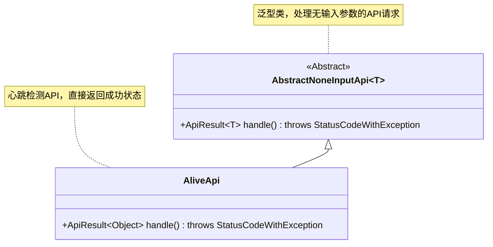
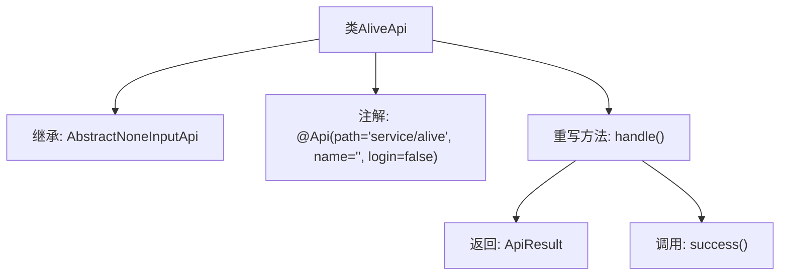

# 基础信息

|      |      |
|------|------|
| 名称 | AliveApi |
| 编码语言 | .java |
| 代码路径 | WeFe/board/board-service/src/main/java/com/welab/wefe/board/service/api/service/AliveApi.java |
| 包名 | com.welab.wefe.board.service.api.service |
| 依赖项 | ['com.welab.wefe.common.exception.StatusCodeWithException', 'com.welab.wefe.common.web.api.base.AbstractNoneInputApi', 'com.welab.wefe.common.web.api.base.Api', 'com.welab.wefe.common.web.dto.ApiResult'] |
| 概述说明 | 这是一个无需登录的存活检测API类，路径为"service/alive"，继承自AbstractNoneInputApi，返回成功结果。 |

# 说明

该代码定义了一个名为AliveApi的公开类，继承自AbstractNoneInputApi，泛型参数为Object。类上标注了@Api注解，指定路径为"service/alive"，未设置名称，且不需要登录验证。类中重写了handle方法，返回一个成功的ApiResult对象，不包含任何输入参数处理逻辑。该API主要用于服务存活检测，直接返回成功状态。

# 类列表 Class Summary

| 名称   | 类型  | 说明 |
|-------|------|-------------|
| AliveApi | class | 这是一个无需登录的存活检测API，路径为"service/alive"，继承自AbstractNoneInputApi，返回成功结果。 |

## 类 AliveApi

|      |      |
|------|------|
| 访问范围 | @Api(path = "service/alive", name = "", login = false);public |
| 类型 | class |
| 名称 | AliveApi |
| 说明 | 这是一个无需登录的存活检测API，路径为"service/alive"，继承自AbstractNoneInputApi，返回成功结果。 |

### UML类图

这段代码展示了一个简单的心跳检测API实现。AliveApi继承自抽象类AbstractNoneInputApi，重写了handle方法用于处理请求。类图中清晰地表现了继承关系，AbstractNoneInputApi是一个泛型抽象类，而AliveApi是其具体实现，专门用于返回成功状态的心跳检测。注解@Api表明这是一个无需登录的API端点。

### 内部方法调用关系图

这段代码展示了一个名为AliveApi的类，继承自AbstractNoneInputApi<Object>，并标注了@Api注解用于定义API路径和属性。核心是重写handle()方法，该方法直接返回success()调用的结果，表示API执行成功。流程图清晰地呈现了类继承关系、注解应用和方法调用逻辑，适用于简单的存活检测接口实现。

### 字段列表 Field List

| 名称  | 类型  | 说明 |
|-------|-------|------|

### 方法列表

| 名称  | 类型  | 说明 |
|-------|-------|------|
| handle | ApiResult<Object> | Java方法重写，返回成功ApiResult，可能抛出StatusCodeWithException异常。 |

