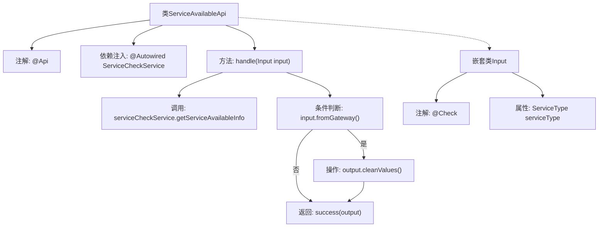

# 基础信息

|      |      |
|------|------|
| 名称 | ServiceAvailableApi |
| 编码语言 | .java |
| 代码路径 | WeFe/board/board-service/src/main/java/com/welab/wefe/board/service/api/service/ServiceAvailableApi.java |
| 包名 | com.welab.wefe.board.service.api.service |
| 依赖项 | ['com.welab.wefe.board.service.service.ServiceCheckService', 'com.welab.wefe.common.exception.StatusCodeWithException', 'com.welab.wefe.common.fieldvalidate.annotation.Check', 'com.welab.wefe.common.web.api.base.AbstractApi', 'com.welab.wefe.common.web.api.base.Api', 'com.welab.wefe.common.web.dto.AbstractApiInput', 'com.welab.wefe.common.web.dto.ApiResult', 'com.welab.wefe.common.wefe.checkpoint.dto.ServiceAvailableCheckOutput', 'com.welab.wefe.common.wefe.enums.ServiceType', 'org.springframework.beans.factory.annotation.Autowired', 'java.io.IOException'] |
| 概述说明 | ServiceAvailableApi类用于查询服务可用性，通过ServiceCheckService获取信息，支持网关过滤敏感数据。输入需指定服务类型。 |

# 说明

该代码定义了一个名为ServiceAvailableApi的API类，用于查询指定服务类型的可用性信息。API路径为"service/available"，功能是列出所有检查点以展示服务可用性。类继承自AbstractApi，输入参数为包含必填服务类型的Input类，输出为ServiceAvailableCheckOutput。处理逻辑通过serviceCheckService获取服务可用信息，若请求来自网关则清理输出值。最终返回成功结果及处理后的输出数据。

# 类列表 Class Summary

| 名称   | 类型  | 说明 |
|-------|------|-------------|
| ServiceAvailableApi | class | ServiceAvailableApi类用于查询服务可用性，通过ServiceCheckService获取信息，处理输入参数serviceType，网关请求时清理输出值。 |


## 类 ServiceAvailableApi

|      |      |
|------|------|
| 访问范围 | @Api(path = "service/available", name = "list all checkpoint in board service to show its availability.");public |
| 类型 | class |
| 名称 | ServiceAvailableApi |
| 说明 | ServiceAvailableApi类用于查询服务可用性，通过ServiceCheckService获取信息，处理输入参数serviceType，网关请求时清理输出值。 |


### UML类图

```mermaid
classDiagram
    class ServiceAvailableApi {
        -ServiceCheckService serviceCheckService
        +handle(Input input) ApiResult~ServiceAvailableCheckOutput~
    }
    <<Interface>> ServiceCheckService {
        // 接口方法未在代码中显示
    }
    class AbstractApi~Input, ServiceAvailableCheckOutput~ {
        <<abstract>>
    }
    class ServiceAvailableCheckOutput {
        +cleanValues()
    }
    class AbstractApiInput {
        <<abstract>>
    }
    class Input {
        +ServiceType serviceType
    }
    class ServiceType {
        // 枚举或类型定义
    }
    class ApiResult~T~ {
        // 泛型结果类
    }

    ServiceAvailableApi --> AbstractApi~Input, ServiceAvailableCheckOutput~ : 继承
    ServiceAvailableApi --> ServiceCheckService : 依赖
    ServiceAvailableApi ..|> Input : 包含(内部类)
    Input --> AbstractApiInput : 继承
    AbstractApi~Input, ServiceAvailableCheckOutput~ --> ApiResult~T~ : 使用
    AbstractApi~Input, ServiceAvailableCheckOutput~ --> ServiceAvailableCheckOutput : 使用
    Input --> ServiceType : 关联
```

这段类图展示了`ServiceAvailableApi`及其相关类的结构。`ServiceAvailableApi`继承自泛型抽象类`AbstractApi`，依赖`ServiceCheckService`接口，并包含一个静态内部类`Input`。`Input`继承自`AbstractApiInput`并关联`ServiceType`枚举。`AbstractApi`使用泛型`ApiResult`和`ServiceAvailableCheckOutput`作为返回类型，后者具有清理数据的方法。整体结构体现了API处理输入、调用服务并返回结果的典型模式，通过泛型和继承实现了类型安全与代码复用。


### 内部方法调用关系图



这段代码流程图展示了ServiceAvailableApi类的核心结构和工作流程。该类是一个API接口，通过@Api注解定义路径和描述，继承AbstractApi并指定输入输出类型。主要逻辑在handle方法中：先通过serviceCheckService获取服务可用性信息，然后根据输入参数判断是否来自网关（fromGateway），如果是则清理输出值，最后返回处理结果。嵌套类Input定义了必需的serviceType参数并添加了校验注解。整个流程体现了API请求处理、服务调用和条件分支的典型模式。

### 字段列表 Field List

| 名称  | 类型  | 说明 |
|-------|-------|------|
| serviceCheckService | ServiceCheckService | 使用@Autowired自动注入ServiceCheckService实例。 |

### 方法列表

| 名称  | 类型  | 说明 |
|-------|-------|------|
| handle | ApiResult<ServiceAvailableCheckOutput> | 该方法处理服务可用性检查请求，返回服务可用性信息。若请求来自网关，则清理输出值。成功时返回处理结果。 |


